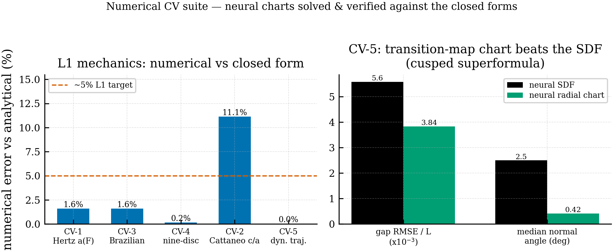
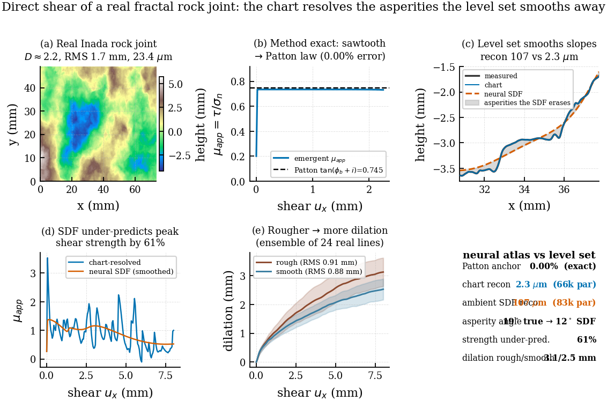
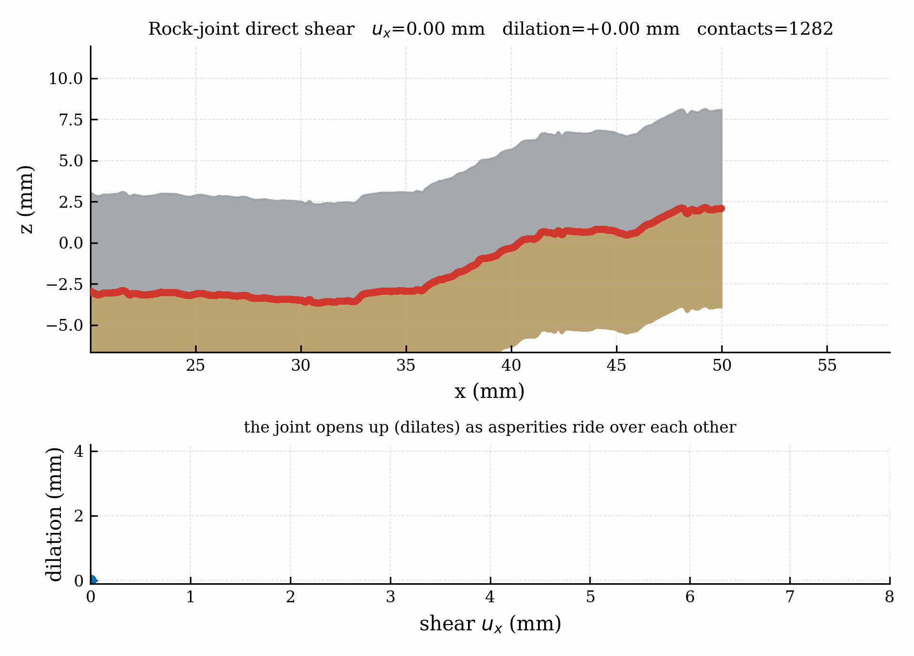
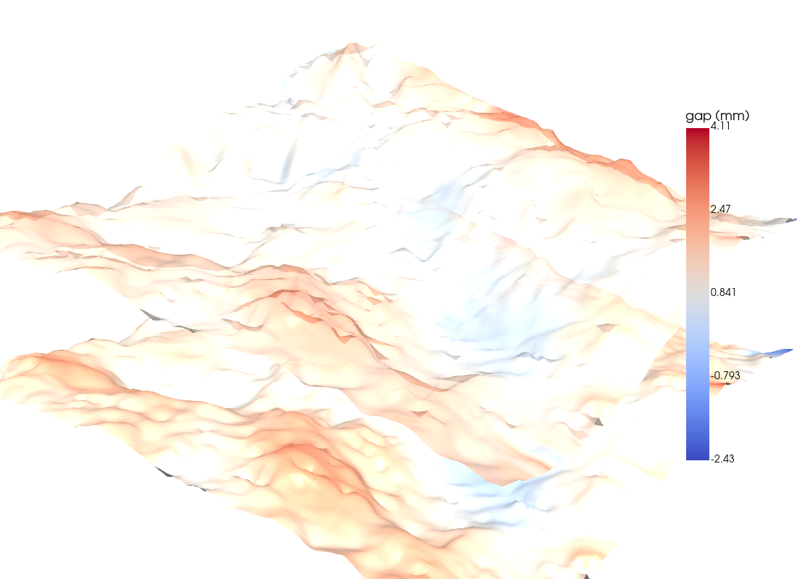
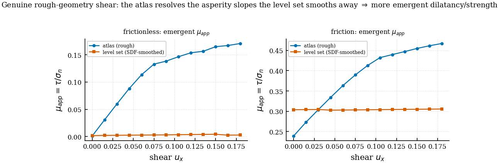

# Neural Atlas for Contact Mechanics

A meshfree framework for **contact mechanics on complex 3D geometries** using learned
**coordinate charts** and **neural signed-distance functions**, with a chart-based Material
Point Method (MPM), persistent-homology-based contact detection, and an analytical
verification suite that doubles as the acceptance test for the neural charts.

> **Status.** The contact framework (penalty / augmented-Lagrangian / friction / topology /
> self-contact) and a closed-form **analytical verification suite (CV-1..CV-6)** are in place. A
> **numerical verification suite** (branch `numerical-cv-suite`) now trains neural coordinate charts
> on the CV shapes and solves them — a ported chart-FEM + a 2-D FEM + three neural chart types —
> reproducing the closed forms to ~1–2% (CV-1 Hertz, CV-3 Brazilian, CV-4 nine-disc), and
> **measuring the chart-over-level-set advantage** (CV-5 cusps, CV-6 fractal). Full status &
> capability matrix: [§11.8 of the verification manual](docs/contact_verification_manual.md).
>
> The earlier **Nine-Circles brittle-fracture** work has been **archived** under
> [`archive/`](archive/) (code, tests, docs, figures) — preserved for history, not maintained.
> The repository is now focused solely on neural-atlas contact mechanics.

---

## Contact framework

A complete meshfree contact stack for the chart-based MPM, verified against analytic results or
machine precision on every path.

| Phase | Module | What it adds | Verification |
|---|---|---|---|
| 1 | `solvers/contact/gap.py`, `contact_pair.py`, `contact_manager.py` | SDF gap oracle (forward pass + autograd normal) + `ContactBody`/`ContactPair` + broad/narrow phase | Normal accuracy vs analytic sphere $< 1°$ |
| 2 | `solvers/contact/penalty.py` | Penalty force $f=\epsilon_n\langle -g\rangle_+ V_p\mathbf n$ + contact-stable $dt$ | P2G scatter conserves total contact force to machine precision |
| 3 | `solvers/mpm/schwarz_mpm.py::configure_contact` | Multi-body orchestration; vectorized broad-phase + per-chart force | Two-sphere collision: momentum conserved to $2\times10^{-15}$ |
| 4 | `solvers/contact/augmented_lagrangian.py` | Persistent Uzawa multiplier; exact enforcement at moderate $\epsilon_n$ | Ball-drop at $\epsilon_n=5\times10^4$: penalty 5.8 cm penetration, **AL 0 cm** |
| 6 | `solvers/contact/friction.py` | Regularized Coulomb $\mathbf f_T=-\mu\|\mathbf f_N\|\,\mathbf v_T/\sqrt{\|\mathbf v_T\|^2+\epsilon_T^2}$ | Sliding-block: measured $2.9423$ vs analytic $\mu g=2.9430$ m/s² (ratio 1.000) |
| 7 | `solvers/contact/contact_topology.py` | Persistent-homology events on combined SDF $\phi_{AB}=\min(\phi_A,\phi_B)$ | Two-sphere sweep: exactly one `first_contact`, one `separation` |
| 7b | `solvers/contact/contact_chart_spawn.py` | `spawn_contact_chart_pair()` bridges events to `add_charts()` | SDF normal → frame → spawn pair → solver grows 1→3 charts |
| 8 | `solvers/contact/self_contact.py` | Surface-filter + initial-gap-delta heuristic for folding | Folding-slab: 36 surface particles flagged, 5 bulk never active |

*(Phase 5 — an FEM-Robin contact-transmission path sketched in `contact_atlas/02_implementation_plan.md` — was not pursued; the framework is MPM-based.)*

**Key design decisions**
- **No Jacobian pull-back for contact forces** — MPM grid velocity/gravity are in physical space; contact forces scatter the same way (`f_I += f_p N_I(ξ_p)`, no $J^{-T}$). See `docs/contact_theory_manual.md §1.2`.
- **Penalty and AL share one force API** — both return per-particle force for `particle_to_grid(..., contact_force=...)`; swap strategies without touching the solver.
- **Friction is stateless and composable** — `compute_friction_force(v, n, ‖f_N‖, μ, ε_T)` plugs onto any normal-force scheme.
- **Topology monitor uses the combined-SDF $H_0$** — `ContactTopologyMonitor` reuses the `atlas/topo` persistent-homology pipeline for first-contact/separation/enclosure events.

| Benchmark | Demonstrates | File |
|---|---|---|
| Ball drop (penalty) | Bounded penetration & rebound | `benchmarks/contact/ball_drop_mpm.py` |
| Two-sphere collision | Symmetric multi-body momentum conservation | `benchmarks/contact/two_sphere_collision_mpm.py` |
| Ball drop (AL vs penalty) | AL reduces residual penetration 5.8 cm → 0 cm | `benchmarks/contact/ball_drop_al_mpm.py` |
| Sliding block + friction | Coulomb deceleration matches $\mu g$ to 0.025% | `benchmarks/contact/sliding_block_mpm.py` |
| Topology event sweep | $\beta_0$ transition detection | `benchmarks/contact/contact_topology_demo.py` |
| Folding slab (self-contact) | Folding without bulk false positives | `benchmarks/contact/folding_slab_mpm.py` |
| Superformula cam-drive | Nonconvex rigid-body contact (CV-5) | `benchmarks/contact/supershape_cam_drive.py` |

---

## Contact detection & computation via transition maps

Contacts are read from the **chart transition map** rather than from a level set alone. Each body
$X$ carries boundary charts $\varphi_X:\theta\mapsto x$ (analytic today; trained `ChartDecoder`s
once the neural charts land). The contact correspondence between two bodies $A,B$ is the
**boundary-to-boundary transition map**

$$\tau_{AB}:\ \theta_A\ \longmapsto\ \psi_B=\big(\varphi_B^{-1}\!\circ\varphi_A\big)(\theta_A),$$

i.e. take a surface point on $A$, $\varphi_A(\theta_A)$, into physical space and **invert $B$'s
chart** to find the matching surface parameter on $B$ (Newton inverse `common/geometry.py::invert_decoder`).

**Detect.** Sample one body's boundary chart and evaluate the partner's *inverse-chart gap*

$$g_B(p)=\lVert p-c_B\rVert-\rho_B(\psi),\qquad \psi=\angle\,Q_B^{-1}(p-c_B),$$

which for a star-shaped body is single-valued and smooth everywhere; $g_B<0 \Rightarrow$ penetration.
Scanning the chart parameter enumerates **every disjoint contact arc** — essential for nonconvex
shapes, where a single closest-point projection returns only one foot. (CV-5 shows this head-to-head:
the chart scan finds $\ge 2$ arcs while a single CPP reports 1.)

**Compute.** The contact normal comes from the **chart Jacobian**, not $\nabla\phi$:

$$\mathbf n=\frac{t_1\times t_2}{\lVert t_1\times t_2\rVert},\qquad t_\alpha=\frac{\partial\varphi}{\partial\xi^\alpha},$$

exact even at high-curvature lobe tips. The force is then the standard penalty / augmented-Lagrangian
normal force plus regularized Coulomb friction, scattered through the MPM P2G channel:
$\mathbf f=\epsilon_n\langle -g\rangle_+\,\mathbf n\ (+\ \text{friction})$.

**Why it helps (vs the SDF closest-point projection).** The transition map is single-valued and
analytic in concavities, where the Euclidean SDF closest-point projection (Liu & Sun 2020, Eq. 22)
becomes multivalued across the medial axis and the Eikonal normal degrades. **Honest caveats:** the
inverse radial gap is *not* the Euclidean perpendicular distance (biased $\sim 1/\cos\alpha$ on steep
flanks — a bounded 1-D chart refine removes it); and the production oracle `solvers/contact/gap.py`
**currently uses the neural-SDF gradient** — the transition-map chart oracle is the analytical
formulation exercised by CV-1..CV-6 and the target once neural charts replace the SDFs.

Full treatment: `docs/contact_theory_manual.md` (algorithms), `docs/contact_verification_manual.md`
§2 (kinematics) and §11 (neural-chart verification protocol), `solvers/contact/supershape.py` (CV-5).

---

## Analytical verification (CV-1..CV-6)

Closed-form contact solutions, derived in SymPy and adversarially cross-checked against Johnson's
*Contact Mechanics* and Timoshenko–Goodier, recast in the neural-atlas / transition-map framing.
They are the **acceptance targets for the neural charts**.

| Benchmark | Problem | Closed-form targets |
|---|---|---|
| **CV-1** | Hertz normal contact (3D + 2D) | $a,p_0,\delta$, force–approach, subsurface yield |
| **CV-2** | Cattaneo–Mindlin friction | stick radius $c/a$, tangential traction |
| **CV-3** | Brazilian disc | $\sigma_t=2P/\pi Dt$, stress field, diametral compliance |
| **CV-4** | Nine-disc packing | equibiaxial center, force–compression law |
| **CV-5** | Nonconvex superformula contact | multi-arc detection, chart-gap vs SDF (the transition-map test) |
| **CV-6** | Koch snowflake fractal contact | $O(1)$-storage, resolution-independent IFS chart ($O(\text{depth})$ detection) vs $O(9^n)$ uniform / $O(4^n)$ adaptive SDF |

See **[docs/contact_verification_manual.md](docs/contact_verification_manual.md)** for the pass
criteria, embedded figures, and the **two-level neural-chart verification protocol (§11)**. Symbolic
derivations + numpy evaluators: **[docs/hertz_derivation/](docs/hertz_derivation/README.md)** and
`postprocessing/contact_fields.py`.

### Numerical verification (branch `numerical-cv-suite`)

The CV closed forms are now used as acceptance targets for **trained neural charts solved
numerically** — a chart-based FEM (`solvers/fem/`, ported + verified: patch test, MMS $O(h^2)$), a
2-D plane-stress FEM, and three neural chart types (neural SDF, neural radial/transition-map chart,
and the ChartDecoder domain map). Drivers in `benchmarks/contact/cv_numerical/`; measured results:

| CV | numerical result vs closed form |
|---|---|
| **CV-1** Hertz | FEM line contact, neural disc-SDF indenter; $a(F)$–$E^*$ to **~1.6%** |
| **CV-2** Cattaneo | FEM tangential stick/slip; $c/a=\sqrt{1-Q/\mu P}$ to **~5–11%** |
| **CV-3** Brazilian | FEM centre stress to **1.62% / 0.58%** |
| **CV-4** nine-disc | FEM unit cell, equibiaxial centre to **0.15%** |
| **CV-5** superformula | neural **radial chart** (gap 3.8e-3, normal 0.42°) **beats** the neural SDF (gap 8e-3, degraded normal); neural-detection dynamics match the analytical chart to **0.04%** |
| **CV-6** Koch | neural-SDF refinement ceiling **measured** (charts beat level-sets on fractals) |



Full status, honest caveats, and the can/cannot **capability matrix**:
[§11.8 of the verification manual](docs/contact_verification_manual.md).

### Capstone (CV-7) — direct shear of a real fractal rock joint

The closed-form suite earns the right to turn the machinery on a problem with **no closed form**: the
direct shear of a real **Inada-granite** tensile fracture (Digital Rocks Portal #273, DOI
`10.17612/QXSA-TK92`; self-affine, $D\approx2.2$, RMS 1.7 mm, 23.4 µm). Each face is a learned 1-D
height chart $h_\theta(x)$ (`solvers/contact/profile_chart_2d.py`); two mating faces are sheared
under plain Coulomb (no dilatancy law), so dilation and the friction angle are **emergent from the
resolved asperity geometry**. Measured:

- **Method anchor:** mating sawtooth shear reproduces the closed-form Patton law $\tan(\phi_b+i)$ to **0.00%**.
- **Chart vs level set:** the height chart reconstructs the surface to **2.3 µm**; a real ambient 2-D
  neural SDF reaches only **107 µm (47× worse) with more parameters**, smoothing the mean asperity
  angle 19.4°→12.5° — so the level set **under-predicts peak shear strength by 61%**.
- **Roughness:** rougher joint dilates more (3.13 vs 2.53 mm, ensemble of 24 real scanlines).





Detail + honest caveats: [§11.9 of the verification manual](docs/contact_verification_manual.md).

#### 3-D extension — mixed-mode cyclic shear of a deformable joint

The capstone extends to a full **3-D surface** $h_\theta(x,y)$ (`solvers/contact/surface_chart_3d.py`),
the three **loading modes** (in-plane / out-of-plane / mixed, `rock_joint_shear_3d.py`), and a
**deformable two-block chart-FEM** with a dilatant-frictional interface under **mixed-mode cyclic
loading** (`rock_joint_cyclic_fem.py`). Measured:

- **3-D anisotropy (rigid):** across vs along ridges → Patton (0.00 %) vs $\mu/\cos i$ (zero dilation);
  on the real Inada surface the three modes differ (steady $\mu_{\rm app}$ 0.28 / 0.48 / 0.44; dilation
  1.0 / 1.9 / 1.8 mm) with a transverse-traction coupling — the genuine 3-D payoff.
- **Deformable FEM (verified, monotonic):** flat → Coulomb $\tau/\sigma_n=\mu$ (0.2 %); dilatant →
  Patton $\tan(\phi_b+i)$ (0.2 %). **Cyclic:** hysteresis loops + CNV normal-stress coupling + Plesha
  asperity degradation (peak decays 0.669→0.609 over 4 cycles). *Cyclic energy balance is approximate
  (~1.5×) — Coulomb non-smoothness; honest caveat in §11.10.*
- **PyVista** 3-D animation of the two real surfaces shearing (`figures/rock_joint_3d_shear.gif`).



Detail + V&V: [§11.10 of the verification manual](docs/contact_verification_manual.md).

#### The genuine atlas-vs-level-set demonstration (no shortcut)

§11.10's deformable model imposed the dilation via an effective angle on a *flat* interface (kept as a
labeled benchmark). The genuine version trains a **boundary-fitted ChartDecoder** for the rough block,
**verifies it first**, then solves Coulomb friction on the *actual rough geometry* — dilation EMERGES
from the asperities (`solvers/fem/rough_block_decoder.py`,
`benchmarks/contact/cv_numerical/{cv7_decoder_verify,rock_joint_decoder_shear,cv7_atlas_vs_sdf_shear}.py`):

- **Verified first:** the Fourier decoder reconstructs the rough surface to **2.2% of RMS** (a vanilla
  tanh decoder: 48% — spectral bias), the chart-FEM has no element foldover, and converges **O(h²)** on
  the curved geometry.
- **Emergent (not imposed):** frictionless shear → μ_app 0→0.17 (pure geometric dilatancy ≈9.7°); with
  μ=0.3 → 0.47.
- **Payoff:** the same shear on the ambient-SDF-smoothed geometry under-predicts the dilatancy by **98%**
  (frictionless) and the strength by **35%** — the level set smooths the asperity slopes the atlas resolves.



Detail + honest caveats: [§11.11 of the verification manual](docs/contact_verification_manual.md).

---

## Quick start

```bash
pip install -e .

# Run the active test suite (contact + core MPM)
pytest -q                                   # 120 passed, 7 skipped

# Analytical CV references (self-checking, no solver needed)
python3 postprocessing/contact_fields.py            # numpy evaluators self-test
python3 docs/hertz_derivation/hertz_transition_map.py
python3 docs/hertz_derivation/brazilian_disc_atlas.py
python3 docs/hertz_derivation/nine_disc_atlas.py

# Contact benchmarks
python3 benchmarks/contact/ball_drop_al_mpm.py
python3 benchmarks/contact/sliding_block_mpm.py
python3 benchmarks/contact/two_sphere_collision_mpm.py
python3 benchmarks/contact/supershape_cam_drive.py          # + --free-A control

# Regenerate the verification figures
python3 postprocessing/plot_liusun_all.py
python3 postprocessing/plot_supershape_demo.py
```

---

## Documentation

| Document | Description |
|----------|-------------|
| [Contact Theory Manual](docs/contact_theory_manual.md) | Algorithms: SDF gap oracle, penalty, augmented Lagrangian, regularized Coulomb friction, topology-aware detection, contact chart spawning, self-contact, multi-body orchestration |
| [Contact Verification Manual](docs/contact_verification_manual.md) | CV-1..CV-6 closed-form benchmarks (embedded figures) + the **neural coordinate-chart verification protocol (§11)** |
| [Analytical derivations index](docs/hertz_derivation/README.md) | SymPy derivations, numpy evaluators, plotting, and how it all maps to CV-1..CV-6 |
| [MPM Velocity-Gradient Audit](docs/mpm_velocity_gradient_audit.md) | Curved-chart MPM velocity-gradient correctness (the integrator underpinning contact) |
| [Design docs](contact_atlas/) | Brainstorm, implementation plan, variational theory & well-posedness |

---

## Repository structure

```
neural_atlas_MPMcontact/
├── atlas/            # SDF training, chart construction, persistent-homology topology
├── common/           # ChartDecoder / MaskNet / MLP, geometry (Jacobians, invert_decoder), Schwarz utils
├── solvers/
│   ├── mpm/          # chart-based MPM (particles, grid, transfers, constitutive, schwarz_mpm)
│   └── contact/      # gap, penalty, augmented_lagrangian, friction, contact_topology,
│                     #   contact_chart_spawn, self_contact, contact_manager, supershape
├── benchmarks/
│   ├── contact/      # ball-drop, two-sphere, sliding-block, folding-slab, topology, supershape cam-drive
│   └── mpm_basic/    # (placeholder for MPM core benchmarks)
├── postprocessing/   # contact_fields (numpy refs), pyvista_field2d, plot_liusun_*, plot_supershape_demo, utils
├── docs/             # contact_theory_manual, contact_verification_manual, hertz_derivation/, mpm audit
├── contact_atlas/    # design docs (brainstorm, implementation plan, math theory)
├── tests/            # contact + core-MPM tests (test_neural_chart_verification.py = neural-chart harness)
├── figures/          # contact figures (embedded in the verification manual)
└── archive/          # legacy Nine-Circles fracture work — preserved, not maintained
```

---

## Next steps (neural coordinate charts)

The neural-chart pipeline is now **built and verified** on the `numerical-cv-suite` branch: neural
SDFs (`atlas/sdf/train_analytical_sdf.py`) and the neural radial chart
(`atlas/charts/train_radial_chart.py`) are trained on the CV shapes and solved with the chart-FEM
(`solvers/fem/`) / rigid-body engine against the closed forms via the two-level protocol
(`docs/contact_verification_manual.md §11`, §11.8). Remaining work:
1. The **ChartDecoder domain map trained per CV shape** (the FEM is verified to run on a ChartDecoder;
   the per-shape atlas is the remaining Stage-2 piece).
2. The **full N-body explicit-contact disc array** (CV-4 currently verifies the per-disc unit cell).
3. **3-D axisymmetric Hertz** (needs adaptive/local mesh refinement for the small contact patch) and
   **MPM dynamic cross-checks**.

---

## References

- K. L. Johnson (1985), *Contact Mechanics*, Cambridge Univ. Press.
- Timoshenko & Goodier, *Theory of Elasticity*; Mindlin (1949); Hondros (1959).
- C. Liu & W. Sun (2020), "ILS-MPM," *CMAME* 369:113168.
- Alart & Curnier (1991); Simo & Laursen (1992); Wriggers (2006) — contact algorithms.
- Cohen-Steiner, Edelsbrunner & Harer (2007) — persistence-diagram stability.
