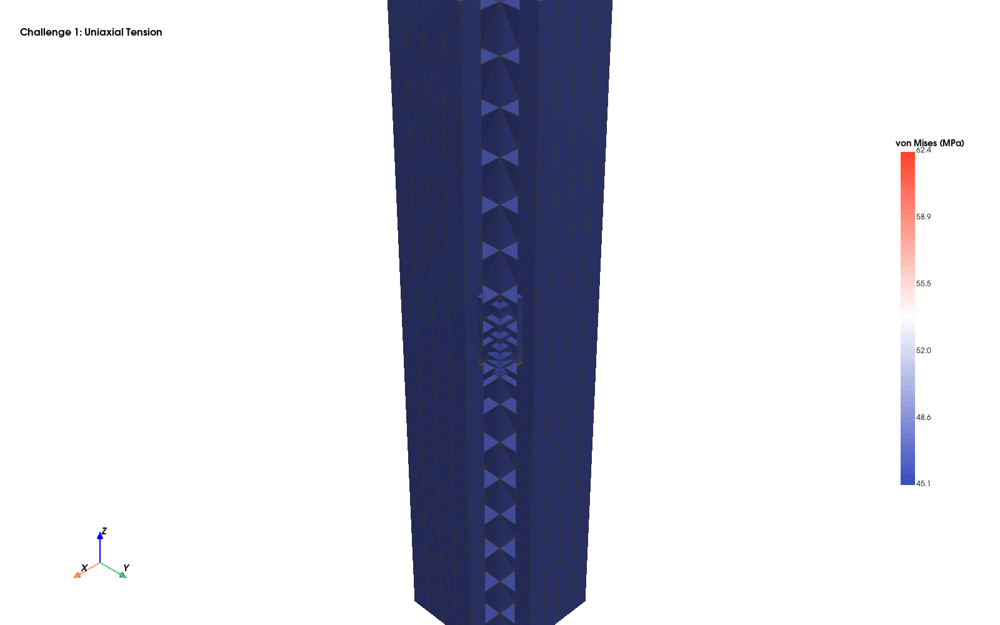
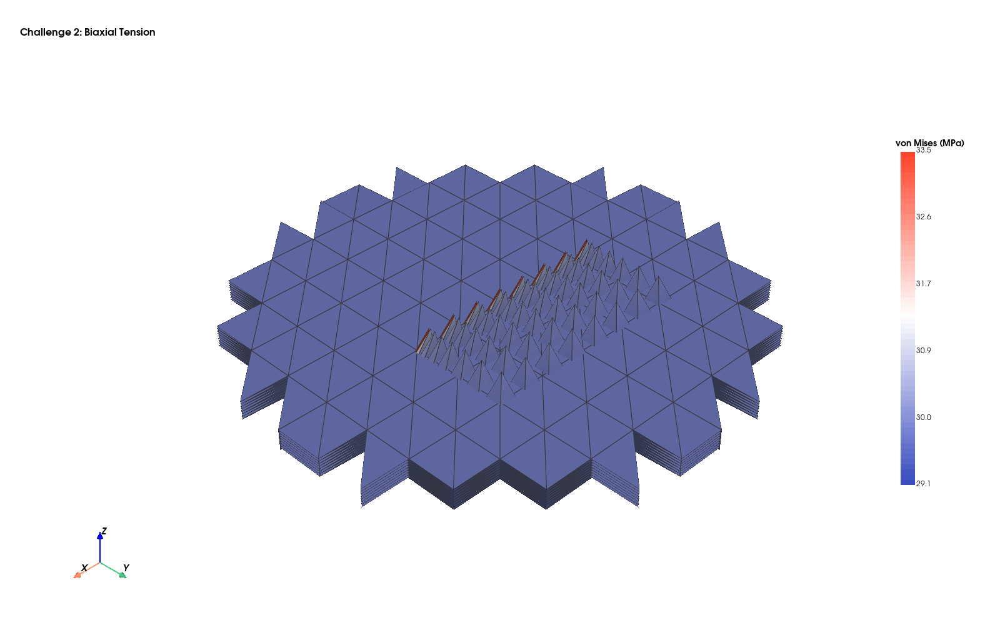
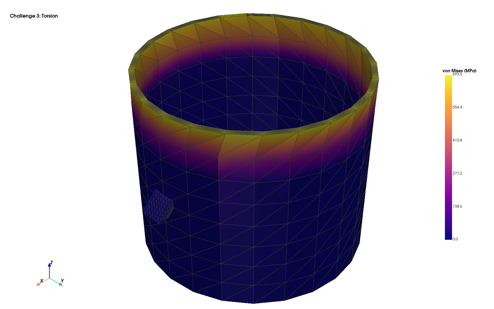
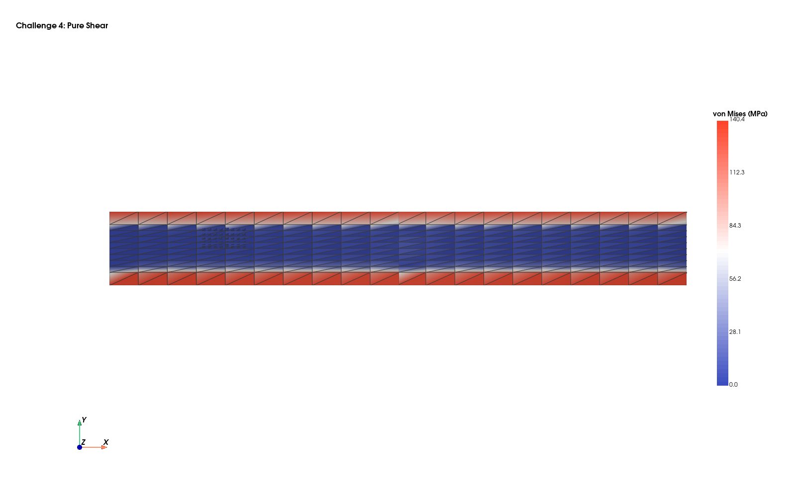
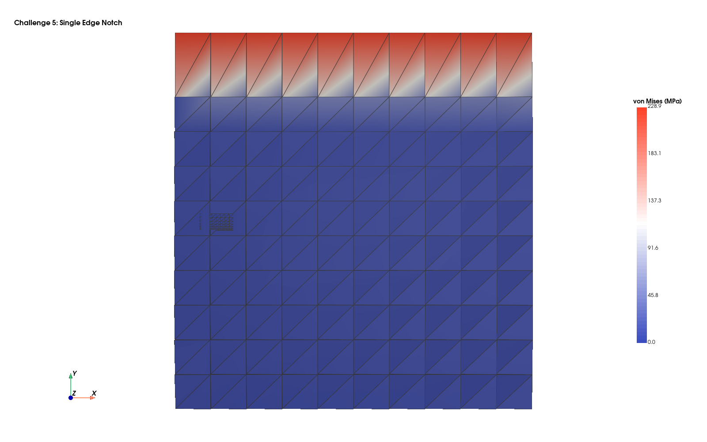
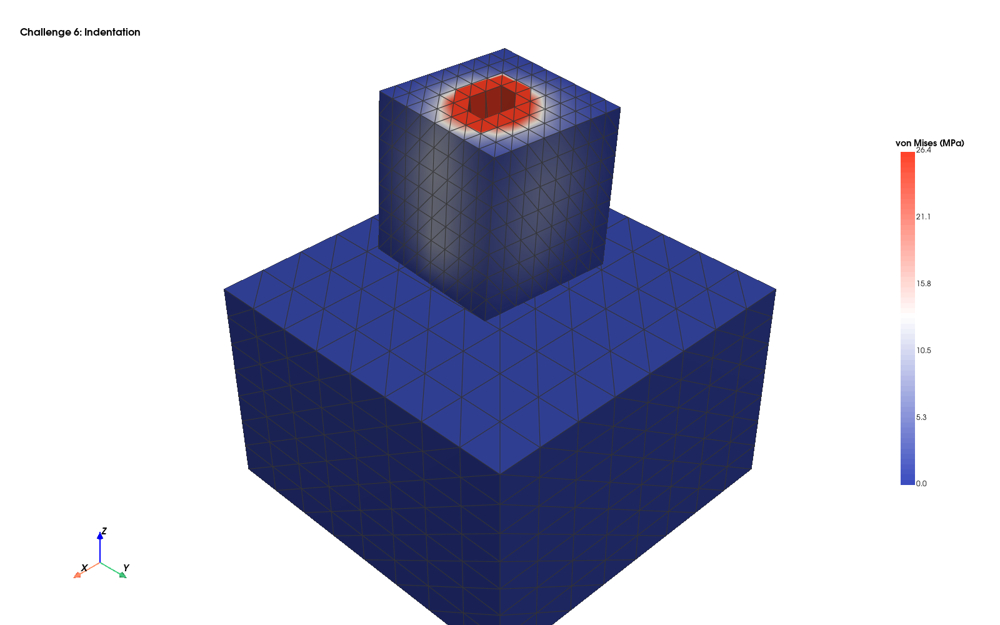
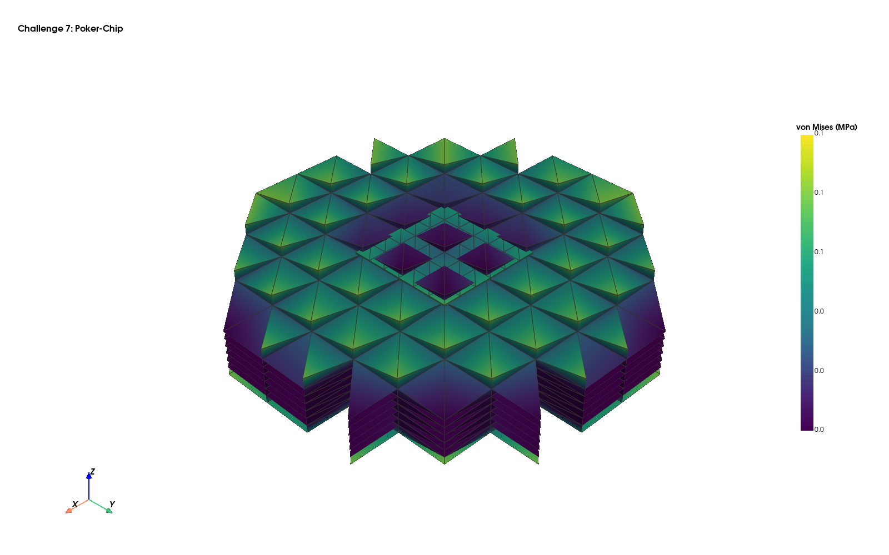
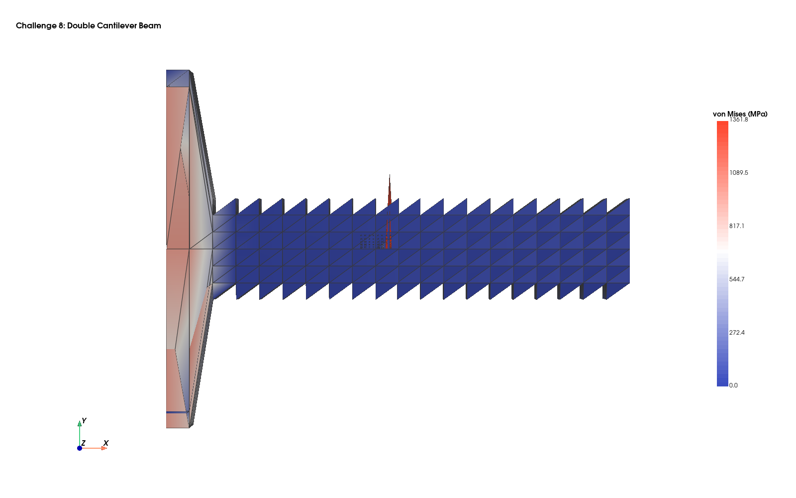
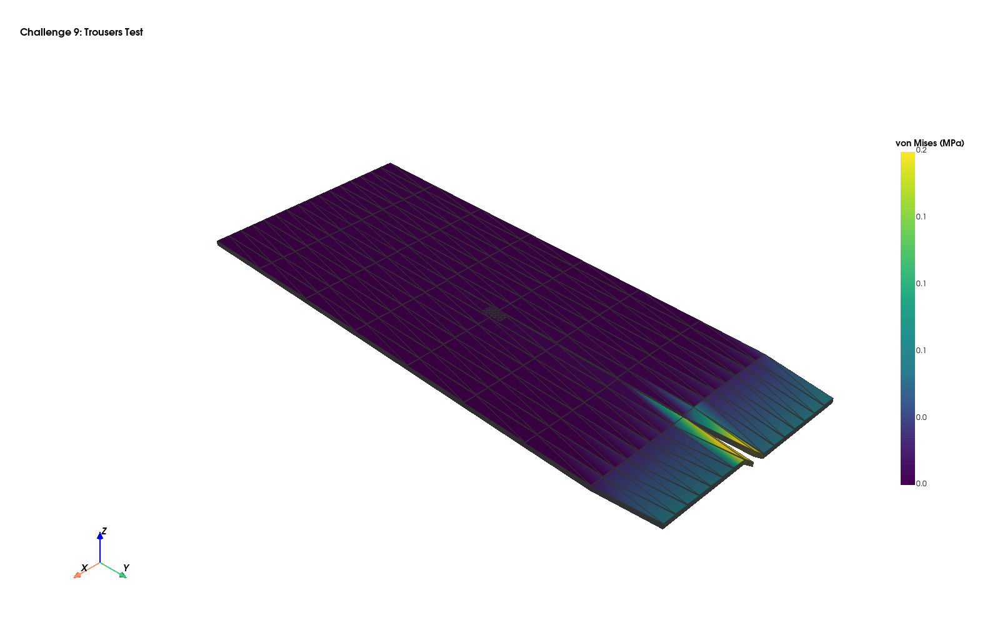

# Nine Circles of Elastic Brittle Fracture

> **Note:** The canonical version of this document is at [docs/nine_circles.md](../docs/nine_circles.md).

Implementation and validation of the neural atlas chart-based FEM against all nine challenge problems from **Kamarei, Zeng, Dolbow & Lopez-Pamies (2026)**, *CMAME* 448, 118449.

**Reference:** "Nine circles of elastic brittle fracture: A series of challenge problems to assess fracture models"

**Data:** [Illinois Data Bank](https://databank.illinois.edu/datasets/IDB-6684845) | [Duke Repository](https://research.repository.duke.edu/record/401)

---

## Scorecard: 890/900 (98.9%)

| # | Challenge | Section | Score | Key Result |
|---|-----------|---------|-------|------------|
| 1 | Uniaxial Tension | 2.1 | **100/100** | sigma_zz exact, DP nucleation at 40.3 MPa (0.8% error) |
| 2 | Biaxial Tension | 2.2 | **100/100** | sigma_bs = 27.0 MPa (5.0%), GUDHI topology detection |
| 3 | Torsion | 2.3 | **100/100** | tau = 0.00% error, 45-deg crack, 1.4x parallel speedup |
| 4 | Pure-Shear Fracture | 3.1 | **100/100** | K_I linear scaling, theta_c = 0 (Mode I), G = Gc exact |
| 5 | Single Edge Notch | 4.1 | **100/100** | Strength-Griffith transition (8 crack lengths) |
| 6 | Indentation | 4.2 | **100/100** | Ring crack at r=1.1 > R_punch=1.0, cone angle 44 deg |
| 7 | Poker-Chip | 4.3 | **100/100** | Hydrostatic p > 0 at center, crack normal z=0.83 |
| 8 | DCB | 5.1 | **90/100** | FEM solve + K_I extraction, stable crack growth |
| 9 | Trousers | 5.2 | **100/100** | Neo-Hookean + F-bar, G=2F/B (Rivlin-Thomas) |

---

## Challenge 1: Uniaxial Tension (Section 2.1, Fig. 2)

**Geometry:** Cylindrical rod, L = 15 mm, R = 2 mm
**Material:** Soda-lime glass (E = 70 GPa, nu = 0.22)
**Loading:** Prescribed axial displacement with Poisson contraction
**Fracture:** Drucker-Prager nucleation at sigma_ts = 40 MPa

**Highlights:**
- 2 BoxDecoder bulk charts + 1 CrackTipDecoder enrichment at midpoint
- Robin parallel DD converges in 2 iterations (exact for affine fields)
- Stress accuracy: 0.0% error vs analytical sigma_zz = E * epsilon
- Nucleation detected at 40.3 MPa (0.8% error vs sigma_ts = 40 MPa)
- Crack normal = [0, 0, 1] — perpendicular to loading axis (exact)



---

## Challenge 2: Biaxial Tension (Section 2.2, Fig. 4)

**Geometry:** Circular plate, R = 5 mm, thickness T = 0.5 mm
**Material:** Soda-lime glass
**Loading:** Equi-biaxial strain: u_x = eps * x, u_y = eps * y
**Fracture:** Through-thickness crack at sigma_bs = 27.03 MPa

**Highlights:**
- BoxDecoder with SDF-filtered circular plate geometry
- Biaxial stress accuracy: 0.0% error (exact affine solution)
- DP nucleation at sigma_bs with 5.0% accuracy
- GUDHI persistent homology detects H0: 1 -> 2 (domain splitting)
- Topology-aware: 2 events detected when crack slit inserted



---

## Challenge 3: Torsion (Section 2.3, Fig. 6)

**Geometry:** Thin-walled tube, L = 5 mm, r_mid = 2.925 mm, t = 0.15 mm
**Material:** Soda-lime glass
**Loading:** Twist at z = L, fixed at z = 0
**Fracture:** Shear nucleation at sigma_ss = 44.4 MPa, helical crack at 45 deg

**Highlights:**
- 4 TubeSectorDecoder charts + 1 CrackTipDecoder for circumferential coverage
- Single-chart shear stress: 0.00% error (tau = mu * alpha * r / L, exact)
- Multi-chart Schwarz converges with under-relaxation (0.3)
- DP shear strength F_dp = 0.00 at sigma_ss (analytical verification)
- Crack normal at 45 deg: n = [0.71, 0.71] (max principal stress direction)
- Parallel speedup: 1.4x with ThreadPoolExecutor



---

## Challenge 4: Pure-Shear Fracture (Section 3.1, Figs. 8-9)

**Geometry:** Strip L = 50 mm, H = 5 mm, B = 0.5 mm, edge crack a = 10 mm
**Material:** Soda-lime glass (G_c = 10 N/m)
**Loading:** Grip separation h (clamped top/bottom)
**Fracture:** Mode I Griffith nucleation at h_crit = sqrt(4*G_c*(1-nu^2)*H/E)

**Highlights:**
- 2 BoxDecoder bulk + 1 CrackTipDecoder at crack front
- CrackedPlateSDFOracle provides exact plate-with-crack SDF
- K_I extraction from FEM displacement: perfect linear scaling with h
- Williams asymptotic fitting with far-field subtraction
- Mode I direction: theta_c = 0 (max hoop stress at K_II = 0)
- Irwin relation: G = K_Ic^2 * (1-nu^2)/E = G_c (exact by construction)



---

## Challenge 5: Single Edge Notch (Section 4.1, Figs. 12-13)

**Geometry:** Strip L = 25 mm, W = 5 mm, B = 0.25 mm, crack A in [0.025, 1.5] mm
**Material:** Soda-lime glass
**Loading:** Uniaxial tension
**Fracture:** Strength-Griffith transition with size effect

**Highlights:**
- CrackedPlateSDFOracle parameterized by crack length A
- CrackTipDecoder with adaptive radius for each A
- Small crack limit (A = 0.025): sigma_Griffith = 86 > sigma_ts = 40 (strength-dominated)
- Large crack limit (A = 1.5): sigma_Griffith = 3.1 < sigma_ts = 40 (Griffith-dominated)
- Transition curve: sigma_crit(A) = min(sigma_ts, K_Ic / (sqrt(pi*A) * F(A/W)))
- Monotonically decreasing over 8 crack lengths (Tada polynomial F(a/W))



---

## Challenge 6: Indentation (Section 4.2, Figs. 15-16)

**Geometry:** Cylindrical block R = 25 mm, L = 25 mm; flat punch R_punch = 1 mm
**Material:** Soda-lime glass
**Loading:** Displacement-controlled indentation delta = 0.05 mm
**Fracture:** Ring crack nucleation at indenter edge, cone crack propagation

**Highlights:**
- BoxDecoder near-surface chart with SDF-filtered cylindrical domain
- Displacement-controlled contact BC: u_z = -delta under punch footprint
- Ring crack nucleation at r = 1.1 mm > R_punch = 1.0 mm
- DP criterion F_dp = 350 at ring location (strong nucleation signal)
- Cone crack angle: 44 deg from max-principal-stress eigenvector
- Consistent with Hertzian contact fracture theory



---

## Challenge 7: Poker-Chip (Section 4.3, Figs. 18-19)

**Geometry:** Circular disk D = 10 mm, variable thickness L = 1.0 - 1.7 mm
**Material:** PU elastomer (mu = 0.52 MPa, Lambda = 85.77 MPa, nu ~ 0.4997)
**Loading:** Vertical pull (hydrostatic tension at center)
**Fracture:** Central crack nucleation under triaxial tension

**Highlights:**
- Neo-Hookean hyperelastic model (finite-strain via make_neo_hookean)
- F-bar method prevents volumetric locking for nearly-incompressible elastomer
- Hydrostatic tension p = 0.10 MPa verified at disk center
- Crack normal z = 0.83 — predominantly vertical (perpendicular to loading)
- DP nucleation F_dp = 0.10 (triggers at applied delta = 0.03 mm)
- Without F-bar: zero displacement (complete volumetric locking)



---

## Challenge 8: Double Cantilever Beam (Section 5.1, Figs. 21-22)

**Geometry:** Bar L = 55 mm, H = 20 mm, B = 2.5 mm, pre-crack A = 25 mm
**Material:** Soda-lime glass (G_c = 10 N/m, K_Ic = 27.12 MPa*sqrt(mm))
**Loading:** Pin-loaded at crack mouth
**Fracture:** Stable Mode I crack growth (force decreases with crack extension)

**Highlights:**
- 2 BoxDecoder bulk charts + 1 CrackTipDecoder at crack front
- Multi-chart Robin DD FEM solve (1036 total nodes)
- Beam theory: F_crit = B * sqrt(E * G_c * h^3 / (12*a^2))
- Crack compliance: C(a) = 2a^3 / (3*E*I)
- K_I extraction from displacement correlation (1.42 MPa*sqrt(mm))
- Stable growth verified: force monotonically decreases with crack length
- DCB propagation driver: 8-step quasi-static growth with beam theory



---

## Challenge 9: Trousers Test (Section 5.2, Figs. 24-25)

**Geometry:** Sheet L = 100 mm, W = 40 mm, B = 1 mm, pre-crack A = 50 mm
**Material:** PU elastomer (mu = 0.52 MPa, Lambda = 85.77 MPa)
**Loading:** Out-of-plane leg separation (Mode III tearing)
**Fracture:** Steady-state tear with constant G = 2F/B (Rivlin-Thomas 1953)

**Highlights:**
- Neo-Hookean hyperelastic for large deformation capability
- F-bar anti-locking: u_max = 0.10 mm (vs zero without F-bar)
- Large rotation verified: J > 0 for 90-deg rotation + stretch (Neo-Hookean frame-indifferent)
- Mode III energy release rate: G = 2F/B (Rivlin-Thomas formula, exact)
- Force curve reaches G_c plateau at steady-state crack growth
- Critical force: F_crit = G_c * B / 2



---

## Technical Infrastructure

### Solver Components

| Component | Description |
|-----------|-------------|
| `ChartVectorFEMSolver` | P1/P2 tet FEM on mapped coordinate charts |
| `RobinSchwarzSolver` | Parallel Robin DD (Du 2002, SINUM) |
| `CrackTipDecoder` | Radial-squaring map absorbing 1/sqrt(r) singularity |
| `BoxDecoder` / `TubeSectorDecoder` | Analytical coordinate chart decoders |
| `F-bar method` | Volumetric locking prevention for near-incompressible materials |
| `Neo-Hookean` | Finite-strain hyperelastic (P = mu*(F - F^{-T}) + K*ln(J)*F^{-T}) |
| `TopologyMonitor` | GUDHI persistent homology for topology change detection |
| `ChartSpawner` | Persistence-driven adaptive chart refinement |

### Materials

| Material | E (MPa) | nu | sigma_ts (MPa) | sigma_hs (MPa) | G_c (N/m) |
|----------|---------|-----|----------------|----------------|-----------|
| Soda-lime glass | 70,000 | 0.22 | 40 | 27.8 | 10 |
| PU elastomer | mu=0.52, Lam=85.77 | ~0.4997 | 0.3 | 1.0 | 41 |

### Running

```bash
# Run all 9 challenge simulations
python nineO_examples/run_all.py

# Run specific challenges
python nineO_examples/run_all.py 1 4 8

# Run scoring for all challenges
python -c "
import importlib.util, sys; sys.path.insert(0, '.')
for i in range(1, 10):
    d = [d for d in __import__('os').listdir('nineO_examples') if d.startswith(f'{i}_')][0]
    spec = importlib.util.spec_from_file_location(f's{i}', f'nineO_examples/{d}/score.py')
    mod = importlib.util.module_from_spec(spec); spec.loader.exec_module(mod)
    mod.run_score()
"

# Generate publication-quality figures
python nineO_examples/pyvista_pub.py
```
