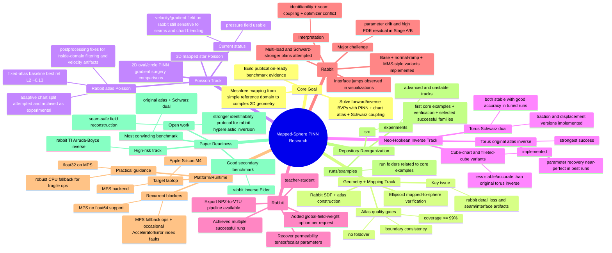

# Mapped Sphere Method Research Handoff (ChatGPT 5.2)

## How To Use This
1. Upload this file plus `/Users/wsun/Documents/Softwares/Mapped_sphere_method_for_complex_geometry/PINN_coordinate_chart_3Dgeometry/docs/chatgpt52_context_pack.json` to ChatGPT 5.2.
2. Paste `/Users/wsun/Documents/Softwares/Mapped_sphere_method_for_complex_geometry/PINN_coordinate_chart_3Dgeometry/docs/chatgpt52_seed_prompt.txt`.
3. Ask ChatGPT to continue from the "Open Questions" and "Next Experiment Queue" sections.

## Mind Map

## Status Snapshot
- Best-performing families (from `/Users/wsun/Documents/Softwares/Mapped_sphere_method_for_complex_geometry/PINN_coordinate_chart_3Dgeometry/runs/run_ranking_latest.json`):
  - `torus_inverse_original_atlas` (best score `~3.96e-07`)
  - `torus_inverse_schwarz_displacement` (best score `~6.73e-03`)
  - `torus_inverse_schwarz_traction` (best score `~1.02e-02`)
  - `mapping_rabbit` (best score `~2.72e-02`)
  - `rabbit_inverse_elder` (best score `~4.31e-02`)
- Medium performance:
  - `rabbit_poisson_atlas` (best score `~7.43e-02`, but velocity field quality remains sensitive)
- Weak/high-risk:
  - rabbit TI Arruda-Boyce inverse variants
  - torus cube/filleted-INN mapping variants

## Code Map (Current Layout)
- Stable/core scripts in `/Users/wsun/Documents/Softwares/Mapped_sphere_method_for_complex_geometry/PINN_coordinate_chart_3Dgeometry/src`:
  - `pinn_gradient_surgery.py`
  - `pinn_3d_ellipsoid_mapped_sphere.py`
  - `train_sdf_rabbit.py`
  - `train_mapping_from_sdf.py`
  - `run_poisson_star3d_mapped.py`
  - `run_rabbit_inverse_neohookean_mapped.py`
  - `run_torus_inverse_neohookean_atlas.py`
  - `run_torus_inverse_neohookean_schwarz_dual.py`
  - `run_rabbit_inverse_elder_atlas_schwarz.py`
  - `export_rabbit_elder_inverse_paraview.py`
- Advanced/unstable tracks in `/Users/wsun/Documents/Softwares/Mapped_sphere_method_for_complex_geometry/PINN_coordinate_chart_3Dgeometry/experiments`

## High-Value Open Questions
1. Rabbit Poisson velocity artifacts: seam-safe gradient reconstruction and robust streamline-quality export.
2. Rabbit Arruda-Boyce inverse drift: whether single traction family is sufficient for 4-parameter TI identification.
3. Schwarz interface enforcement: best balance between continuity and global field fidelity on highly detailed rabbit charts.
4. MPS reliability: isolating ops that should always run on CPU for deterministic stability.

## Next Experiment Queue (Paper-Oriented)
1. Final torus evidence pack:
   - 3 seeds, traction/displacement Schwarz dual, mean/std tables, VTU figures.
2. Rabbit Elder upgraded evidence:
   - keep successful setup, add small global field penalty, report identifiability and robustness.
3. Rabbit Poisson figure-quality pass:
   - pressure-focused + seam-filtered velocity visualization policy for publication.
4. Rabbit Arruda-Boyce (if kept):
   - staged identifiability study first (sensitivity rank + condition + load design), then inverse fitting.

