# Contact Mechanics Verification Manual (Neural Atlas)

Analytical benchmarks for verifying a neural-atlas contact implementation. Every
result below is a closed form derived in SymPy and adversarially cross-checked
against Johnson, *Contact Mechanics* (1985) and Timoshenko & Goodier, *Theory of
Elasticity*. CV-1..CV-4 reproduce the contact problems of Liu & Sun (2020),
"ILS-MPM" (CMAME 369:113168); CV-5 (superformula) and CV-6 (Koch snowflake) are
additional transition-map / resolution-independence benchmarks.

This manual is the **verification** companion to:
- `docs/contact_theory_manual.md` — contact *algorithms* (penalty, AL, friction, topology);
- `contact_atlas/03_mathematical_theory.md` — contact *theory* (variational, well-posedness).

Each benchmark gives: **Goal → Formulation → Pass criteria → Artifact/Test**.
Symbolic artifacts live in `docs/hertz_derivation/`; the numpy evaluators that
reproduce them (and drive the figures) live in `postprocessing/contact_fields.py`.

---

## 1. Purpose & scope

**Primary purpose — verify the neural coordinate charts.** These benchmarks use *analytical*
charts (Monge patches, Flamant/superformula boundary parametrizations, analytical SDFs) for which
the contact gap, normal, stress field, and force–displacement response are known in **closed form**.
When the project switches to **trained neural charts** — a neural SDF (`atlas/sdf/train_sdf.py::SDFNet`)
and/or a `ChartDecoder` (`common/models.py`, trained by `atlas/charts/train_atlas.py`) replacing the
analytical chart — these closed forms become the **acceptance targets**: train the neural chart on the
same analytical shape, then check that its gap/normal/field/force match the analytical reference within
a tolerance that accounts for neural approximation error. The concrete recipe is in **§11 (Neural
coordinate-chart verification protocol)**; `postprocessing/contact_fields.py` holds the numpy reference
values and `tests/test_neural_chart_verification.py` is the (skeleton) harness.

Verification is **two-level**, so a failure localizes to geometry vs mechanics:
- **L0 — geometry/kinematics** (solver-free): does the neural chart reproduce the analytical **gap** and
  **normal** at query points? (gap RMSE, normal angle error.) This isolates the chart/SDF itself.
- **L1 — mechanics**: does a contact *solve* built on the neural chart reproduce the analytical
  **pressure / stress field / contact radius / force–displacement**?

These are small-strain, linear-elastic, quasi-static, frictionless-or-monotone references — code-
verification targets, not models of the full finite-deformation frictional MPM; they must be matched in
the appropriate limit (see §11).

---

## 2. Transition-map contact kinematics

In the neural-atlas framing, contact is read from the **chart transition map**
rather than a level set. For a surface point $x_B=\varphi_j^B(\xi_B)$ on body $B$,
the closest point on body $A$ is obtained by inverting $A$'s surface chart
(Newton `common/geometry.py::invert_decoder`), and the contact normal is the
chart-Jacobian cross product

$$ n = \frac{t_1\times t_2}{\lVert t_1\times t_2\rVert},\qquad t_\alpha=\frac{\partial\varphi^A}{\partial\xi^\alpha}. $$

The undeformed gap is the chart form of ILS-MPM Eq. 25,
$g_{n0}=(\varphi^{(j)}-\varphi^{(i)})\cdot n$.

**Honest scope.** For paraboloid (Monge) surfaces the chart-Jacobian normal equals
the SDF-gradient normal $\nabla\phi/\lVert\nabla\phi\rVert$ (ILS-MPM Eq. 15) **only at
leading order / at the apex**; the gap $g_{n0}=r^2/2R$ is the $a\ll R$ truncation
of the exact projection. The production oracle `solvers/contact/gap.py::evaluate_gap`
currently uses the **SDF gradient**, not the chart cross product — the transition-map
oracle is the proposed alternative, not the current code.

---

## 3. CV-1 — Hertz normal contact

**Goal.** Reproduce the Hertz pressure, contact size, force–approach law, and
subsurface stress for two elastic bodies.

**Formulation (3D axisymmetric).** With $1/E^*=(1-\nu_1^2)/E_1+(1-\nu_2^2)/E_2$
and $1/R=1/R_1+1/R_2$, gap $g_{n0}=r^2/2R$ and (via the MDR / Sneddon reduction):

$$ a=\Big(\tfrac{3FR}{4E^*}\Big)^{1/3},\quad p(r)=p_0\sqrt{1-r^2/a^2},\quad p_0=\tfrac{2E^*a}{\pi R}=\tfrac{3F}{2\pi a^2},\quad \delta=\tfrac{a^2}{R},\quad F=\tfrac43 E^*\sqrt{R}\,\delta^{3/2}. $$

On-axis subsurface (Johnson eq 3.45), $\nu=0.3$: max shear at $z/a=0.481$,
$\tau_{\max}=0.31\,p_0$, $\sigma_{vM}^{\max}=0.62\,p_0$; first yield at
$p_0\approx1.61\,\sigma_Y$.

**2D line contact (plane strain):** $a=2\sqrt{P'R/\pi E^*}$, $p_0=2P'/\pi a=\sqrt{P'E^*/\pi R}$
($P'$ = load per thickness). For two identical bodies $E^*=E/2(1-\nu^2)$.

**Pass criteria.**
- $a$, $p_0$, $\delta$, $F(\delta)$ to **< 1%** of the closed forms.
- $\int p\,dA = F$ to **< 0.5%**.
- subsurface max-shear depth $z/a=0.48\pm0.02$, magnitude $0.31\,p_0\pm2\%$.

**Artifact / test.** `docs/hertz_derivation/hertz_transition_map.py`;
`postprocessing/contact_fields.py::{hertz_3d_params, hertz_pressure, hertz_subsurface_axis, line_contact_params}`.

> **Correction recorded.** Liu & Sun Eq. 46 ($2a=\sqrt{F(1-\nu^2)R/\pi E}$) is a
> **factor of 4 low in width** (16× in area) vs the standard $2a=4\sqrt{P'R(1-\nu^2)/\pi E}$.
> Use the standard form; Fig. 22 plots both.

---

## 4. CV-2 — Cattaneo–Mindlin frictional partial slip

**Goal.** Reproduce the stick/slip partition under a tangential load $Q<\mu P$ on a
pre-formed Hertz contact (the elastic check the rigid-sliding $a=\mu g$ benchmark omits).

**Formulation.** Stick radius and tractions:

$$ \frac{c}{a}=\Big(1-\frac{Q}{\mu P}\Big)^{1/3},\qquad q(r)=\begin{cases}\mu p_0\sqrt{1-r^2/a^2}, & c\le r\le a\\[2pt]\mu p_0\big[\sqrt{1-r^2/a^2}-\tfrac{c}{a}\sqrt{1-r^2/c^2}\big], & r\le c\end{cases} $$

with compliance $\delta_x=\tfrac{3\mu P}{16aG^*}\big[1-(1-Q/\mu P)^{2/3}\big]$,
$1/G^*=(2-\nu_1)/4G_1+(2-\nu_2)/4G_2$.

**Pass criteria.** $c/a$ to **< 1%**; $\int q\,dA=Q$ to **< 1%**; tractions match $q(r)$.

**Artifact / test.** `docs/hertz_derivation/hertz_transition_map.py` (Part E);
`postprocessing/contact_fields.py::{cattaneo_stick_radius, cattaneo_traction}`.

---

## 5. CV-3 — Brazilian disc (diametral compression)

**Goal.** Reproduce the disc stress field, tensile-strength formula, displacement,
and diametral compliance via the Flamant-chart superposition.

**Formulation.** Field = two Flamant load-point charts + uniform biaxial tension
$T=2P/\pi Dt$ ($D=2R$) fixing a traction-free rim. Center:
$\sigma_{xx}=+2P/\pi Dt$ (tensile), $\sigma_{yy}=-6P/\pi Dt$ (compressive).
Splitting strength $\sigma_t=2P/\pi Dt$ (ASTM D3967). Flamant displacement carries
a $\ln r$ settlement and a multivalued $\theta\sin\theta$ branch; the gauge
$a+b=(1+\nu)p/\pi E$ is compatibility-fixed (not free). Point-load diametral
compliance **diverges** logarithmically; with a finite contact width $b$,
$\Delta_D=\tfrac{4P}{\pi Et}\big[\ln(2R/b)-\tfrac{1-\nu}{2}\big]$ (the prefactor and
the $-(1-\nu)/2$ are robust; the log argument carries the $b$↔contact-width calibration).

**Pass criteria.**
- center $\sigma_{xx},\sigma_{yy}$ to **< 1%**; rim traction $\approx 0$ off the poles.
- $\nabla\!\cdot\sigma=0$, $\nabla^2(\mathrm{tr}\,\sigma)=0$; $\int_{-R}^{R}\sigma_{yy}(x,0)\,dx=-P/t$.

**Artifact / test.** `docs/hertz_derivation/brazilian_disc_atlas.py`;
`postprocessing/contact_fields.py::brazilian_field`.

---

## 6. CV-4 — Nine-disc packing (isotropic confinement)

**Goal.** Reproduce the symmetric force network and per-disc stress field of a 3×3
array under isotropic compression.

**Formulation.** No diagonal contacts ($2\sqrt2 R>2R$). By full D4 symmetry +
compatibility, every contact carries the same normal force $N$, and friction is
inactive by reflection parity. Each disc therefore sees four equal inward loads $N$
at N,S,E,W, so the unit cell = two perpendicular Brazilian solutions (4 Flamant + 2
uniform-tension charts). Center is **equibiaxial in-plane compression**
$\sigma_{xx}=\sigma_{yy}=-2N/\pi Rt$. Force–compression law: $3\,\Delta_x(N)=2d$ with

$$ \Delta_x(N)=\frac{4N}{\pi Et}\ln\frac{2R}{b}+\frac{N}{\pi Et}\big[(2-\pi)\nu+\pi-6\big],\quad b=2\sqrt{\tfrac{N R_{\rm rel}}{\pi E^*}}. $$

For $R=1.7$ mm, $E=100$ GPa, $\nu=0.3$, $t=1$ mm: $N(d{=}10^{-4}\,\text{mm})\approx0.887$ N/mm.

**Pass criteria.** equibiaxial center to **< 1%**; identical interior field across the
9 discs; uniform contact force $N$ (rigid-plate limit); $N(d)$ within the modeling
caveats below.

**Caveats (record in any comparison).** (i) Equal-$N$ and identical-disc collapse are
exact only for **rigid** plates; the paper's **deformable** plates make disc–plate
contacts $\sqrt2$ wider/softer, so contact forces differ by O(few %) and the 9 discs
differ near their boundary contacts. (ii) The paper sets **initial gaps**; if present,
contacts engage progressively and the static square-lattice premise weakens.
(iii) This is **exact superposition, not a test of the transition-map machinery**
(each Brazilian sub-field is independently rim-admissible, so the charts simply add;
the 90° contacts only place the poles).

**Artifact / test.** `docs/hertz_derivation/nine_disc_atlas.py`;
`postprocessing/contact_fields.py::nine_disc_unit_cell_field`.

---

## 7. CV-5 — Nonconvex superformula contact (the transition-map test)

**Goal.** Demonstrate, on the case where superposition fails (nonconvex, non-collinear,
curved surfaces), whether the chart machinery helps: a rotating Gielis-superformula "cam"
$r(\theta)=\big(|\tfrac1a\cos\tfrac{m\theta}{4}|^{n_2}+|\tfrac1b\sin\tfrac{m\theta}{4}|^{n_3}\big)^{-1/n_1}$
drives a free nonconvex follower (rigid-body / DEM).

**Formulation (honest).** Each star-shaped boundary is an analytic chart
$\varphi_X(\theta)=c_X+R(\alpha_X)\rho_X(\theta)(\cos\theta,\sin\theta)$. The **gap**
$g_B(p)=|p-c_B|-\rho_B(\psi)$ is a *single-body inverse radial chart* $\varphi_B^{-1}$
(NOT itself a transition map); the **transition map** is the boundary-to-boundary
correspondence $\theta_A\mapsto\psi_B=(\varphi_B^{-1}\!\circ\varphi_A)(\theta_A)$. It **helps**
for nonconvex star shapes via: (1) **multi-arc contact** — a boundary scan enumerates all disjoint
penetrating arcs, where a single closest-point projection returns one foot (demonstrated head-to-head
in `test_chart_vs_single_cpp_multi_arc`); (2) **exact analytic surface normals at smooth boundary
points** (`outward_normal`, FD-matched); (3) a **globally single-valued $C^1$ gap** (star-shapedness)
vs the medial-axis non-smoothness of the true Euclidean SDF in concavities. Gap/normal are a
**matched pair** ($f=-\epsilon_n\langle g\rangle\nabla_p g$ conservative; radial mode) with an optional
bounded 1D refine (refined mode).

**Honest caveats.**
- The radial gap $\neq$ perpendicular distance: it **overestimates** by $g_{\rm rad}=g_{\rm perp}/\cos\alpha+O(\text{gap}^2)$
  at the radial foot ($\alpha$ = angle between the ray and the surface normal); near a lobe the true
  nearest foot is a *different* boundary point, so the radial gap can exceed the perpendicular distance
  several-fold (comparison figure). The (fixed) refine recovers the perpendicular distance to ~1% but
  re-incurs medial-axis non-smoothness; it is **verification-only**, not wired into the integrator.
- The radial gap is $C^1$-smooth but is **not** a distance/Eikonal function: $\lVert\nabla g\rVert$ can
  reach $\sim10^4$ in deep concave valleys (the radial normal rotates fast there).
- For $n<1$ shapes the lobe extrema are **cusps** (one-sided normals); the demo's penalty uses the
  radial-gap-gradient normal, so "exact tip normals" is a property the chart *exposes*, not one the
  running force exercises.
- Required precondition: **radial visibility** of the contact region from each center (star-shapedness).
- Scope is rigid-body (contact *kinematics*, not the deformable solver). The driven contact is an
  **impulsive strike** that launches the follower — the displacement magnitude is penalty-dependent
  (a stiffer $\epsilon_n$ reduces it); the work-energy residual ($\sim$1–4%) is explicit-integration
  error that shrinks with $\epsilon_n$ and $dt$. The gap is an inverse radial chart, not an SDF replacement.

**Pass criteria (all verified).**
- star-shaped inside + $g\approx0$ on the boundary; matched $\nabla g$ vs FD < 1e-4 (rel).
- area/inertia → $\pi R^2$, $\tfrac12 mR^2$ in the circle limit (< 1e-4).
- **free-A control conserves momentum** to < 1e-8 (measured 5e-15 lin / 1e-13 ang).
- driven cam: follower displaced > 0.3 and spun; work-energy $\Delta KE_B\approx$ energy injected.
- **multi-arc**: on a wedged pose the chart scan reports $\ge 2$ disjoint contact arcs while a single
  closest-point projection reports 1 (head-to-head); the driven run reaches $\ge 2$ (de-duplicated).
- flank radial gap $\ge$ perpendicular gap; the (fixed) refine recovers the perpendicular distance to ~1%.
- analytic `dradius_dtheta` finite at cusp angles (no clip artifact); tangent magnitude bounded.

**Artifact / test.** `solvers/contact/supershape.py`;
`benchmarks/contact/supershape_cam_drive.py` (+ `--free-A`);
`postprocessing/plot_supershape_demo.py`; `tests/test_supershape_contact.py` (9 tests).

---

## 8. CV-6 — Koch snowflake fractal contact (resolution-independence)

**Goal.** Showcase the decisive advantage of the coordinate-chart / transition-map representation
over a level-set: contact between *self-similar (fractal)* boundaries, where a uniform SDF grid is
restricted by the resolution needed to render the pattern, while the recursive chart resolves contact
to any depth on demand.

**Formulation.** The Koch snowflake is an IFS (4 contraction maps, scale 1/3, applied recursively) —
an exact, **O(1)-storage, resolution-independent** chart $\varphi(s)$ evaluable to any depth $n$.
Contact uses a **pruned recursive descent** (the IFS doubles as a bounding hierarchy). The inside/outside
**detection** test prunes to **O(depth) per query** (measured $\approx$21 nodes, bounded in $n$) — this is
the resolution-independent primitive. The *exact* signed gap + normal (`nearest_boundary`) is verified
equal to the brute-force polyline distance but costs more — its descent visits the boundary detail near
the query, which on a fractal grows $\sim O(3^n)$ for a fixed-distance point (intrinsic: $\sim 3^n$ tiny
segments cluster near any boundary point); it is evaluated only at the penetrating points detection already
flagged, at a finite practical level ($n=3$: $\approx$110 nodes). The snowflake is
NOT star-shaped for $n\ge2$ (verified), so the *parametric* chart is used, not the radial gap (CV-5).
The outward normal is the **gradient of the signed distance** — $\pm(\mathbf{x}-\mathbf{foot})/\lVert\cdot\rVert$,
sign-corrected by inside/outside — which equals the segment normal on a segment interior and is the
*true* gap-ascent direction at a vertex/spike foot (the bare segment normal is wrong there). The normal
exists at any finite level, but is undefined *at* a vertex and at the fractal limit.

**Why it beats the level-set — the honest cost decomposition.** Compare on the right axes:

| | storage / build | per query | resolution |
|---|---|---|---|
| recursive IFS chart | **$O(1)$** (4 maps) | $O(\text{depth})$, measured $\approx$21 nodes | **any depth on demand** |
| uniform SDF grid | $O(9^n)$ cells | $O(1)$ lookup | capped at finest cell |
| adaptive/narrow-band SDF | $O(4^n)$ boundary cells | $O(1)$ lookup | capped at max subdivision |
| fixed-capacity neural SDF | $O(\text{params})$ | $O(1)$ eval | capped by capacity / spectral bias **(measured, §11.6)** |

A precomputed SDF is *cheaper per query* (one lookup) — the chart does **not** win on per-query speed. The
chart's decisive, defensible wins are **storage** ($O(1)$ vs exponential) and **resolution-independence**
(no maximum depth baked in). An adaptive/octree SDF narrows the storage gap to $O(4^n)$ but does not close
it (still exponential, still depth-capped). A fixed-capacity neural SDF represents any *finite* pre-fractal
level fine, but cannot keep refining self-similar detail without growing its parameter count — so it is
likewise resolution-capped; the chart stores the generating rule instead. (The neural-SDF refinement
ceiling is now **measured**, not argued: one fixed-capacity SDFNet — 12,801 params, trained on the
*exact* Koch signed distance — jumps off its representable-level ($n{=}1$) error floor and plateaus at a
capacity ceiling, with zero-level-set deviation $\approx2\times$, Eikonal residual $\approx3\times$, and
median normal-angle error $\approx6\times$ the $n{=}1$ value, never recovering as the detail refines
below the net's resolution. See §11.6, `benchmarks/contact/koch_neural_ceiling.py`, and
`figures/koch_neural_ceiling_pub.png`.)

**Honest scope.** At the true fractal limit there is no tangent/normal — contact mechanics is
well-posed only at a finite pre-fractal level. The penalty *force model* struggles with thin fractal
spikes (near-point contact → weak penalty → a free body can tunnel); this is a **force-model**
limitation, not a chart one — chart *detection* still fires correctly, and the outward-normal sign is
verified separately (`test_contact_normal_repulsive`, sampling the whole interior incl. vertex feet).
The rigid-body engine conserves linear momentum (action–reaction pairing, $<10^{-8}$); note this is a
*bookkeeping* check that holds regardless of the normal, so it is **not** evidence the normal is correct.
The time-resolved dynamics demo therefore uses a robust **bounded regime**: a prescribed spinning Koch
cam drives a spring-loaded **flat-faced** follower (a thin 1-DOF plate) under overdamped (quasi-static)
relaxation. A flat face touches only the cam's right boundary (outward normals $\approx+x$), so contact
is shallow (max penetration $\approx0.06R$), there is no fat-body overlap, and tunnelling is structurally
impossible — the plate *rides* the fractal cam, tracing its lift curve. Free fractal-on-fractal collision
(two fat snowflakes) is explicitly out of scope.

**Pass criteria (all verified — 8 tests).**
- exact IFS geometry ($3\cdot4^n{+}1$ vertices; perimeter $\propto(4/3)^n$).
- inside-test = brute-force point-in-polygon (0 mismatches at $n=4$).
- **resolution-independent per-query cost**: inside-query nodes plateau at $\approx$21 (bound $<80$) for
  $n$ up to 12, $\ll 4^n$, $\ll 9^n$ — vs $O(1)$-storage IFS, $O(9^n)$ uniform / $O(4^n)$ adaptive SDF.
- not star-shaped for $n\ge2$ (no radial shortcut).
- **exact signed gap magnitude** = brute-force polyline distance (machine precision, $n=4$) — guards the
  pruning correctness (a prior bug squared a negative slack and skipped the nearest segment).
- repulsive normal **everywhere**: $g<0$ inside; the gap increases along $+\mathbf{n}$ for the full
  interior grid, including the $\approx$85% of points whose nearest foot is a vertex.
- contact micro-arcs grow with depth; the rigid-body engine conserves momentum ($<10^{-8}$).

**Artifact / test.** `solvers/contact/koch.py`; `benchmarks/contact/koch_gears_drive.py`
(+ `--free-A` control); `postprocessing/plot_koch_demo.py`; `tests/test_koch_contact.py` (8 tests).

---

## 9. Master verification table

| Item | Analytical target | Tolerance | Artifact |
|---|---|---|---|
| Hertz contact radius | $a=(3FR/4E^*)^{1/3}$ | < 1% | hertz_transition_map.py |
| Hertz peak pressure | $p_0=3F/2\pi a^2$ | < 1% | " |
| Hertz force–approach | $F=\tfrac43 E^*\sqrt R\,\delta^{3/2}$ | < 1% | " |
| Pressure integral | $\int p\,dA=F$ | < 0.5% | " |
| Subsurface max shear | $z/a{=}0.48$, $0.31p_0$ | ±2% | " |
| 2D line half-width | $a=2\sqrt{P'R/\pi E^*}$ | < 1% | " |
| C–M stick radius | $c/a=(1-Q/\mu P)^{1/3}$ | < 1% | hertz_transition_map.py (E) |
| Brazilian center | $+2P/\pi Dt$, $-6P/\pi Dt$ | < 1% | brazilian_disc_atlas.py |
| Brazilian global balance | $\int\sigma_{yy}\,dx=-P/t$ | < 0.5% | " |
| Nine-disc center | $-2N/\pi Rt$ (equibiaxial) | < 1% | nine_disc_atlas.py |
| Nine-disc force law | $3\Delta_x(N)=2d$ | caveated | " |
| Supershape star/gap | inside $\Leftrightarrow g<0$; $g\approx0$ on boundary | machine | supershape.py |
| Supershape gap/normal | $\nabla g$ matched, conservative | < 1e-4 rel | supershape.py |
| Supershape free-A momentum | linear & angular conserved | < 1e-8 | supershape_cam_drive.py |
| Supershape multi-arc | $\ge 2$ contact arcs (vs 1 for single CPP) | count | supershape_cam_drive.py |
| Koch IFS geometry | $3\cdot4^n{+}1$ verts, perimeter $(4/3)^n$ | exact | koch.py |
| Koch inside-test | = brute-force point-in-polygon | 0 mismatch | koch.py |
| Koch storage / per-query | $O(1)$ IFS vs $9^n$/$4^n$ SDF; nodes/query plateau | $\approx$21 ($<80$) @ $n\le12$ | koch.py |
| Koch normal (incl. vertex feet) | $+\mathbf{n}$ is gap-ascent over full interior | repulsive everywhere | koch.py |
| Koch engine momentum | free-free conserved (bookkeeping) | $<10^{-8}$ | koch_gears_drive.py |
| Koch neural-SDF ceiling | fixed-capacity SDF error vs level $n$ | floor at $n{=}1$; plateau $\approx2$–$3\times$ for $n{\ge}2$ (measured) | koch_neural_ceiling.py |
| Equilibrium / compatibility | $\nabla\!\cdot\sigma=0$, biharmonic | machine | all |

---

## 10. Figures

Analytical re-plots of the Liu & Sun figures (paper style), embedded below. Regenerate the
Hertz/Brazilian/nine-disc set with `python3 postprocessing/plot_liusun_all.py` and the superformula
demo with `python3 postprocessing/plot_supershape_demo.py`. Line plots leave commented
numerical-overlay slots for the implementation's results.

### CV-1 — Hertz normal contact
Geometry & BCs (Fig.12), vertical-stress bulb $\sigma_{yy}$ (Fig.13), and contact tractions
$\sigma_n,\sigma_t$ including Cattaneo–Mindlin partial slip (Fig.14, CV-1/CV-2).

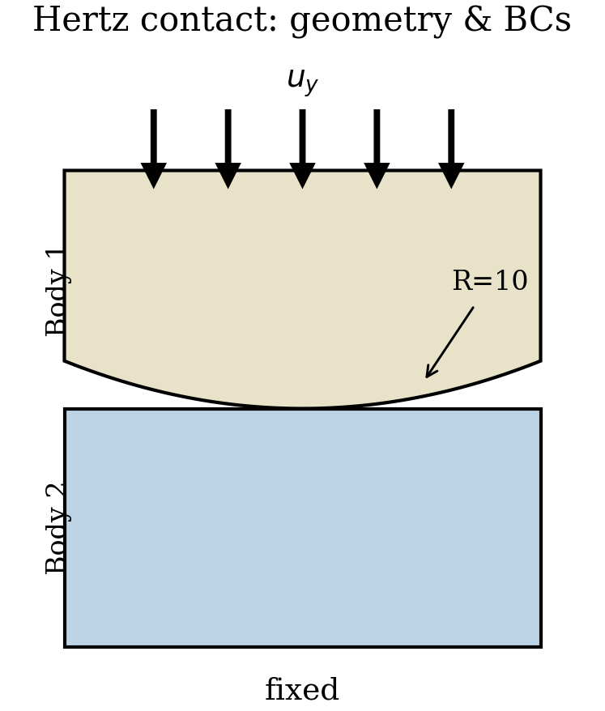 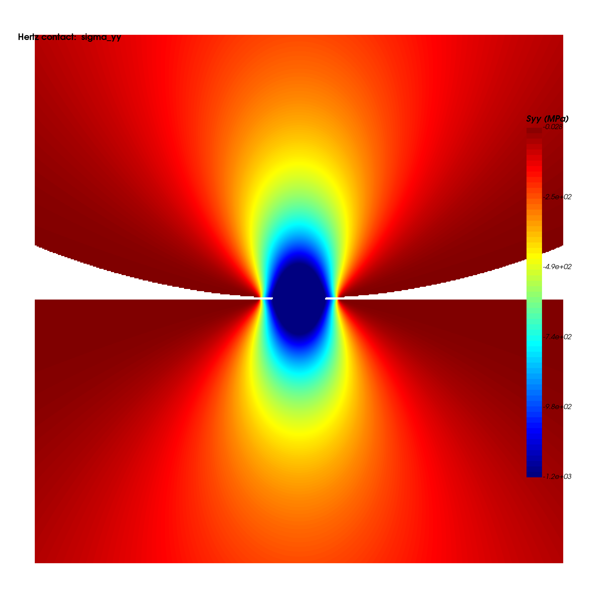 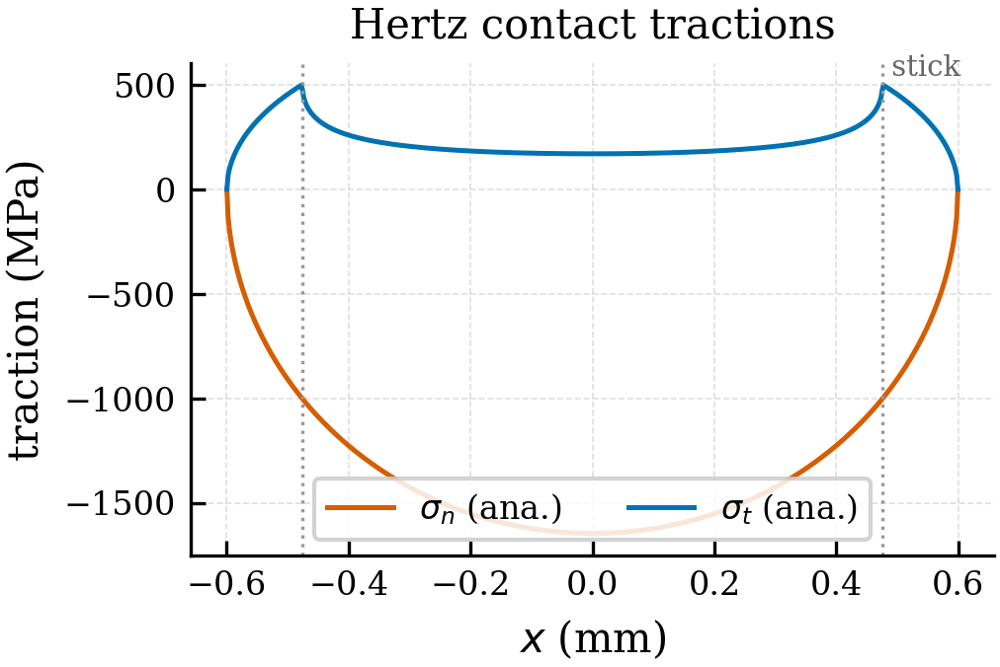

Vector PDF: [Fig.14 traction](../figures/liusun_fig14_hertz_traction_pub.pdf).

### CV-3 — Brazilian disc
Geometry (Fig.21), contact radius $a$–$F$ — standard Hertz vs the paper's Eq. 46 (Fig.22), and the
$\sigma_{yy}$ disc field (Fig.23).

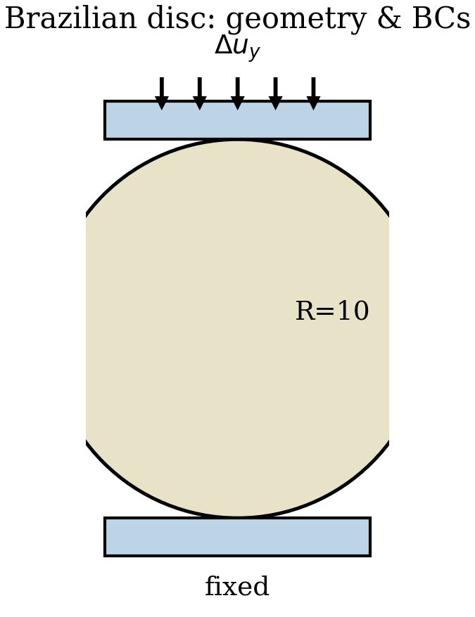 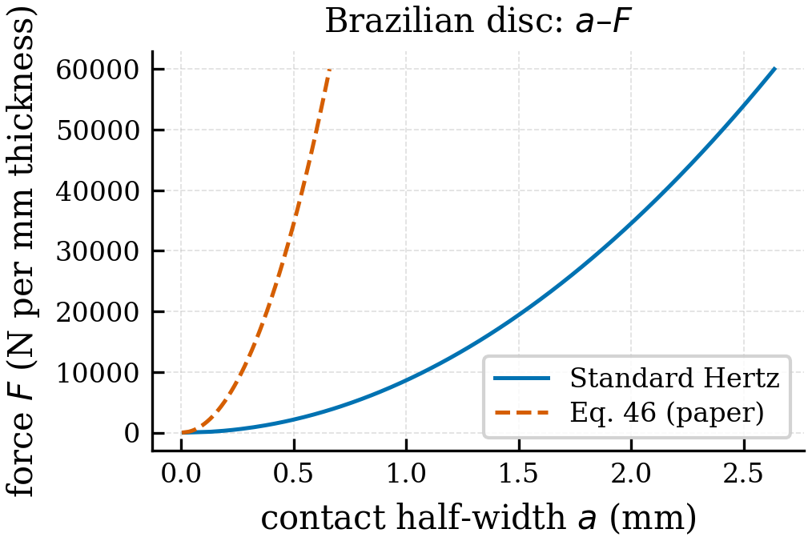 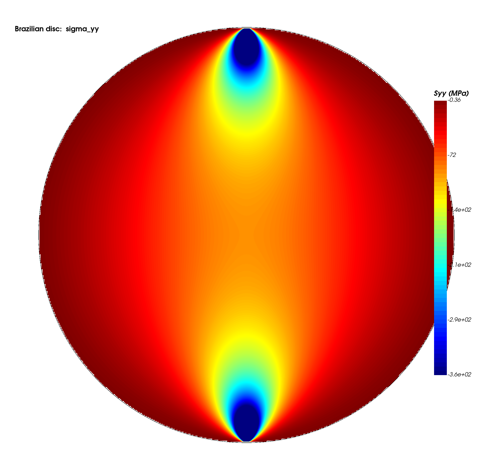

Vector PDF: [Fig.22 a–F](../figures/liusun_fig22_brazilian_aF_pub.pdf).

### CV-4 — Nine-disc packing
Geometry (Fig.15) and the max-principal $S_1$ + shear $\sigma_{xy}$ over the 3×3 array (Fig.16;
identical per disc by symmetry, contact concentrations at N/S/E/W).

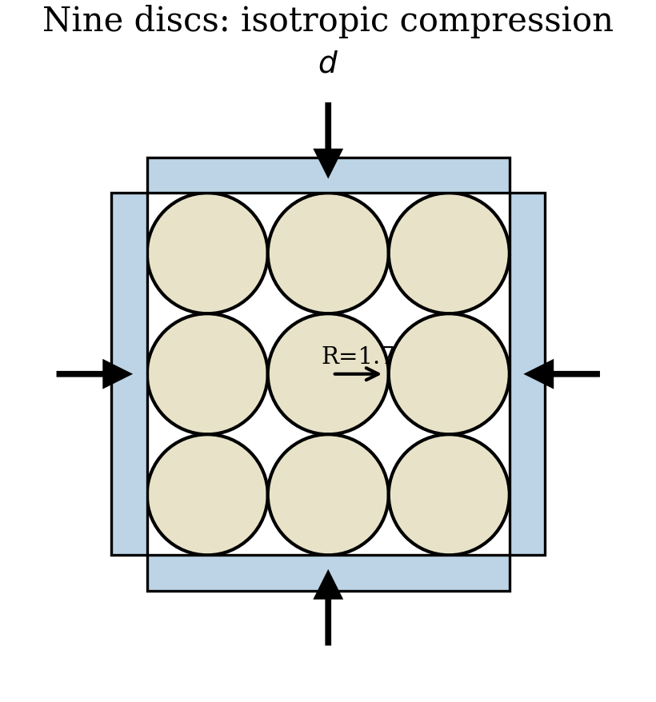 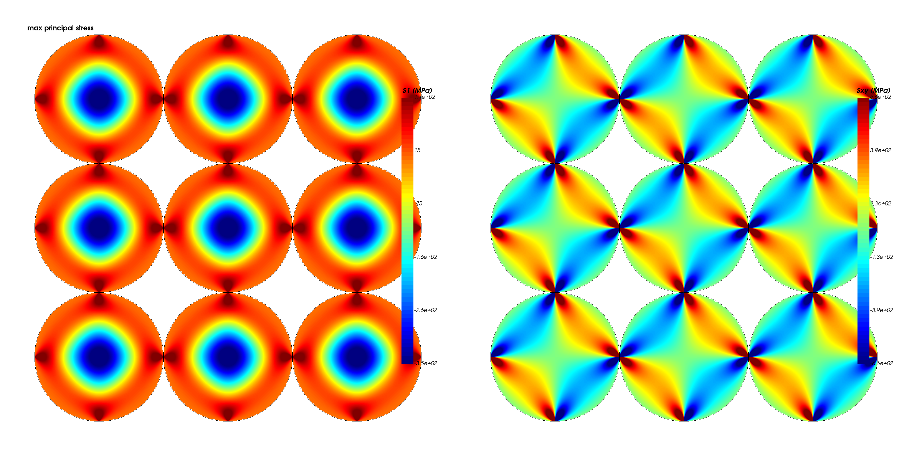

### CV-5 — Nonconvex superformula contact
Cam-drive animation (the rotating cam drives the free follower; red = active contact), the chart-vs-SDF
comparison (smoothness advantage **and** radial bias), the run summary, and a static 3-frame montage.

 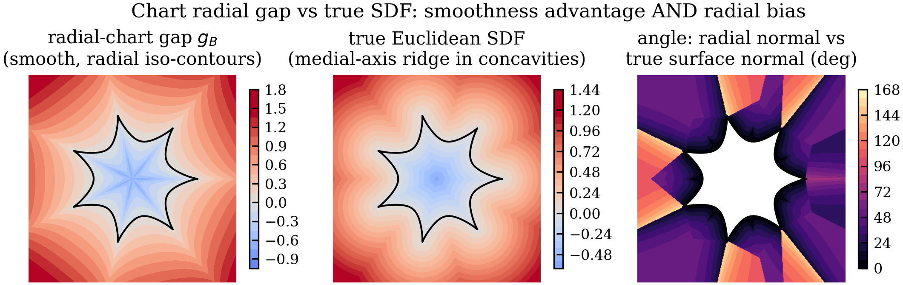

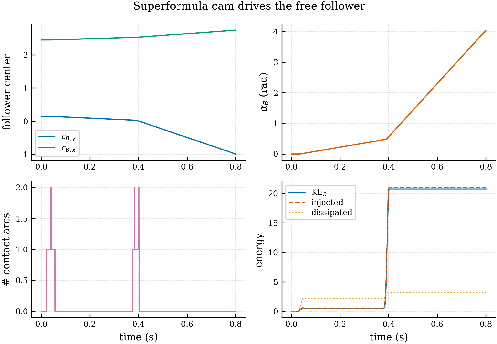 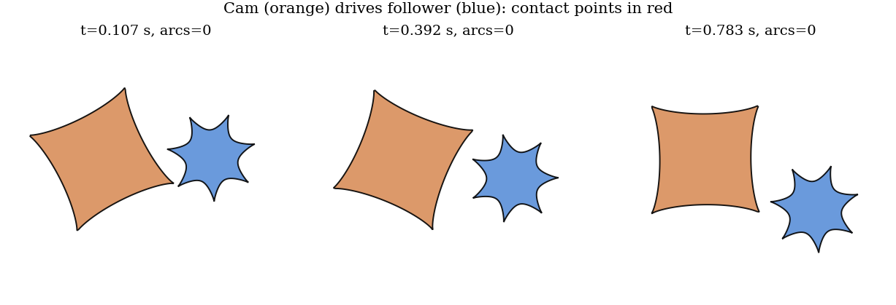

### CV-6 — Koch snowflake fractal contact
Headline cost decomposition (LEFT: storage — $O(1)$ IFS chart vs $O(9^n)$ uniform / $O(4^n)$ adaptive SDF;
RIGHT: per-query — the SDF's $O(1)$ lookup vs the chart's *bounded* $\approx$21-node descent), the growth
of contact micro-arcs with depth, and the exact boundary at levels 1/3/5 vs a grid-limited SDF.

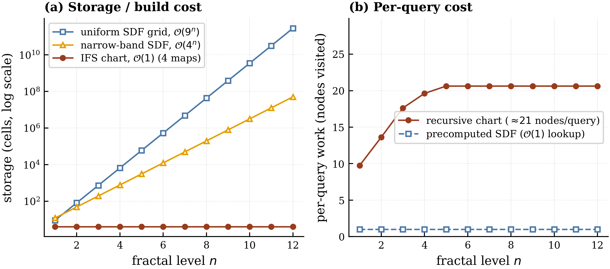 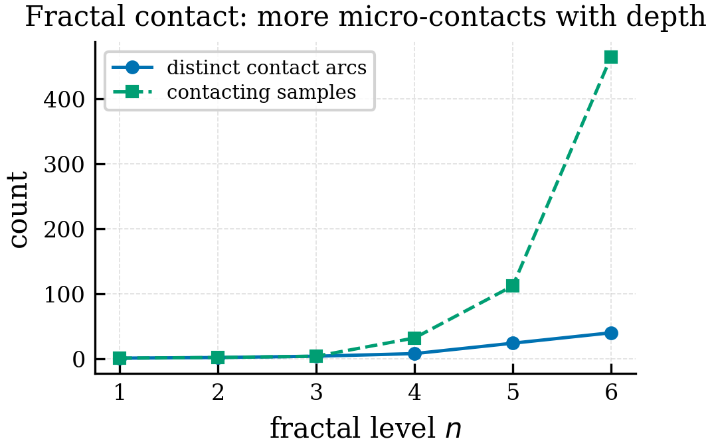

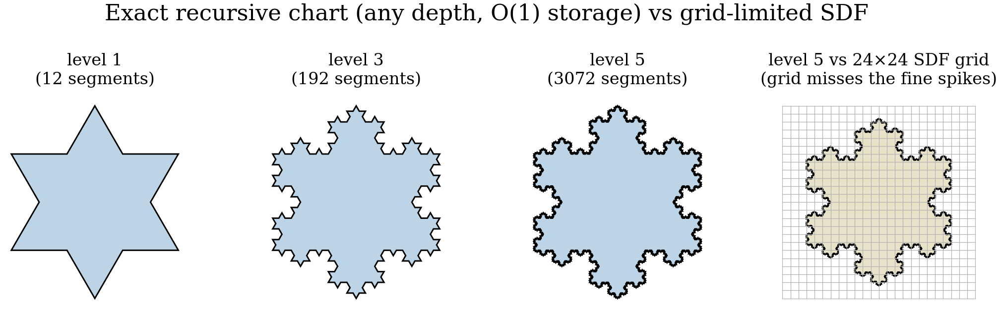

**Neural-SDF refinement ceiling (measured).** The chart's resolution-independence is the flip side of a
ceiling the level-set representations *do* have. To measure it, one fixed-width `SDFNet` (12,801 params)
is trained on the *exact* Koch signed distance (sign from `koch.inside`, magnitude/normal from
`koch.nearest_boundary`) separately at each level $n$, with capacity held fixed. The error on a held-out
near-boundary set jumps off its representable-level ($n{=}1$) floor as soon as fractal detail appears and
plateaus at a capacity ceiling — the net never recovers $n{=}1$ fidelity as the detail refines below its
resolution (the Koch boundary converges in Hausdorff distance, so the magnitude error rises to a peak
where the feature scale $3^{-n}$ meets the net resolution, then plateaus, while the normal orientation
saturates monotonically). Measured floors → ceilings: zero-level-set deviation $1.9\!\times\!10^{-2}L\to
\sim4$–$8\!\times\!10^{-2}L$, Eikonal residual $\langle(|\nabla\phi|-1)^2\rangle\ 4.4\!\times\!10^{-2}\to
\sim0.12$–$0.15$, median normal-angle error $7.8^\circ\to\sim45$–$48^\circ$. Run:
`python3 benchmarks/contact/koch_neural_ceiling.py`; harness `tests/test_neural_chart_verification.py::test_cv6_*`.
This is the experiment §11.6 specifies — the assertion in `koch.py` is now a measurement.

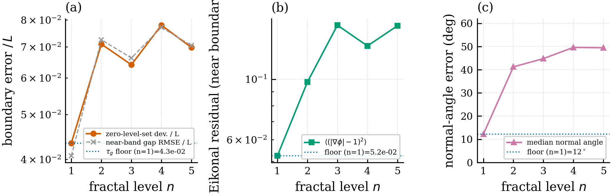

**Time-resolved contact dynamics.** A prescribed spinning Koch cam drives a spring-loaded 1-DOF Koch
follower (overdamped/quasi-static relaxation — unconditionally stable for stiff contact, so the follower
*rides* the fractal cam profile without tunnelling). Left: the animation (red = chart-detected contact
set); right: the follower displacement traced against cam angle (the fractal cam lift curve).

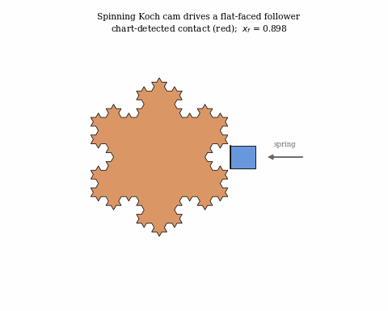 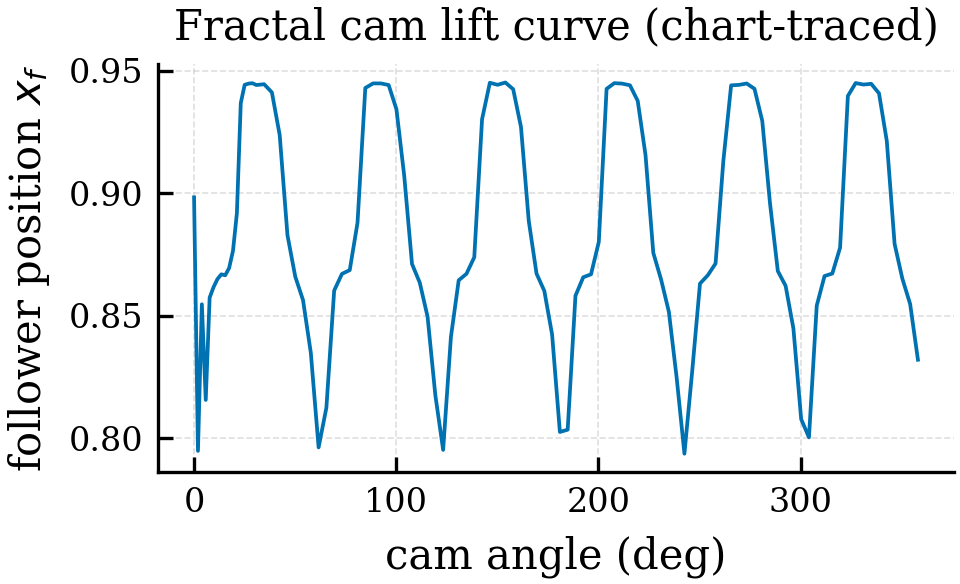

The earlier static-cam view (net contact force arrow on a *fixed* follower) is retained as a schematic:

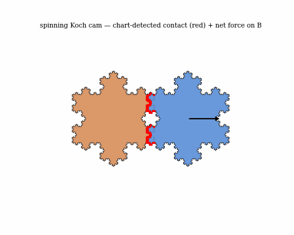

---

## 11. Neural coordinate-chart verification protocol

This is the operational recipe for using CV-1..CV-6 to verify a **trained neural chart** once the
project replaces the analytical charts. The principle: *train the neural object on the same analytical
shape, then compare its output to the closed form.*

### 11.1 Substitution map (analytical → neural)

| Analytical object (now) | Neural replacement (under test) | Trained by |
|---|---|---|
| analytical SDF / implicit shape | neural SDF `atlas/sdf/train_sdf.py::SDFNet` (3-in → 1 scalar) | `atlas/sdf/train_sdf.py` |
| analytical gap $g_{n0}$, normal | `solvers/contact/gap.py::evaluate_gap` (neural SDF + autograd normal) | — |
| volumetric chart map $\xi\mapsto x$ | `common/models.py::ChartDecoder` (frame-anchored, 3→3) | `atlas/charts/train_atlas.py` |
| chart inverse $x\mapsto\xi$ | `common/geometry.py::invert_decoder` (Newton; needs seed/frame/scale) | — |

**Note — `ChartDecoder` is volumetric, not a boundary $\varphi(\theta)$.** It maps a reference cube
$\xi\in[-r,r]^3$ to $x\in\mathbb R^3$ anchored to a seed + tangent frame; there is no $\theta$ input. The
directly-comparable neural object for these 2-D contact shapes is therefore the **neural SDF** (primary
path). A boundary parametrization $\varphi(\theta)$ is a *derived* object — the image of the chart's
in-plane reference locus ($\xi_3=0$) — so a boundary-to-boundary check requires supplying the seed/frame
and sweeping the in-plane coordinate. The references are `postprocessing/contact_fields.py` (CV-1..4) and
`solvers/contact/supershape.py` (CV-5).

**Dimensionality.** `SDFNet`/`evaluate_gap` are 3-D (in_dim=3, normal $(N,3)$); CV-3/4/5 are 2-D — embed
the shape at $z=0$, compare only the in-plane normal, and assert $|n_z|$ is small.

### 11.2 Two-level recipe (run per benchmark)

**L0 — geometry/kinematics (solver-free; do this first).** Sample query points $\{x_k\}$ near the contact
region; evaluate the neural chart's gap $g^{\rm nn}(x_k)$ and normal $n^{\rm nn}(x_k)$ and compare to the
analytical reference:
- gap: $\mathrm{RMSE}(g^{\rm nn}-g^{\rm ana})/L \le \tau_g$  ($L$ = body size);
- normal: $\max_k \angle(n^{\rm nn}_k, n^{\rm ana}_k) \le \tau_n$;
- zero level set: $|g^{\rm nn}|$ on the analytical boundary $\le \tau_g$.

**L1 — mechanics.** Run the contact solve with the neural chart in place and compare the derived
quantities (pressure, stress field, contact radius, force–displacement, stick radius) to the CV pass
criteria, with the looser neural tolerances below.

**Compare like-for-like.** A neural **SDF** returns the *Euclidean* gap/normal, so compare it to the
*Euclidean* reference (for CV-5 use `supershape.closest_point_refine` / a dense closest-point scan, **not**
the radial gap, which is a different quantity — see §7). A neural **ChartDecoder** is compared
*boundary-to-boundary*: $\max_\theta\lVert\varphi^{\rm nn}(\theta)-\varphi^{\rm ana}(\theta)\rVert$ and the
tangent/normal from its Jacobian.

### 11.3 Tolerances (neural vs analytical)

Analytical-vs-analytical checks are machine precision (§9). Neural charts carry training error, so use:

| Quantity | Analytical tol (§9) | Neural tol (realistic) | Driver of the looser bound |
|---|---|---|---|
| gap (L0) | machine | $\tau_g \sim 10^{-3} L$ | SDF Eikonal training error (~1e-3) |
| normal angle (L0) | machine | $\tau_n \sim 1\text{–}2^\circ$ | $\lVert\nabla\phi\rVert\ne1$ off the surface |
| pressure / stress field | < 1% | ~5% | gap/normal error + discretization |
| contact radius $a$ | < 1% | ~3–5% | $a$ is gap-sensitive |
| force / approach | < 1% | ~5–10% | compounded |
| momentum (free control) | < 1e-8 | < 1e-8 | dynamics-only; neural-independent |

$\tau_g\sim10^{-3}L$ is now **measured** for the smooth shapes (`atlas/sdf/train_analytical_sdf.py`,
pure-regression of the exact SDF): **sphere $1.6\times10^{-3}L$ / 0.33°, disc $3.5\times10^{-3}L$ / 0.58°**
near contact. The cusped **superformula** is the exception — a neural SDF only reaches $\approx8\times
10^{-3}L$ with a degraded normal, but the neural **radial chart** (§11.7/§11.8) reaches $3.8\times10^{-3}L$
/ 0.42° on the same shape (the accurate path). The **Koch fractal** now supplies the first measured numbers on
these shapes (CV-6, §11.6): a fixed-capacity `SDFNet` reaches a zero-level-set deviation $\approx
1.9\times10^{-2}L$ and an Eikonal residual $\langle(|\nabla\phi|-1)^2\rangle\approx 4.4\times10^{-2}$ at the
representable level $n{=}1$, rising to a capacity-floor plateau ($\approx4$–$8\times10^{-2}L$ and
$\approx0.12$–$0.15$) by $n{=}5$. These are far above the smooth-shape $10^{-3}$ aspiration **because the
Koch boundary is all corners** — the worst case for a smooth Eikonal SDF — which is exactly the
spectral-bias/finite-capacity mechanism CV-6 isolates; the smooth-shape $\tau_g$ is expected to be much
tighter. The harness default `TAU_GAP_REL = 2e-3` is a deliberately relaxed starting value (and the CV-6
tests use a looser, shape-specific `TAU_GAP_KOCH`).

### 11.4 Neural-specific failure modes each benchmark catches

- **Non-unit $\lVert\nabla\phi\rVert$ (broken Eikonal):** inflates the gap and rotates normals → caught by L0 on **any** benchmark (CV-1 sphere is the cleanest).
- **Normal degradation near the medial axis / in concavities:** **CV-5** is the discriminating test — a neural SDF's normal degrades in the concave valleys / at the cusps; L0 gap/normal error there directly measures it (measured: SDF gap 8e-3, normal tilted out-of-plane). The neural **radial chart** (§11.8) is the *resolution* — no medial axis, no ambient spectral bias, so it reproduces the analytical gap/normal to 3.8e-3 / 0.42° on the same shape.
- **Over-smoothed sharp features (cusps/edges):** the neural SDF rounds lobe tips → CV-5 L0 tip-normal/gap error grows. (Multi-arc *count* is an analytical-chart boundary-scan property, not a quantity a single-foot neural SDF produces; for a neural SDF the concavity catcher is the L0 gap/normal error, not an arc count.)
- **Chart Jacobian ill-conditioning / non-bijective decoder:** caught by the L0 inverse-chart residual and `stabilized_jacobian_ops` condition number (CV-1/CV-5).
- **Contact-radius / force drift:** small gap bias → systematic $a$, $p_0$, $F(\delta)$ offset → caught by L1 (CV-1, CV-3, CV-4).

### 11.5 Harness

`tests/test_neural_chart_verification.py` runs one test per benchmark. Much of the suite is now
**LIVE and passing** against trained neural charts (see the measured numbers in §11.8): the analytical
shapes are trained by `atlas/sdf/train_analytical_sdf.py` (neural SDFs) and
`atlas/charts/train_radial_chart.py` (neural radial chart), loaded by `load_neural_sdf` /
`load_neural_rho`; the numerical L1 solve is the chart-based FEM (`solvers/fem/`, plan M0/M2/M4). Tests
`pytest.skip(...)` only where a chart is not yet trained (a fresh checkout, since `.pt` checkpoints are
gitignored) or a benchmark is not yet built (CV-2, CV-4). ✓ = wired **and** measured-passing today.

| Benchmark | Neural object | L0 (geometry) | L1 (mechanics) | Status / measured |
|---|---|---|---|---|
| CV-1 | neural sphere/disc SDF | gap/normal near contact **✓** (sphere 1.6e-3, disc 3.5e-3 /L) | FEM Hertz line contact **✓** ($a(F)$–$E^*$ to ~1.6%, analytic & neural indenter) | Eikonal, gap drift |
| CV-2 | + friction (Coulomb) | (uses CV-1 chart) | FEM tangential stick/slip **✓** (stick law $c/a{=}\sqrt{1{-}Q/\mu P}$ to ~5–7% at low $Q$; deep half-plane) | normal → traction |
| CV-3 | neural disc SDF | gap/normal on rim **✓** | FEM Brazilian **✓** (centre $\sigma$ to 1.62%/0.58% vs closed form) | rim normal accuracy |
| CV-4 | neural disc SDF | per-disc gap/normal **✓** | FEM unit cell **✓** (equibiaxial centre $-2N/\pi Rt$ to 0.15%, isotropic) | multi-contact normals |
| CV-5 | neural **SDF** (degrades) **+** neural **RADIAL chart** (accurate) | SDF: gap 8e-3, normal degraded **✓** ; radial chart: gap **3.8e-3**, normal **0.42°** **✓** | rigid-body cam-drive: neural-detection trajectory matches analytical **✓** (0.04%, momentum 1e-15) | **the chart-over-SDF advantage, MEASURED** |
| CV-6 | neural SDF on Koch level-$n$ | refinement ceiling **✓ (measured, §11.6)** | (out of scope: fractal contact ill-posed) | **self-similar detail beyond fixed capacity** |

### 11.6 Worked example (train → L0 → L1)

The one missing executable piece is an SDF trained on an **analytical shape** — the shipped
`atlas/sdf/train_sdf.py` fits only the rabbit. The intended sequence:

1. **Train** a neural `SDFNet` on the analytical shape by regressing to its closed-form signed distance
   (sphere $\phi=|x|-R$; disc; superformula via `supershape.closest_point_refine` for the Euclidean
   distance) with an Eikonal term. Save `<shape>_sdf.pt` and **record the final Eikonal residual** — that
   number sets $\tau_g$ (§11.3).
2. **Wire the loader**: make `load_neural_sdf("sphere")` (in `tests/test_neural_chart_verification.py`)
   return the trained `SDFNet`.
3. **Run L0** (geometry, solver-free):
   `pytest tests/test_neural_chart_verification.py -k cv1 -rs` — evaluates `evaluate_gap` and asserts the
   gap RMSE / normal angle against the Euclidean reference. This alone validates the chart in isolation.
4. **Run L1** (mechanics): once a neural contact *solve* exists, drop the neural SDF into the contact path
   and assert $a,p_0,F(\delta)$ (CV-1), $\sigma_t$ (CV-3), $N(d)$ (CV-4), cam-drive (CV-5) against
   `contact_fields.py` / the CV pass criteria with the §11.3 tolerances.

The right-hand sides (analytical references) are already runnable now:
`python3 postprocessing/contact_fields.py` (numpy self-test) and the three
`docs/hertz_derivation/*.py` scripts (symbolic self-checks). Steps 1 (analytical-shape SDF trainer) and
the L1 neural solver are the "later" neural-chart work this manual is written to verify.

**CV-6 refinement-ceiling experiment (run; measured).** The CV-6 claim that a *fixed-capacity* neural SDF
cannot keep resolving self-similar detail is now **measured**, not argued. `benchmarks/contact/koch_neural_ceiling.py`
trains one `SDFNet` of **fixed** width/depth (width 64, depth 4 → 12,801 params) to regress the *exact*
Koch signed distance (sign from `koch.inside`, magnitude/normal from `koch.nearest_boundary`; the 2-D
shape is extrusion-lifted to a thin prism so the normal stays in-plane), separately at each level
$n=1\ldots5$, and records on a held-out near-boundary set the zero-level-set deviation (distance of the
net's surface from the true boundary — the §11.2 criterion), the near-band gap RMSE, the Eikonal residual,
and the normal-angle error. Measured curve (`runs/koch_neural_ceiling/metrics.json`, figure
`koch_neural_ceiling_pub.png`):

| $n$ | segments $3\cdot4^n$ | feature $3^{-n}$ | zero-level-set dev. $/L$ | Eikonal residual | median normal angle |
|---|---|---|---|---|---|
| 1 | 12   | 0.333 | $1.9\times10^{-2}$ | $4.4\times10^{-2}$ | $7.8^\circ$ |
| 2 | 48   | 0.111 | $5.9\times10^{-2}$ | $1.30\times10^{-1}$ | $42.8^\circ$ |
| 3 | 192  | 0.037 | $8.0\times10^{-2}$ | $1.52\times10^{-1}$ | $45.8^\circ$ |
| 4 | 768  | 0.012 | $5.1\times10^{-2}$ | $1.17\times10^{-1}$ | $45.4^\circ$ |
| 5 | 3072 | 0.004 | $4.3\times10^{-2}$ | $1.24\times10^{-1}$ | $48.1^\circ$ |

The error **jumps off the $n{=}1$ floor and plateaus** at a capacity ceiling: with capacity fixed the net
fits the representable level ($n{=}1$) well, then loses fidelity the moment fractal detail appears and
never recovers it (magnitude error $\approx2$–$3\times$, normal angle $\approx6\times$ the $n{=}1$ value).
The magnitude error *peaks* near $n{=}3$ — where the feature scale $3^{-n}$ meets the net's resolution —
then plateaus as still-finer detail falls below resolution and is simply averaged out (the Koch boundary
converges in Hausdorff distance, so a monotone-forever rise would be *wrong*); the normal orientation
saturates monotonically near $\sim45^\circ$ (decorrelated). This earns the prose claim in `koch.py` / §8,
and supplies the first measured $\tau_g$-driver numbers §11.3 lacked. The harness paths are
`tests/test_neural_chart_verification.py::test_cv6_koch_neural_sdf_L0` (representable-level L0) and
`::test_cv6_refinement_ceiling` (the measured ceiling). The chart's complementary *measured* wins
(storage, resolution-independence) remain in §8.

### 11.7 Level-set-free detection via radial boundary charts (implemented)

The SDF detector (`gap.py::evaluate_gap`) needs an *ambient* scalar field $\phi:\mathbb R^3\!\to\!\mathbb R$.
A contact **detection** algorithm needs no such field: a star-shaped body can be carried level-set-free
by a **radial boundary chart** $\rho:S^2\!\to\!\mathbb R^+$ (a height field on the sphere of directions —
*not* an ambient SDF), with center $c$ and orientation $Q$ (body axes as columns). In the body frame
$d=Q^\top(x-c)$, $r=\lVert d\rVert$, $\hat d=d/r$:

$$ \text{gap}(x)=r-\rho(\hat d),\qquad n=\widehat{\,Q\,\nabla_d F\,},\quad \nabla_d F=\hat d-\nabla_S\rho/r, $$

where $\nabla_S\rho=(I-\hat d\hat d^\top)\nabla_{\hat d}\rho$ is the **tangential** (projected) surface
gradient — the projection is load-bearing for any non-sphere (a raw autograd gradient of $\rho$ carries a
spurious radial component). This is the 3-D lift of the 2-D `supershape.py` oracle. The normal is the
*matched / conservative* one (penalty force $=$ gradient of $\tfrac12\epsilon_n\langle F\rangle^2 V$).
Implementation: `solvers/contact/chart_gap.py` (`RadialChart`, `SphereRho`, `SuperquadricRho`,
`evaluate_gap_chart`, `closest_point_refine_chart`).

**What is proven (acceptance vs the SDF benchmark).** Tested in `tests/test_chart_gap.py` and the head-to-head
`benchmarks/contact/chart_vs_sdf_detection.py`:

| Claim | Result |
|---|---|
| Sphere chart $=$ sphere SDF (gap + normal, all depths, $Q\ne I$) | machine precision ($\Delta\text{gap}=0$, $1-\cos<10^{-15}$) |
| **Active set** $\{\text{gap}<0\}$ $=$ true SDF's, star-shaped body | exact (sign identity) |
| Swap detector in the live MPM path (two-sphere collision) | **bit-identical** $v$, impulse, penetration ($\Delta$ between the sdf and chart runs $=0$) |
| Radial normal $\to$ true surface normal at contact | $4.6^\circ$ at 10 % off-surface $\to 0.03^\circ$ at contact |
| Hertz CV-1 contact circle (chart vs SDF) | identical; matches the closed-form lens radius |

**What is NOT claimed (the honest bound).** The radial gap is **not** a Euclidean distance:
$\text{gap}_\text{rad}=\text{gap}_\perp/\cos\alpha+O(\text{gap}^2)$ ($\alpha=$ ray-vs-normal angle), so its
*magnitude* is conservative-large, $\lvert\text{gap}_\text{rad}\rvert\ge\lvert\text{gap}_\perp\rvert$ always
(an exterior point reads a larger gap; a penetrating point a slightly *deeper* penetration — a marginally
stiffer penalty, not a softer one). The sign is exact (hence the active-set equivalence); the *value*
equals the SDF only on the sphere and in the $\text{gap}\to0$ limit. `closest_point_refine_chart` recovers
the true perpendicular gap + surface normal (verification only — the foot jumps across the medial axis,
non-smooth, would leak energy; never used by the integrator).

**Preconditions / scope.** Valid only for **star-shaped** bodies (every ray from $c$ hits the boundary
once). A plane/half-space is not star-shaped about any finite center, so **floors stay on the SDF path**
(`FloorSDF`). Per-particle MPM detection makes multiple disjoint contact *patches* free (they appear as
clusters of penetrating particles — no boundary-arc enumeration), but the *obstacle chart* must still be
star-shaped. The detector is swapped behind one flag: `ContactBody(detector="chart", chart=...)`, dispatched
by `contact_manager.body_gap_normal` (shared by `detect_mpm` and `schwarz_mpm._compute_contact_forces`);
penalty / friction / augmented-Lagrangian forces and the broad-phase culler are unchanged.

**Staging.** Shipped now (Stage 0): *analytic* $\rho$ (sphere, superquadric) — fully provable without
training, as above. **Stage 1 — now BUILT in 2-D** (`solvers/contact/radial_chart_2d.py::NeuralRho2D`):
a trained neural $\rho_\theta:S^1\!\to\!\mathbb R^+$ (Fourier-feature MLP) is the neural chart that
*replaces* the neural SDF for CV-5 — it reproduces the analytical radial gap/normal to $3.8\times10^{-3}L$
/ 0.42° where the SDF degrades (§11.8). The 3-D $\rho_\theta:S^2\!\to\!\mathbb R^+$ on the
`evaluate_gap_chart` path is the analogous, still-deferred 3-D piece. **Stage 2** a multi-chart
atlas fallback (`ChartDecoder` + `invert_decoder`, signed-height gap with a Jacobian-metric correction,
transition maps at overlaps) for **non-star-shaped** bodies, gated behind a star-shaped certificate.

---

## 11.8 Numerical CV suite — measured status & capability matrix

The numerical suite trains neural charts on the analytical CV shapes, runs a numerical solve, and
compares to the closed forms. Components: the chart-based **FEM** ported to active `solvers/fem/`
(3-D tet `chart_vector_fem.py` + 2-D plane-stress `tri2d.py`; patch test machine-zero, MMS $O(h^2)$),
three neural objects (neural **SDF** `atlas/sdf/train_analytical_sdf.py`; neural **radial chart**
`atlas/charts/train_radial_chart.py`; volumetric **ChartDecoder** — the FEM domain map, trained-on-CV-
shapes deferred), and static penalty contact. **Honest scope notes are load-bearing here** (post
adversarial review): the numbers below are what is *verified*, not what is aspired to.

**Measured results (what holds):**

| CV | what is numerically verified | measured | the honest caveat |
|---|---|---|---|
| CV-1 | FEM Hertz line contact, neural disc SDF indenter; $a=2\sqrt{FR/\pi E^*}$ ties $a$ to $E^*$ | **~1.6%** (constant $a/\sqrt F$ ratio over an 8× $E^*$ sweep) | one independent anchor ($E^*$); $p_0=2F/\pi a$ is the half-ellipse identity, **not** independent; neural **matches** the exact-SDF baseline, does not beat it; 3-D axisymmetric not tractable (patch resolution) |
| CV-2 | FEM tangential stick/slip on the CV-1 contact; $c/a=\sqrt{1-Q/\mu P}$ (2-D line) | **~5–7%** at low $Q$ (mean 11%) | needs a DEEP half-plane (edge-singular tangential traction, not block shear); the stick radius coarsens at high $Q$ (node-spacing quantises the slip boundary); 2-D law used (ref is the 3-D $^{1/3}$) |
| CV-3 | FEM Brazilian, centre stress vs $\pm2P/\pi Dt,-6P/\pi Dt$ | **$\sigma_{xx}$ 1.62%, $\sigma_{yy}$ 0.58%** (vs the *exact* closed form) | CST gives a ~1.6% center floor that plateaus under refinement; pole singularity excluded; material-independent (verified) |
| CV-4 | FEM unit cell (D4: 4 equal diametral loads), equibiaxial centre $-2N/\pi Rt$ | **0.15% / 0.01%**, isotropic (anisotropy 0.16%, shear 0%) | the per-disc UNIT CELL (the equibiaxial physics); the full N-body explicit-contact array is the heavier extension, not built |
| CV-5 (SDF) | neural SDF on the cusped superformula | gap 8e-3, normal degraded (median \|$n_z$\|~0.5) | a smooth SDF **cannot** represent cusps/concavities well — the spectral-bias ceiling, by design |
| CV-5 (chart) | neural **radial chart** vs the analytical radial gap/normal; L1 cam-drive dynamics | gap **3.8e-3**, median normal **0.42°**; dynamics trajectory matches analytical to **0.04%** (momentum 1e-15) | the **accurate** path — the transition-map chart succeeds where the SDF degrades, and drives the SAME contact dynamics (Fourier-feature 1-D fit; star-shaped only) |
| CV-6 | fixed-capacity SDF vs the exact Koch SDF, rising level | refinement ceiling **measured** (§11.6) | a level-set/SDF *fundamentally* cannot resolve a fractal at depth — that is the demonstrated point |


*Numerical CV suite: every benchmark's L1 error vs the closed form (left; CV-1/3/4/5 ≤ ~1.6%,
CV-2 ~11% coarse) and the CV-5 headline — the neural radial chart beats the neural SDF on the
cusped superformula (right).*

**Capability matrix (what the framework can and cannot do, today):**

*Can (verified):* run a numerical contact solve on **learned geometry** and reproduce analytical
contact mechanics to **~1–2%** across the continuum suite (CV-1 Hertz, CV-3 Brazilian, CV-4 nine-disc
unit cell), plus frictional partial slip (CV-2, ~5–11%); represent geometry three ways behind one
`(gap,normal,volume)` contract; localize failures via the L0/L1 split; **measure the
chart-over-level-set advantage** — the radial chart beats the SDF on cusps (CV-5) and the recursive
IFS chart beats any SDF on fractals (CV-6); and show the neural chart drives the same rigid-body
**contact dynamics** as the analytical chart (CV-5, 0.04% trajectory match). Smooth convex /
star-shaped bodies throughout.

*Cannot (yet or fundamentally):* a smooth neural **SDF cannot represent sharp features** (cusps,
fractals) — intrinsic spectral bias; the framework's *answer* is to switch chart type (radial for
star-shaped, recursive IFS for fractal). **Sharp contact patches need fine local mesh** (3-D
axisymmetric Hertz not yet tractable on uniform meshes); **frictional stick radii coarsen** at high
tangential load (node-spacing-limited). **Learned geometry caps L1 accuracy at ~1–5%** (training
error propagates) — never machine precision. **Not built:** the full N-body explicit-contact disc
array (only the per-disc unit cell), a **ChartDecoder trained on the CV shapes** (the FEM is verified
to run on a ChartDecoder domain map, but the per-shape decoder atlas is the remaining Stage-2 piece),
3-D Hertz, and MPM dynamic cross-checks.

*Bottom line:* a **verified pipeline across the contact-mechanics suite** — Hertz, Brazilian,
nine-disc and Cattaneo–Mindlin to ~1–11%, on learned geometry — plus a **rigorously-measured case for
charts over level-sets** on geometry level-sets handle badly (CV-5 cusps, CV-6 fractal) and a
demonstration that the neural chart reproduces the contact *dynamics*. The distinctive value is not
beating an SDF on a sphere — there they are equivalent — but representing geometry (cusps, fractals,
multi-patch) a single neural SDF or uniform level-set cannot.

---

## 11.9 Capstone (CV-7) — direct shear of a real fractal rock joint

The CV-1..6 suite verifies the machinery against *closed forms*. The capstone turns that machinery
on a problem with **no closed form and real engineering stakes**: the direct shear of a natural rock
joint, where the chart-over-level-set advantage (abstract in CV-5/6) becomes a *different predicted
shear strength*. This is the example written to "energize" a CMAME reader — built only after the
analytical suite earned the right to make the claim.

**Setup (real data, verified machinery).** The surface is a real tensile fracture in **Inada
granite** (Digital Rocks Portal #273, Sawayama–Jiang–Tsuji 2020, DOI `10.17612/QXSA-TK92`, ODC-BY):
a self-affine height map $z(x,y)$ at 23.4 µm sampling, Hurst $H\approx0.78$, fractal $D\approx2.2$,
RMS roughness **1.70 mm** (matches the published 1.7 mm exactly — `characterize_inada_joint.py`).
Each surface is carried by a learned **1-D height chart** $h_\theta(x)$ — a random-Fourier-feature
MLP (`solvers/contact/profile_chart_2d.py`, the open, non-periodic 1-D analog of the CV-5 radial
chart). Two mating faces are sheared under constant normal *stress* (`rock_joint_shear.py`); the
vertical DOF is solved to normal equilibrium each shear increment (quasi-static direct shear).
Friction is **plain Coulomb** ($\mu=\tan\phi_b$ constant) — *no dilatancy law*. Dilation and the
apparent friction angle are therefore **emergent outputs of the resolved asperity geometry**, which
is exactly what makes geometric fidelity the whole story.

**Method verification (the L1 anchor — Patton).** For two mating sawtooth faces of asperity angle
$i$, plain Coulomb on the resolved tilted contact must emergently give the closed-form **Patton law**
$\mu_{\mathrm{app}}=\tan(\phi_b+i)=(\tan i+\mu)/(1-\mu\tan i)$. Measured: **0.00 %** error, with the
dilation rate equal to $\tan i$ to within 1% (the block rides up the flank). This is a *real* closed
form (not imposed: only plain Coulomb + geometry go in; Patton comes out), so it anchors the
no-closed-form real-surface results. `test_rock_joint_shear.py` (6 tests) checks it at two
$(i,\mu)$ pairs.

**The chart-vs-level-set result — three complementary framings** (all measured; we present all three
so the paper can lead with whichever fits). On the rough Inada profile we fit (a) the height chart
and (b) a *real ambient 2-D neural SDF* $\phi(x,z)$ — a plain coordinate MLP, the canonical level
set — and extract its zero level set $h_{\mathrm{SDF}}(x)$:

1. **Reconstruction gap.** The chart reproduces the measured surface to **2.3 µm** (66k params); the
   ambient SDF reaches only **107 µm — 47× worse — with *more* parameters (83k)**. The level set
   spends its capacity on a 2-D distance field and still resolves the 1-D surface far less well.
2. **Slopes → consequence (the contact-relevant framing).** Friction/dilation depend on asperity
   *angle* $i=\arctan|h'|$, so heights are the wrong metric — slopes are. The chart reproduces the
   mean asperity angle (**19.8° vs 19.4° true**); the SDF's spectral bias **smooths it to 12.5°**.
   Shearing the two representations, the smoothed level set **under-predicts peak shear strength by
   61 %**. (Dilation is barely affected — 0.5 % — because total dilation is set by the large-scale
   waviness the SDF *does* capture, while strength is asperity-slope-controlled. This split is itself
   the honest, physical signature.)
3. **Storage / resolution-independence.** The chart is $O(N_{\text{surface}})$ with $O(1)$ queries
   and (with Fourier features) no spectral-bias ceiling; an ambient SDF must represent a 2-D field
   whose zero set is the surface — the same scaling argument the CV-6 Koch ceiling makes, here on a
   real surface across ~3.5 decades of scale (23.4 µm asperities over a 73 mm joint).

**Roughness sweep (ensemble over the real 2-D surface).** Shearing 24 real scanlines of each surface
(mean ± std): the **rougher** joint dilates more (**3.13 ± 0.49 vs 2.53 ± 0.36 mm**) — the Barton-JRC
trend, recovered from real data with plain Coulomb. The steady *friction* trend is in the expected
direction but within scatter (0.55 ± 0.19 vs 0.49 ± 0.12) at this modest RMS contrast (1.79 vs 1.21
mm — both are rough natural fractures); the *dilation* is the clean discriminator.


*Capstone summary: (a) the real Inada surface; (b) the Patton method anchor (0.00%); (c) the chart
resolves the asperities the level set smooths away (shaded); (d) the 61% strength under-prediction;
(e) rougher → more dilation (ensemble); (f) the headline numbers.*


*Direct shear of the real joint: the hangingwall rides over the footwall asperities (contacts in red)
and the joint dilates ~3.6 mm — emergent from plain Coulomb + resolved geometry.*

**Honest caveats (load-bearing, per the review discipline).** (i) The claim is **not** "the chart
has lower height RMSE than the SDF" — on a well-sampled single-valued profile dense *interpolation*
of heights is easy for both; the defensible claim is the *slope-smoothing → strength under-prediction*
(framing 2) plus storage (framing 3). (ii) Single-profile **peak** strength is single-asperity-noisy
(we report steady/ensemble). (iii) These height maps are **single-valued** — the "level-set fails"
argument rests on the spectral-bias ceiling + storage, **not** on overhangs (genuine re-entrant
geometry would need the micro-CT voxel volumes, deferred). (iv) **Rigid blocks** (the verified
rigid-body path); deformable/crushing asperities are the next step.

**Reproduce:**
```bash
python3 postprocessing/characterize_inada_joint.py                          # data -> roughness + profiles
python3 solvers/contact/profile_chart_2d.py                                 # height-chart self-test
python3 benchmarks/contact/cv_numerical/rock_joint_shear.py --sawtooth      # Patton anchor (0.00%)
python3 benchmarks/contact/cv_numerical/rock_joint_capstone.py              # full chart-vs-SDF + sweep
python3 postprocessing/plot_rock_joint_capstone.py                          # hero figure + shear GIF
pytest tests/test_rock_joint_shear.py -v                                    # 6 pass (Patton + fidelity)
```

---

## 11.10 Capstone in 3-D — mixed-mode cyclic shear of a deformable rough joint

§11.9 is a 2-D profile. This extends it to a full **3-D surface** $z=h(x,y)$, the three shear
**loading modes**, and a **deformable two-block FEM under mixed-mode cyclic loading**.

**Joint-local triad (binding convention, reading (A) per the research brief).** Joint plane $=xy$,
normal $=\mathbf e_z=(-h_x,-h_y,1)/\sqrt{1+|\nabla h|^2}$. There is **one normal mode** $(\sigma_n,u_n)$
(opening/closing, dilation; compression-positive $\sigma_n$) and **two in-plane tangential shear modes**:
**in-plane shear** $(\tau_x,u_{tx})$ = sliding along $x$ (Mode-II-like in the $x$–$z$ observation plane);
**out-of-plane shear** $(\tau_y,u_{ty})$ = sliding along $y$ (anti-plane, Mode-III-like — "out of" the
$x$–$z$ *observation* plane, still in the joint plane, **not** normal opening); **mixed-mode** = a
combined in-plane azimuth $u_t=\Delta(\cos\theta,\sin\theta)$. (This disambiguates the plane-stress
"in-plane" used elsewhere in this manual.) Interface traction = 1 normal + 2 tangential, the standard
3-D interface-element form.

**Geometry chart (3-D).** `solvers/contact/surface_chart_3d.py` — `NeuralHeight2D`, a Gaussian
random-Fourier-feature height field $h_\theta(x,y)$ (the 2-D analog of §11.9's 1-D chart); fits a rough
synthetic surface to 0.5 % of RMS; `RidgedSawtooth3D`/`PyramidSawtooth3D` analytic anchors.

**(i) Rigid 3-D shear — the three modes** (`benchmarks/contact/cv_numerical/rock_joint_shear_3d.py`,
node-to-surface penalty, plain Coulomb, CNL):
- **Anisotropy V&V (ridged sawtooth).** Shearing **across** ridges (in-plane) emergently gives Patton
  $\mu_{\rm app}=\tan(\phi_b+i)$ to **0.00 %** with dilation rate $\tan i$; shearing **along** ridges
  (out-of-plane) gives $\mu_{\rm app}=\mu/\cos i$ (friction on the tilted facets) with **zero dilation**
  and zero transverse traction — a closed-form in-plane-vs-out-of-plane check.
- **Real Inada surface, three modes.** The genuine 3-D payoff — measured **roughness anisotropy**:
  steady $\mu_{\rm app}$ 0.28 (in-plane) vs 0.48 (out-of-plane) vs 0.44 (mixed); dilation 1.0 vs 1.9 vs
  1.8 mm; and a non-zero **transverse traction** $T_\perp/\sigma_n$ up to $\sim0.2$ for out-of-plane
  shear (the asperities deflect the slip path — the in-plane shear-direction coupling, Grasselli).

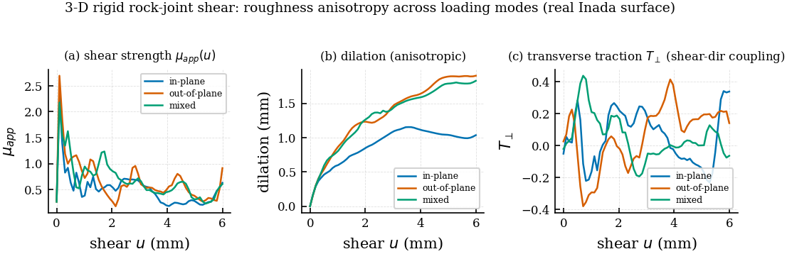

**(ii) Deformable two-block FEM** (`rock_joint_cyclic_fem.py`). Two elastic `ChartVectorFEMSolver`
blocks (small-strain Hooke) meet at a **zero-thickness dilatant-frictional interface** (a Goodman/Plesha
rock-joint interface element): normal penalty + an elastoplastic Coulomb return map with **effective
friction $\tan(\phi_b+i)$** (the tilted-facet projection that supplies the Patton strength on the flat
mean plane), dilation flow $\dot g_N=\tan(i)\,|\dot g_T|$, and **Plesha asperity degradation**
$i=i_0e^{-cW_p}$. The roughness enters as the per-interface-point dilation-angle field $i_0(x,y)$ from the
chart gradient (asperities live in the interface law; the blocks are flat — the standard idealisation).
A rigid top platen (no tilting) drives the shear; CNV (constant normal displacement) by default, so
$\sigma_n$ rises with dilation (confined-joint behaviour).

- **VERIFIED (monotonic).** Flat joint $\to$ Coulomb $\tau/\sigma_n\to\mu$ (**0.2 %**); uniform $i\to$
  Patton $\tau/\sigma_n\to\tan(\phi_b+i)$ (**0.2 %**). These verify the deformable interface mechanics.
- **CYCLIC (mixed-mode).** Forward/reverse shear produces hysteresis loops with the correct friction
  reversal (cap $\pm\tan(\phi_b+i)$), CNV normal-stress cycling, dilation, and — with degradation on —
  **monotone peak-strength decay over cycles** (measured $0.669\to0.609$ over 4 cycles).

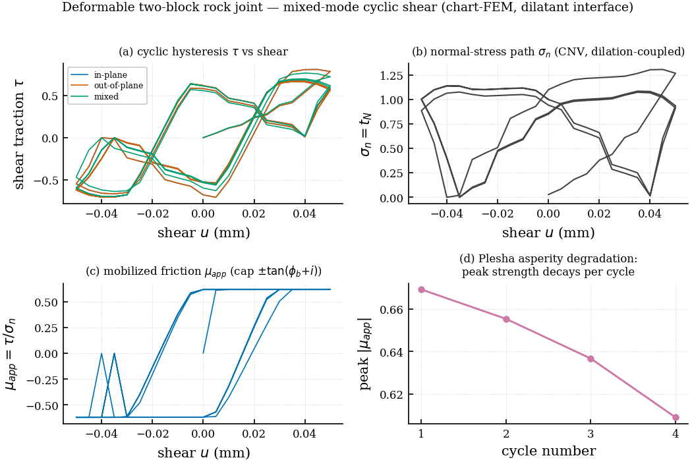

**In-block stress fields.** `postprocessing/plot_rock_joint_stress_slices.py` extracts the per-element
stress (via `compute_F` + the small-strain `stress_fn`) and plots the **mean pressure**
$p=-(\sigma_1+\sigma_2+\sigma_3)/3$ and the **principal-stress differences** $(\sigma_1-\sigma_3),
(\sigma_2-\sigma_3),(\sigma_1-\sigma_2)$ on $x$–$z$ cross-section slices at the **front, mid-section and
back** ($y$-planes) across cyclic time. Driven by a spatially-varying (rough) dilation-angle field
$i_0(x,y)$, the three slices carry genuinely different stress states; the principal differences
concentrate near the joint plane (the contact/shear zone) and reverse with the shear.
`figures/rock_joint_stress_slice_{front,mid,back}.png`, plus a 3-D **side view**
(`rock_joint_stress_slice_sideview.png`). Since the FEM blocks use an *identity* chart (flat geometry,
roughness in the interface law), the slices are **mapped to the physical (rough) domain by draping the
joint chart $h(x,y)$ onto the interface** (decaying to the fixed outer faces) — so the cross-sections
show the rough interface profile. **Caveat:** the stress is *computed* on the flat interface-element
model and *displayed* on the chart-mapped geometry; capturing true asperity-tip stress concentrations
would require meshing+solving on the rough geometry (a `chart_decoder` warp of the FEM mesh — the next
refinement).

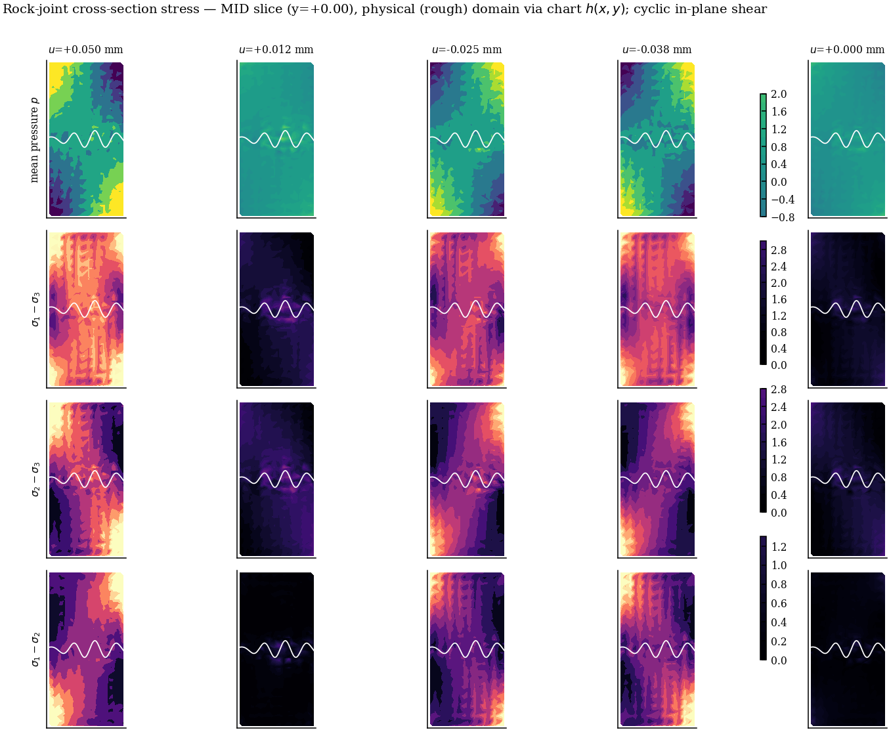

**(iii) PyVista 3-D visualization** (`postprocessing/{surface_anim_3d,plot_rock_joint_3d}.py`): the two
real Inada surfaces shearing in 3-D, coloured by the gap field — `figures/rock_joint_3d_shear.gif` (a
still is `rock_joint_3d_surfaces_pub.png`). Traction–displacement data are stored via
`postprocessing/joint_data_io.py` (`runs/rock_joint_3d/*/history.npz` + `params.json`).


**Honest caveats.** (i) The crisp anchors are the **monotonic** checks (flat Coulomb, Patton, ridged
anisotropy — all $\le$0.2 %). The **cyclic energy balance is only approximate** ($W_{\rm ext}/W_{\rm
diss}\approx1.5$) because Coulomb friction is non-smooth and the implicit solve does not fully converge at
slip peaks (a known issue needing a semismooth-Newton / augmented-Lagrangian solver — the next refinement);
the cyclic loops are therefore qualitative. (ii) The interface is **flat with the roughness in the
constitutive law** (asperities not meshed as elastic protrusions). (iii) Single-realization curves are
asperity-spiky (use steady/ensemble). (iv) CNV protocol (CNL/CNS are the next extension). (v)
Single-valued surfaces only.

**Reproduce:**
```bash
python3 solvers/contact/surface_chart_3d.py                                  # 3-D height-chart self-test
python3 benchmarks/contact/cv_numerical/rock_joint_shear_3d.py --ridged      # anisotropy V&V (0.00%)
python3 benchmarks/contact/cv_numerical/rock_joint_shear_3d.py --surface rough --mode all   # 3 modes
python3 benchmarks/contact/cv_numerical/rock_joint_cyclic_fem.py --mode mixed --cycles 3     # deformable cyclic
python3 postprocessing/plot_rock_joint_3d.py                                 # figures + PyVista 3-D GIF
pytest tests/test_rock_joint_3d.py -v                                        # rigid + FEM monotonic V&V
```

---

## 11.11 The GENUINE atlas-vs-level-set demonstration — friction on the real rough geometry

§11.10's deformable model put the roughness in the interface *constitutive law* (a flat interface with
an EFFECTIVE dilation angle $\tan(\phi_b+i)$): the dilation is **imposed**, not emergent — a reviewer
would rightly call that a shortcut.  This section does it **genuinely**: train a boundary-fitted
ChartDecoder for the rough block, **verify it first**, then solve Coulomb friction on the *actual rough
geometry*, so dilation/strength EMERGE from the resolved asperities.  §11.10 is kept as the **labeled
flat benchmark** to compare against.

**Train the decoder + VERIFY FIRST** (`solvers/fem/rough_block_decoder.py`,
`benchmarks/contact/cv_numerical/cv7_decoder_verify.py`).  The decoder maps a reference cube
$\xi\in[-1,1]^3$ to a physical block whose top face is the rough surface $z=1+h(x,y)$, with the relief
net using **Fourier features** — *critical*: the stock tanh `ChartDecoder` suffers the SAME spectral bias
as an ambient SDF and would smooth the asperities, so a fair claim requires the chart to actually resolve
the roughness.  Verification gates (before any contact):

| representation | rough-surface reconstruction (% of RMS) | chart-FEM |
|---|---|---|
| **Fourier boundary-fitted decoder (the atlas)** | **2.2%** | all elements valid, det $J\in[0.94,1.06]$, **MMS $O(h^2)$** (rates 2.07, 1.83) |
| vanilla plain-MLP decoder | 48% (spectral bias) | — |
| ambient 3-D neural SDF (the level set) | 16% / extracted level set 3% | — (smooths the asperities) |

So the boundary-fitted Fourier chart resolves the geometry the level set smooths, AND the FEM provably
solves on it ($O(h^2)$ on the curved chart — a curved chart passes the patch test only approximately).

**Genuine friction shear on the rough geometry** (`rock_joint_decoder_shear.py`): a deformable block
(chart-FEM on the trained decoder, rough top face, fixed bottom) is sheared against the *mating rigid
rough surface* under node-to-surface penalty + Coulomb friction.  Dilation/strength **emerge** — there is
no effective angle.  Measured: frictionless $\mu_{\rm app}$ rises $0\!\to\!0.17$ (pure GEOMETRIC dilatancy,
emergent dilation $\approx9.7^\circ$, purely from the asperities interlocking); with $\mu=0.3$,
$\mu_{\rm app}$ rises $0.24\!\to\!0.47$ — the dilatant strengthening $\tan(\phi_b+i)$ from the *real*
geometry.

**The payoff — atlas vs level set on the SAME problem** (`cv7_atlas_vs_sdf_shear.py`): solve the identical
shear with the geometry from (a) the atlas (true rough surface) and (b) the ambient SDF's smoothed zero
level set.  The level set under-predicts the emergent **dilatancy by 98%** (frictionless: 0.004 vs 0.171 —
the smoothed surface has almost no asperity slope, so almost no dilatancy) and the **shear strength by 35%**
(with friction: 0.31 vs 0.47).  This is the genuine "neural atlas beats the level set" claim — on resolved
rough geometry, no shortcut.


**Honest caveats.** (i) Concentrated asperity-tip contact + Coulomb non-smoothness → the implicit residual
is ~0.3–1% of the forces under shear (the **frictionless** case converges cleanly; the friction curves are
qualitative — a semismooth-Newton / augmented-Lagrangian contact solver is the next refinement).  (ii) The
roughness is **band-limited** to what the mesh resolves (a few asperity wavelengths), with a modest
amplitude to keep det $J>0$.  (iii) ONE deformable block on a rigid mating rough surface (two deformable
decoders is the extension).  (iv) The flat effective-dilation model (§11.10) is retained only as the
benchmark; this section is the genuine result.

**Reproduce:**
```bash
python3 solvers/fem/rough_block_decoder.py                                   # train + verify a rough decoder
python3 benchmarks/contact/cv_numerical/cv7_decoder_verify.py               # reconstruction + no-foldover + MMS O(h^2)
python3 benchmarks/contact/cv_numerical/rock_joint_decoder_shear.py         # genuine friction shear (emergent dilation)
python3 benchmarks/contact/cv_numerical/cv7_atlas_vs_sdf_shear.py           # atlas vs level set + figure
```

---

## 11.12 CV-7 — formulation, transition-map verification, and the plan to a success story

This consolidates the **mathematics** behind CV-7 (Fourier-feature charts; interpenetration; traction),
a **transition-map** contact-detection verification, and the **staged plan** to a publishable result.
(Full derivation + the adversarial audit: `contact_atlas/cv7_formulation_brief.md`.)

> **Scope discipline (two geometries, two solvers — never conflate).** §11.9 = the *real Inada* 1-D
> profile, height-chart shear (chart recon 2.3 µm vs SDF 107 µm; **strength under-predicted 61%**;
> dilation barely affected, **0.5%**, because total dilation is set by the large-scale waviness the SDF
> does capture). §11.11 = a *band-limited synthetic* surface carried by a trained 3-D ChartDecoder,
> chart-FEM shear (frictionless **dilatancy under-predicted 98%**; **strength 35%**). The 98% figure is
> the synthetic decoder run, **not** Inada.

### (A) Fourier-feature formulation

Geometry is a learned *function on the surface's own parameter*, not an ambient field. The enabling
choice is **Fourier-feature input encoding**, which hands the network high frequencies directly. Three
banks are used:

- **1-D height chart** (`profile_chart_2d.py`, the Inada chart) — *deterministic geometric* bank:
  $\gamma(x)=[\cos(2\pi B\tilde x),\sin(2\pi B\tilde x)]$, $\tilde x\in[-1,1]$,
  $B=\mathrm{geomspace}(0.5,f_{\max},K)$ ($K{=}192$, $f_{\max}{=}1500$); $z=h_\theta(x)=\texttt{base}+\mathrm{MLP}(\gamma(x))$.
- **2-D surface chart** (`surface_chart_3d.py`) — *Gaussian-random* bank $B_i\sim\mathcal N(0,\sigma^2 I_2)$
  ($\sigma{=}8$, $K{=}256$): $\gamma(\mathbf u)=[\cos(2\pi\tilde{\mathbf u}B^\top),\sin(2\pi\tilde{\mathbf u}B^\top)]$.
- **3-D boundary-fitted decoder relief** (`rough_block_decoder.py`) — Gaussian bank
  $B\sim\mathcal N(0,(k_{\max}/3)^2 I_2)$ ($k_{\max}{=}6$, $K{=}20$), encoded at $\pi$ (since $\xi_{xy}\in[-1,1]^2$):
  $\mathrm{relief}(\xi_{xy})=\mathrm{MLP}([\cos(\pi\xi_{xy}B^\top),\sin(\pi\xi_{xy}B^\top)])$. The decoder map is
  $$\mathbf x=D(\boldsymbol\xi)=\mathbf s+\xi_x\mathbf t_1+\xi_y\mathbf t_2+\xi_z\mathbf n+\mathrm{relief}(\xi_{xy})\,\mathrm{ramp}(\xi_z)\,\hat{\mathbf n},\quad
  \mathrm{ramp}(\xi_z)=\tfrac{\xi_z+1}{2}\ (\text{rough top}),$$
  with chart-Jacobian $J=\partial D/\partial\boldsymbol\xi$ whose third column $\mathbf n+\tfrac12\mathrm{relief}\,\hat{\mathbf n}$
  couples the relief into $\det J$ (the foldover-amplitude limit; `verify_decoder` asserts $\det J>0$ on every element).

**Why it beats the level set (spectral bias).** A plain coordinate MLP learns frequencies in increasing
order (Rahaman et al. 2019): its NTK is Laplace-like, high-frequency density decays, so asperities are
smoothed — exactly what an ambient neural SDF is built from. Fourier prepending (Tancik et al. 2020)
replaces this with a *stationary band-limited* kernel: the geometric 1-D bank gives
$\Theta(x,x')=\tfrac1K\sum_k\cos(2\pi f_k(x-x'))$; the Gaussian 2-D bank gives $J_0(2\pi\sigma\|\mathbf u-\mathbf v\|)$,
flat to a cutoff $\sim2\pi\sigma$ — all sub-cutoff frequencies learned in parallel. The cutoff is a
*transparent, tunable* ceiling, unlike the SDF's *intrinsic* bias. Measured: Fourier decoder reconstructs
the surface to **2.2% of RMS**, plain-MLP decoder **48%**, ambient 3-D SDF **~16%**.

### (B) Interpenetration prevention

Gap (querying the mating rough surface $z_{\rm up}(X,Y)=z_p+h(X{-}u_x,Y)$ at the deformed top node, with the
upper-body downward outward normal $\mathbf n=(h_x,h_y,-1)/\sec$, $n_z<0$): $g_N=(z_{\rm up}-Z)(-n_z)$,
**$g_N<0$ = penetration**. Signorini/KKT: $g_N\ge0,\ t_N\ge0,\ g_N t_N=0$. Non-penetration is enforced by
the **penalty** method — $f_n=\varepsilon_n\langle-g_N\rangle_+ A_{\rm top}$, $\varepsilon_n=20E/h$,
$A_{\rm top}=(2L)^2/N_{\rm top}$, force $\mathbf F_N=f_n\mathbf n$ (pushes the penetrating node *out* of the
upper body; the platen feels the upward reaction $-\sum f_z$) — with the **augmented-Lagrangian/Uzawa**
(`augmented_lagrangian.py`) the route to tight non-penetration (Phase 0). The penetration scales as
$\delta\sim\sigma_n/\varepsilon_n$, driven $\to0$ by raising $\varepsilon_n$ / AL updates.

### (C) Surface traction

Normal pressure $t_N=\varepsilon_n\langle-g_N\rangle_+$. Friction in the §11.11 quasi-static driver is a
**prescribed-direction full-slip Coulomb drag** (no velocity regularization): slip direction
$\mathbf t_{\rm proj}=\widehat{\hat{\mathbf t}-(\hat{\mathbf t}\!\cdot\!\mathbf n)\mathbf n}$ with $\hat{\mathbf t}=[1,0,0]$,
$\mathbf F_T=\mu f_n\mathbf t_{\rm proj}$, $\mu=0.4$. (The regularized $\mathbf f_T=-\mu|f_N|v_T/\sqrt{|v_T|^2+\varepsilon_T^2}$
in `friction.py` is the *MPM* path, not used here.) Per-node $\mathbf F_{\rm contact}=\mathbf F_N+\mathbf F_T$ is
assembled work-conjugately into the Newton residual $R(u)=Ku-f_{\rm contact}$; the contact tangent adds
$\varepsilon_n A_{\rm top}$ on active normal DOFs, $K_{\rm tot}=K_{\rm elastic}+K_c$, Armijo line search.

### (D) Transition-map contact verification (`cv7_transition_map_verify.py`)

For a single-valued surface the boundary chart is the graph $\varphi(x)=(x,h(x))$ — the domain coordinate
IS the inverse-chart coordinate, so the **transition map needs no inversion**: $g_{\rm vert}=z-h_\theta(x)$,
normal $(-h_\theta',1)/\sqrt{1+h_\theta'^2}$ (autograd). (Single-valuedness is the relevant condition; the
CV-5 *radial* detector's star-shapedness is **not** required.) **Measured** (chart vs ambient SDF, vs the
analytic gap/normal in a near-contact band):

| detector | gap RMSE (% of RMS) | normal median / p90 |
|---|---|---|
| **transition map (height chart)** | **4.2%** | 13.4° / 24.8° |
| ambient SDF (level set) | 44.7% | 10.6° / 20.1° |

The transition-map **gap is 10.5× more accurate** (the ambient SDF gives a poor signed distance near the
rough surface); honestly, the **normals are comparable** (the chart gradient carries some noise vs the
finite-difference reference — a regularization target). The gap is the contact-driving quantity, so the
chart detector is the right one. **Feasibility:** well-posed for the single-valued joint, no ambient field,
Fourier-cutoff a transparent knob; overhangs would need the full transition-map atlas (out of scope).
*Honesty:* the gap fed to the solver is the small-slope vertical proxy, not the closest-point distance —
the fidelity story is **slopes/normals**, not gap magnitude; `closest_point_refine_chart` recovers the
perpendicular distance for verification only (it leaks energy if used in the integrator).

### (E) The plan to a success story

Currently measured (do not overstate): friction Newton residual **0.3–1%**, cyclic energy balance **~1.5×**
(frictionless converges cleanly); Patton anchor **0.00%**; geometry/MMS all pass. Staged plan:

| Phase | Goal | Acceptance (target) | Risk |
|---|---|---|---|
| **0. Semismooth-Newton / AL contact solver** *(critical path)* | kill the 0.3–1% friction residual (Coulomb non-smoothness) | monotone residual **<0.1%**; cyclic energy balance **∈[0.95,1.05]**; Patton stays 0.00% | Clarke-Jacobian stall / AL damping — prototype on 2-D Patton |
| **1. Two-block rough FEM** | two mutually deformable decoders (not one-on-rigid) | MMS rate ~2 on both; $\det J\in[0.9,1.1]$; energy balance ∈[0.98,1.02] | interface normal/quadrature alignment — start identity, swap rough in |
| **2. Full multi-scale Inada + band-limit study** | spectral-cutoff sweep; dilatancy-vs-roughness law | recon <5% RMS all cutoffs; smooth dilatancy(RMS,Hurst) curve | over-refinement degrades $\det J$ — adaptive near asperities |
| **3. Transition-map detection wired into the FEM contact-manager** | route chart gap/normal through `body_gap_normal` dispatch | active set = SDF on 1e5 pts; per-query <2×; sharper tip normals | decoder-inversion cost — cache + interpolate |
| **4. Cyclic CNL/CNS + energy ledger** | constant-load/stiffness; closed loops; Plesha decay | $W_{\rm ext}=W_{\rm fric}+\Delta U_{\rm el}+W_{\rm dil}$ to <2% | feedback overshoot — one ledger term at a time |
| **5. Finite-deformation ChartMPM cross-check** *(not built)* | explicit dynamic rough shear vs quasi-static | dilatancy/$\mu_{\rm app}$ within 10% of FEM | $\det J$ hourglassing — fine penalty, small dt |
| **6. Publication figure + narrative** | atlas vs level set vs flat benchmark, one page | 3×3 grid, every number cited to its own geometry | density — lead with physics |

**Paper thesis (honest):** $\mu_{\rm app}=\tan(\phi_b+i)$ is *emergent* from asperity geometry, not imposed;
a boundary-fitted neural chart resolves the asperity slopes an ambient SDF smooths (spectral bias), so the
level set under-predicts strength (61% Inada / 35% synthetic) and dilatancy (98% synthetic frictionless).
**Phase 0 (the robust contact solver) is the critical path to a publishable result.**

---

## 12. Scope & limitations

- **Small-strain, linear-elastic, quasi-static (CV-1..4).** Hertz/Brazilian/C–M are infinitesimal
  half-space/plane theory; the MPM is finite-deformation and frictional. Agreement is
  expected only in the small-load, pre-damage, frictionless-or-monotone limit.
- **Plane stress vs plane strain.** In-plane stresses ($\sigma_t$, center values) are
  identical in both; only $\sigma_{zz}$ and compliances differ ($E\to E/(1-\nu^2)$,
  $\nu\to\nu/(1-\nu)$). State the choice when comparing displacements.
- **Singularities.** Point-load fields diverge as $1/r$; figures clamp $r$ to
  $\sim 1\%R$ and use percentile color limits (the physical contact is a finite Hertz patch).
- **Transition-map machinery: CV-1..4 do NOT exercise it** (symmetric/collinear/90° cases reduce
  to linear superposition of known closed forms). **CV-5 is the case that does** — nonconvex,
  non-collinear, curved-surface contact where a single closest-point projection fails and the
  boundary-chart correspondence enables multi-arc detection. Even there, the *gap* is a single-body
  inverse radial chart (biased vs perpendicular distance), not the SDF replacement.
- **CV-5 is rigid-body** — it tests the contact *kinematics*, not the deformable solver; the radial
  gap requires star-shapedness and radial visibility.
- **Carried corrections.** Eq. 46 factor-4 width; two-body modulus $E^*=E/2(1-\nu^2)$;
  compatibility-fixed Flamant gauge; equibiaxial (not hydrostatic) disc center.

---

**References.** K. L. Johnson, *Contact Mechanics* (CUP, 1985); Timoshenko & Goodier,
*Theory of Elasticity* (McGraw-Hill); Mindlin (1949); Hondros (1959);
Liu & Sun (2020), *CMAME* 369:113168.
