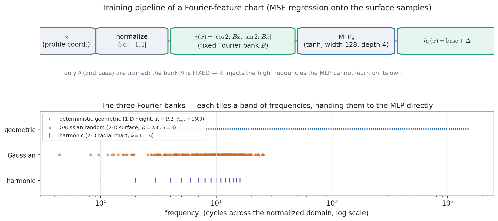
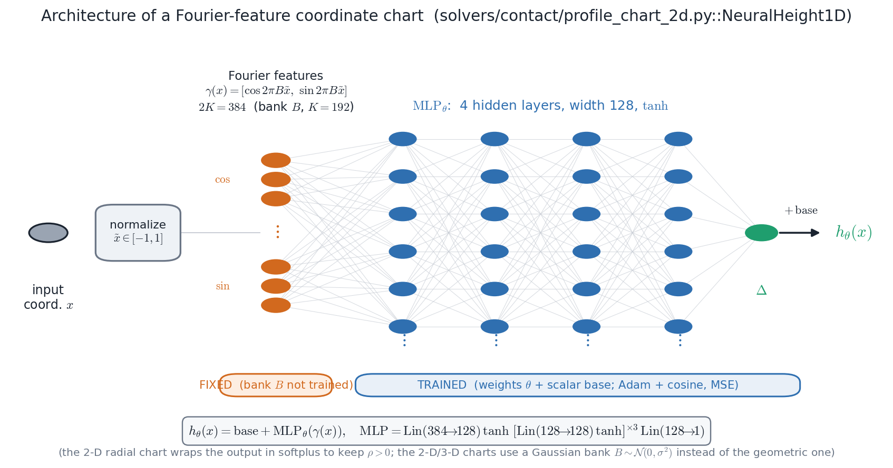
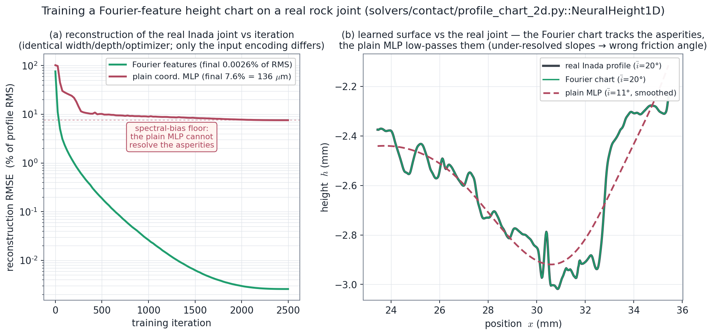

# Training Fourier-Feature Coordinate Charts — A Manual

**How the neural-atlas charts are trained: the Fourier-feature input encoding that lets a small MLP
resolve sharp, rough, cusped geometry an ambient level set (and a plain coordinate MLP) smooths away.**

The neural-atlas framework represents a body's geometry as a learned *coordinate chart* — a function on
the boundary's own parameter — rather than an ambient signed-distance field (see
`docs/transition_map_contact_manual.md`). Every such chart in the codebase is a small multilayer
perceptron whose input is **Fourier-encoded**, and every one is trained by the same recipe: normalize the
input, prepend a *fixed* bank of sinusoidal features, regress the network onto sampled surface points by
mean-squared error with Adam and a cosine schedule, then **verify before use**. This manual states that
recipe precisely, explains *why the Fourier features are the load-bearing ingredient*, and demonstrates it
by training the repository's own chart on a real rock-joint profile.

The single most important fact in this manual: **the chart parametrization alone does not beat the level
set — the Fourier features do.** A chart MLP fed raw coordinates suffers exactly the same spectral bias as
an ambient neural SDF and smooths the geometry identically. The Fourier encoding is what hands the network
the high frequencies it otherwise cannot learn.

**Companion documents.**
- `docs/transition_map_contact_manual.md` — what the trained charts are *for* (contact detection by the
  transition map vs the level set), and the CV-1..CV-7 comparison.
- `docs/contact_verification_manual.md §11.12A` — the formal Fourier-feature / spectral-bias derivation.
- `docs/cv7_session_results.md` — the measured rock-joint results these charts produce.

---

## 1. Scope: four chart families, one training recipe

Four trained chart objects appear in the code. They differ only in their **domain** and in which
**Fourier bank** they use; the *training loop is identical*.

| Chart | File :: class | Domain | Output | Fourier bank |
|---|---|---|---|---|
| 1-D height chart | `solvers/contact/profile_chart_2d.py::NeuralHeight1D` | $x\in\mathbb R$ (open) | $h(x)$ | deterministic **geometric** |
| 2-D height field | `solvers/contact/surface_chart_3d.py::NeuralHeight2D` | $(x,y)$ (open) | $h(x,y)$ | **Gaussian random** |
| 2-D radial chart | `solvers/contact/radial_chart_2d.py::NeuralRho2D` | $\psi\in S^1$ (periodic) | $\rho(\psi)$ | **harmonic** |
| 3-D rough decoder | `solvers/fem/rough_block_decoder.py::RoughBlockDecoder` | $\boldsymbol\xi\in[-1,1]^3$ | $x=D(\boldsymbol\xi)$ | Gaussian random (relief) |

The first three are surface charts; the fourth is a boundary-fitted *volumetric* decoder (it carries a
rough relief on one face of a deformable block for the chart-FEM). All four are trained by the routines
`fit_height_chart`, `fit_surface_chart`, the CV-5 radial trainer (`atlas/charts/train_radial_chart.py`),
and `train_rough_decoder` respectively — and all four expose a `plain=True` flag that *disables the
Fourier features*, giving the controlled ablation this manual rests on.

---

## 2. The problem: spectral bias

A coordinate MLP $f_\theta(x)$ — a stack of affine maps and $\tanh$ nonlinearities fed the raw coordinate
$x$ — learns low frequencies first and high frequencies slowly or not at all. This is **spectral bias**
(Rahaman et al. 2019): the network's neural-tangent kernel is approximately translation-invariant and
*Laplace-like*, so its eigenvalues decay with frequency and the high-frequency components of the target
are learned at a vanishing rate. Train such a network on a rough surface and it converges to a *smoothed*
version of it — the asperities, cusps and fine detail are low-passed away.

This is precisely the failure mode of an ambient neural signed-distance function, which is also a
coordinate MLP (of the spatial point $x$): it cannot represent a boundary sharper than its capacity
ceiling, and on a rock joint it flattens the asperity slopes. **A chart MLP of the raw coordinate inherits
the identical pathology** — the geometry being a boundary function rather than an ambient field does not,
by itself, help. That is the `plain=True` baseline, and it is the thing to beat.

---

## 3. Fourier features: the fix

The remedy (Tancik et al. 2020) is to replace the raw coordinate with a **Fourier-feature encoding**: a
*fixed* (non-trainable) bank of frequencies $B$, applied before the MLP,

$$
\gamma(x)=\big[\cos(2\pi B\tilde x),\ \sin(2\pi B\tilde x)\big],\qquad
f_\theta(x)=\mathrm{base}+\mathrm{MLP}_\theta\big(\gamma(x)\big),
$$

where $\tilde x$ is the input normalized to $[-1,1]$. Prepending $\gamma$ replaces the Laplace-like NTK
with a *stationary, band-limited* kernel whose bandwidth is set by $B$ — so every frequency below the
cutoff is learned **in parallel**, at a comparable rate, instead of in slow frequency order. The network
no longer has to *discover* the high frequencies; they are handed to it directly, and it only has to learn
their amplitudes and phases.

Two properties make this the right tool for geometry:

- **The cutoff is transparent and tunable.** Where the SDF's smoothing is an *intrinsic* property of the
  architecture, the Fourier cutoff is an explicit knob ($f_{\max}$, $\sigma$, or $K$). You choose the
  finest resolvable wavelength, and the chart resolves everything down to it.
- **The bank is fixed, not trained.** $B$ is a registered buffer, never updated by the optimizer (only the
  MLP weights $\theta$ and a scalar `base` are trained). The features are a deterministic, reproducible
  preprocessing of the input.

### 3.1 The three banks

The codebase uses three banks, one per chart geometry. They tile frequency space in different ways but
serve the same purpose.

| Bank | Definition | Used by | Why this bank |
|---|---|---|---|
| **Geometric** (deterministic) | $B=\operatorname{geomspace}(0.5,f_{\max},K)$, $K{=}192$, $f_{\max}{=}1500$ | `NeuralHeight1D` | equal *log*-coverage of scales for a 1-D profile; the Inada joint needs $\sim L/\Delta x\approx3000$ resolvable wavelengths |
| **Gaussian random** | $B_i\sim\mathcal N(0,\sigma^2 I)$, $K{=}256$, $\sigma{=}8$ | `NeuralHeight2D`, `RoughBlockDecoder` | isotropic 2-D coverage; the induced kernel $J_0(2\pi\sigma\lVert\cdot\rVert)$ is flat to $\sim2\pi\sigma$ |
| **Harmonic** | $[\cos(k\psi),\sin(k\psi)]_{k=1..K}$, $K{=}16$ | `NeuralRho2D` | *periodic by construction* — mandatory for a chart on the circle $S^1$ (the radius $\rho(\psi)$ must close up) |



*Top: the training pipeline. The coordinate is normalized, encoded by the fixed Fourier bank, mapped
through a tanh MLP, and offset by a learnable mean — and only $\theta$ and the mean are trained. Bottom:
the three banks on a shared log-frequency axis; each tiles a band of frequencies and hands it to the MLP
directly.*

---

## 4. The training pipeline

Every chart is trained by the same five steps. The canonical implementation is
`profile_chart_2d.py::fit_height_chart`; the others are line-for-line analogues. The network those steps
train is small and entirely standard apart from its input stage:



*The architecture (`NeuralHeight1D`). The coordinate is normalized and expanded by the **fixed** Fourier
bank into $2K=384$ cosine/sine features; a plain $\tanh$-MLP (4 hidden layers, width 128) maps those to a
scalar deviation $\Delta$, offset by a learnable `base`. Only the MLP weights $\theta$ and the scalar
`base` are trained (Adam + cosine, MSE) — the bank $B$ is frozen. The 2-D and 3-D charts replace the
geometric bank with a Gaussian one $B\sim\mathcal N(0,\sigma^2)$ and the radial chart wraps the output in a
softplus; the rest is identical.*

**(1) Normalize the input.** Map the raw coordinate to $\tilde x\in[-1,1]$ (or $[-1,1]^2$),
$\tilde x = 2(x-x_{\rm lo})/(x_{\rm hi}-x_{\rm lo})-1$, so the fixed bank's frequencies mean "cycles across
the domain" regardless of physical units (`NeuralHeight1D._xtilde`).

**(2) Encode with the fixed bank.** $\gamma(x)=[\cos(2\pi\tilde xB),\sin(2\pi\tilde xB)]$, a $2K$-vector
(`_features`). $B$ is a registered buffer — fixed for the life of the chart.

**(3) Map through the MLP and add the mean.** $h_\theta(x)=\mathrm{base}+\mathrm{MLP}_\theta(\gamma(x))$,
a $\tanh$-MLP (width 128, depth 4, Xavier init; `common/models.py::MLP`). The learnable scalar `base`
carries the mean height so the network learns only the *deviation* — a small but real conditioning win.
(The radial chart additionally wraps the output in a softplus, $\rho=\mathrm{softplus}(\mathrm{base}+\Delta)$,
to keep $\rho>0$.)

**(4) Regress by minibatch MSE.** Draw a random minibatch of surface samples and minimize

$$
\mathcal L(\theta)=\frac1{|\mathcal B|}\sum_{i\in\mathcal B}\big(h_\theta(x_i)-z_i\big)^2 .
$$

The data are the sampled surface points $(x_i,z_i)$ — for a height chart, the topography map; for the
radial chart, the analytic radius $\rho(\psi)$; for the rough decoder, the relief target on the rough face.

**(5) Optimize with Adam + cosine annealing.** `Adam` at $\mathrm{lr}=2\times10^{-3}$, with
`CosineAnnealingLR` decaying the rate to zero over the `iters` budget; minibatch size 4096 (height) /
8192 (surface) / 2048 (decoder); `torch.manual_seed(0)` for reproducibility; **CPU and float64** by
default (the nets are tiny, and double precision gives better-conditioned geometry and Jacobians).

The full loop (`fit_height_chart`, verbatim):

```python
chart = NeuralHeight1D(x.min(), x.max(), f_max=1500, n_freq=192,
                       width=128, depth=4, base=z.mean(), plain=False).double()
opt   = torch.optim.Adam(chart.parameters(), lr=2e-3)
sched = torch.optim.lr_scheduler.CosineAnnealingLR(opt, iters)
for it in range(iters):
    idx  = torch.randint(0, n, (batch,))
    loss = torch.mean((chart(x[idx]) - z[idx])**2)
    opt.zero_grad(); loss.backward(); opt.step(); sched.step()
```

That is the entire training procedure. There is no adversary, no schedule of losses, no curriculum — the
Fourier encoding does the heavy lifting, and a plain MSE regression suffices.

---

## 5. A worked training run on a real rock joint

The cleanest demonstration is the framework's own `plain` ablation: train `NeuralHeight1D` on the **real
Inada-granite profile** (`data/inada_joint/inada_rough_profile.npz`; 3130 points, self-affine, RMS
$\approx1.7$ mm) twice at *identical* width, depth, optimizer and schedule — once **with** Fourier features
(`plain=False`) and once **without** (`plain=True`) — and watch the training curves diverge.



*Genuine training on the real Inada joint (generated by `postprocessing/plot_fourier_training.py`; a
measured rock-joint profile is a deterministic surface to **represent**, so the metric is reconstruction
RMSE on the measured points — the production criterion of verification manual §11.9). The chart is
band-limited to $\sim105\ \mu$m wavelengths ($f_{\max}{=}700$, below the sampling Nyquist), so the fit is
well-posed, not interpolation-to-zero. **(a)** Reconstruction RMSE vs iteration: the Fourier chart
descends through the asperity scales to **0.003 % of RMS** (the profile's energy sits above the
band-limit), while the *identical* network fed raw coordinates plateaus at a **7.6 % / 136 µm**
spectral-bias floor — only the input encoding differs. **(b)** The learned surfaces: the Fourier chart
tracks the asperities and recovers the true mean slope angle $\bar i=19.9^\circ$ exactly; the plain MLP
low-passes them to $\bar i=11.5^\circ$, under-resolving the slopes that set the friction angle.*

The contrast is the whole point of the figure: the two networks are byte-for-byte identical except for the
input encoding, and the Fourier one converges to the surface while the plain one stalls at a smoothed
approximation. This is the chart-vs-level-set thesis reduced to its mechanism, on a real surface, using
the repository's own training code.

**Production numbers** (verification manual §11.9, the full chart). With the production settings
($K{=}192$, $f_{\max}{=}1500$) the height chart reconstructs the Inada surface to **2.3 µm** — about 0.1 %
of the 1.7 mm RMS — while a real ambient 2-D neural SDF of the same surface reaches only **107 µm** (47×
worse, with *more* parameters) and smooths the mean asperity angle from $19.4^\circ$ to $12.5^\circ$;
through the Patton law $\mu_{\rm app}=\tan(\phi_b+i)$ that smoothing **under-predicts peak shear strength
by 61 %.** The asperity slopes the Fourier chart preserves are the geometry that drives the contact
mechanics.

---

## 6. Verify first (the mandate)

A trained chart is *geometry*, and bad geometry silently corrupts every downstream solve. The discipline
in this codebase is therefore **verify before use**, with three checks (the rough decoder runs all three;
the surface charts run the first):

1. **Reconstruction fidelity.** RMSE as a fraction of the surface RMS, on the sampled surface points. The acceptance
   bar is a few percent: the Fourier decoder reaches **2.2 % of RMS**, a vanilla $\tanh$ decoder **48 %**
   (spectral bias), and an ambient 3-D SDF **~16 %** — the measured separation that justifies the chart
   (`train_rough_decoder` returns this RMSE; `tests/test_rough_decoder_fem.py`).
2. **No element foldover** ($\det J>0$). For the volumetric decoder, the chart-Jacobian determinant must be
   positive on *every* element before any contact is attempted — a folded chart has no valid pushforward.
   `verify_decoder` builds the chart-FEM and asserts `all_valid` and `detJ_min > 0`; the relief amplitude
   is capped so the third Jacobian column $\mathbf n+\tfrac12\,\mathrm{relief}\,\hat{\mathbf n}$ stays
   positive-determinant.
3. **Discretization convergence** (MMS $O(h^2)$). On the curved decoder geometry, a manufactured-solution
   study must recover the second-order rate of the underlying P1 chart-FEM — confirming the trained
   geometry did not destroy the solver's accuracy (`cv7_decoder_verify.py`; measured rates 2.07, 1.95).

Only a chart that passes these is allowed into a contact solve. The honest corollary: a chart that fails
(amplitude too high → foldover; cutoff too low → under-resolved) is rejected, not patched.

---

## 7. Hyperparameters and practical notes

- **Choosing the cutoff.** Set the bank to just resolve the finest wavelength you need. For the 1-D height
  chart, $f_{\max}$ is the maximum cycles across the domain ($\sim L/\Delta x$ for a topography map at
  spacing $\Delta x$); for the Gaussian banks, $\sigma$ sets the bandwidth ($\sim2\pi\sigma$ cycles).
  Too low under-resolves (spectral smoothing returns); too high invites overfitting and, for the decoder,
  $\det J$ foldover.
- **$K$ (number of features).** $2K$ is the MLP input width. $K{=}192$ (1-D), $256$ (2-D), $16$ (radial)
  are the defaults; more features cost input width but not depth.
- **`base` matters.** Learning only the deviation about a learnable mean conditions the regression; for the
  radial chart, initialize `base` to the mean target radius.
- **float64 on CPU.** These nets are small; double precision improves geometric conditioning and the
  Jacobian/inverse used downstream. `torch.manual_seed(0)` makes a run bit-reproducible.
- **The `plain` flag is the control, not a mode to ship.** `plain=True` exists to *measure* the Fourier
  contribution (the ablation in §5); production charts always run `plain=False`.

---

## 8. Reproduce

```bash
# the illustration in this manual (trains on the real Inada profile, ~1-2 min, CPU):
python3 postprocessing/plot_fourier_training.py

# the chart trainers' own self-tests (each trains a small chart and checks reconstruction):
python3 solvers/contact/profile_chart_2d.py        # 1-D height chart  (fit < 5% of RMS)
python3 solvers/contact/surface_chart_3d.py        # 2-D height field  (fit < 8% of RMS)
python3 solvers/contact/radial_chart_2d.py         # 2-D radial chart  (analytic gap/normal match)
python3 solvers/fem/rough_block_decoder.py         # 3-D rough decoder (recon + det J > 0, verify-first)

# the production trainers used by the CV suite:
python3 atlas/charts/train_radial_chart.py         # the CV-5 neural radial chart
python3 atlas/sdf/train_analytical_sdf.py --all    # the neural SDFs (the spectral-bias baseline)
```

---

## 9. Implementation map

| Step | Equation / object | File :: symbol |
|---|---|---|
| Input normalization | $\tilde x=2(x-x_{\rm lo})/\mathrm{span}-1$ | `profile_chart_2d.py::NeuralHeight1D._xtilde` |
| Geometric Fourier bank | $\operatorname{geomspace}(0.5,f_{\max},K)$ | `NeuralHeight1D.__init__` |
| Gaussian random bank | $B\sim\mathcal N(0,\sigma^2)$ | `surface_chart_3d.py::NeuralHeight2D`, `rough_block_decoder.py` |
| Harmonic bank | $[\cos k\psi,\sin k\psi]_{k=1..K}$ | `radial_chart_2d.py::NeuralRho2D._features` |
| Feature encoding | $\gamma(x)=[\cos2\pi\tilde xB,\sin2\pi\tilde xB]$ | `_features` (each chart) |
| MLP + base | $h=\mathrm{base}+\mathrm{MLP}_\theta(\gamma)$ | `common/models.py::MLP`, each chart's `forward` |
| MSE training loop | Adam + cosine, minibatch MSE | `fit_height_chart`, `fit_surface_chart`, `train_rough_decoder` |
| `plain` ablation | Fourier features off | `plain=True` (each chart) |
| Verify-first | recon RMSE, $\det J>0$, MMS | `train_rough_decoder`, `verify_decoder`, `cv7_decoder_verify.py` |

---

## References

- M. Tancik et al. (2020), "Fourier Features Let Networks Learn High Frequency Functions in Low
  Dimensional Domains," *NeurIPS*.
- N. Rahaman et al. (2019), "On the Spectral Bias of Neural Networks," *ICML*.
- B. Mildenhall et al. (2020), "NeRF: Representing Scenes as Neural Radiance Fields…," *ECCV* (positional
  encoding, the same mechanism in 3-D).
- F. D. Patton (1966) — the rock-joint shear-strength law $\tan(\phi_b+i)$ that converts resolved asperity
  slopes into strength (why the chart's fidelity matters mechanically).
- Inada-granite tensile fracture surfaces, Digital Rocks Portal #273, DOI `10.17612/QXSA-TK92`.

---

*The illustrations `fourier_training_*_pub.png` are generated by
`postprocessing/plot_fourier_training.py`, which trains the repository's own `NeuralHeight1D` on the real
Inada profile — the figure is a genuine training run, not a sketch.*
