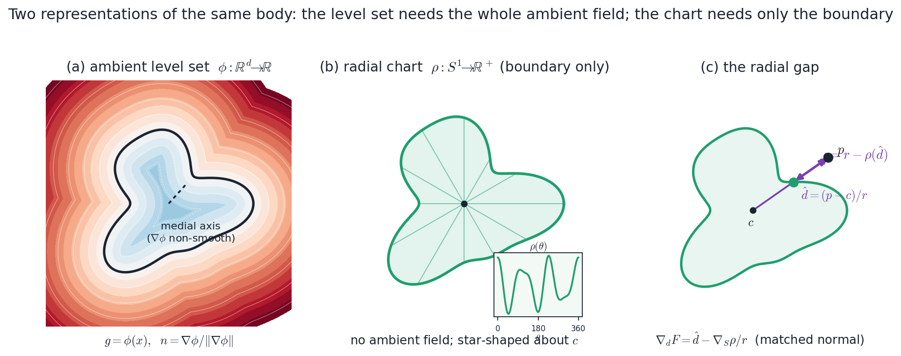
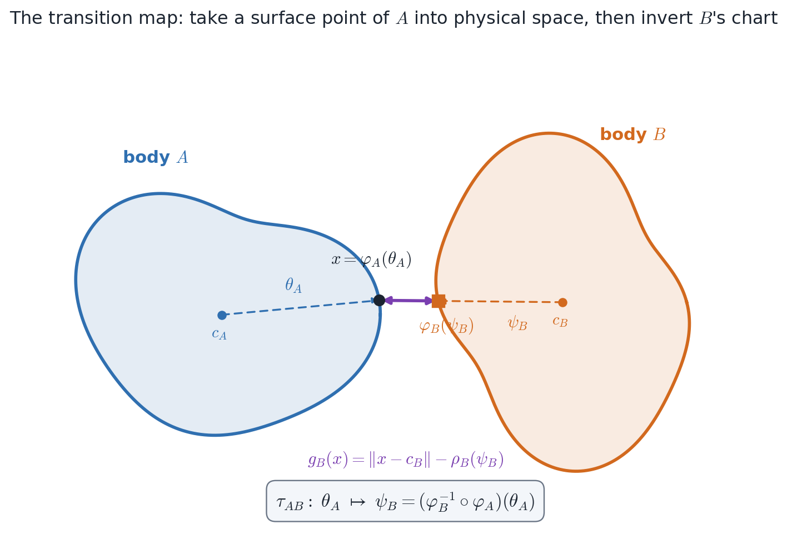
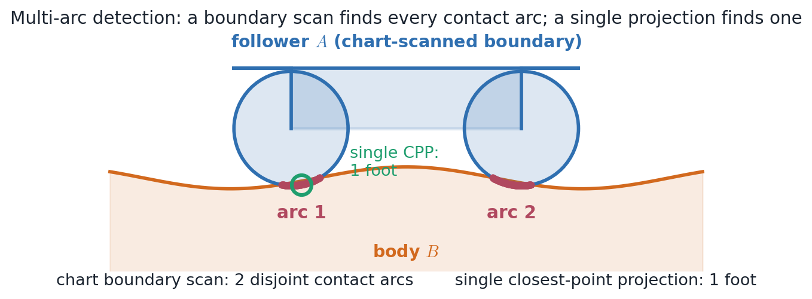
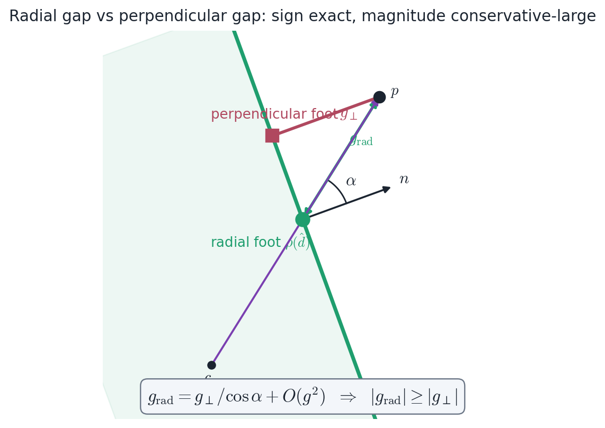
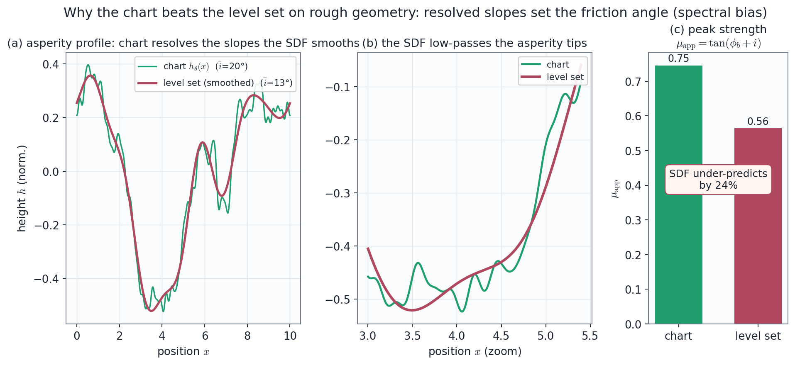
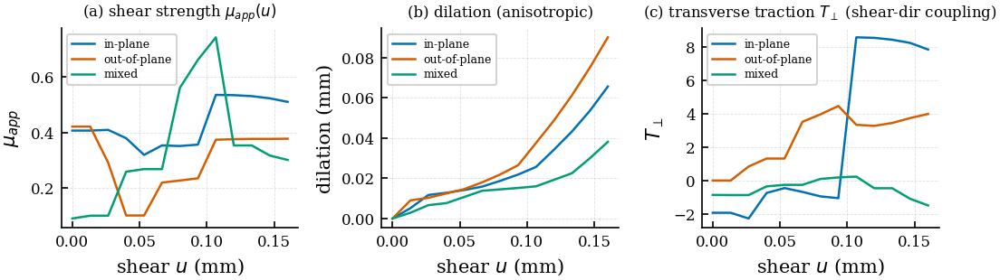

# Transition-Map Contact Mechanics — A Theory Manual

**A mathematical treatment of contact detection and computation by chart transition maps, and a
head-to-head comparison against the ambient level set (neural SDF) on the CV-1..CV-7 benchmark suite.**

This manual develops the one idea that distinguishes the neural-atlas contact framework from a
conventional level-set contact solver: *contact is read from the chart transition map rather than from
an ambient signed-distance field.* It states what a transition map is, proves why it is enough to detect
and compute contact, derives the gap and normal it produces, and then puts the two representations on the
same problems — the closed-form verification benchmarks CV-1 through CV-6 and the genuine rough rock-joint
capstone CV-7 — to show, with measured numbers, exactly where the chart helps and where it does not.

The treatment is deliberately honest. A transition-map chart is *not* a universal replacement for a level
set: it carries a single-body inverse-chart gap that is conservative-large rather than Euclidean, it
requires star-shapedness (radial charts) or single-valuedness (height charts), and on the convex,
collinear, superposable problems (CV-1..CV-4) it is exactly equivalent to the SDF and buys nothing. The
manual makes those preconditions explicit and reports the cases where the chart *measurably* wins —
cusped nonconvex geometry (CV-5), self-similar fractal geometry (CV-6), and real rough geometry (CV-7) —
together with the cases where it is honestly comparable or worse.

**Companion documents.**
- `docs/contact_theory_manual.md` — the force machinery (penalty, augmented Lagrangian, regularized
  Coulomb friction, persistent-homology topology, self-contact, multi-body orchestration) on the
  chart-based MPM. This manual reuses those forces verbatim and concentrates on the *geometry* feeding
  them.
- `docs/contact_verification_manual.md` — the closed-form acceptance criteria CV-1..CV-6 (§3–§8), the
  transition-map kinematics (§2), the neural-chart protocol (§11), the measured numerical status and
  capability matrix (§11.8), and the CV-7 capstone (§11.9–§11.12).
- `docs/cv7_session_results.md` — the measured CV-7 Phase-1..5 results and honest caveats.
- `contact_atlas/03_mathematical_theory.md` — the variational formulation and well-posedness.

**Notation.** Bodies are labelled $A,B,\dots$; a body's interior is $\Omega_X\subset\mathbb R^d$ ($d=2,3$)
and its boundary $\partial\Omega_X$. We use the sign convention $g<0\Leftrightarrow$ **penetration**
throughout (an SDF that is negative inside, a gap that is negative when the surfaces overlap). The
Macaulay bracket is $\langle z\rangle_+=\max(0,z)$. A *chart* is a parametrization of a body's boundary,
$\varphi_X:\Theta_X\to\partial\Omega_X$; a *level set* is an ambient scalar field
$\phi_X:\mathbb R^d\to\mathbb R$ whose zero set is $\partial\Omega_X$.

---

## 1. Two representations of a body

Every contact algorithm must answer two questions about a query point $x$ near a body $X$: *is $x$ inside
$X$ (and by how much)?* — the **gap** — and *which way is out?* — the **normal**. The neural-atlas
framework can answer them from either of two representations of $X$, and the entire thesis of this manual
is that the choice of representation, not the choice of force law, controls fidelity on geometrically hard
contact.

*Two representations of the same star-shaped body. **(a)** The ambient level set $\phi:\mathbb R^d\to\mathbb R$
fills all of space; its zero set is the boundary, but it carries a medial axis in the interior where
$\nabla\phi$ is non-smooth, and a fixed-capacity neural $\phi$ low-passes sharp features. **(b)** The
radial boundary chart $\rho:S^1\to\mathbb R^+$ stores only the boundary as a height field on the circle of
directions — no ambient field, no medial axis. **(c)** The gap is read along the ray from the center:
$g=r-\rho(\hat d)$, with the matched (conservative) normal $\nabla_d F=\hat d-\nabla_S\rho/r$.*

### 1.1 The ambient level set (neural SDF)

The classical representation is a signed-distance function. For a body $A$ we train a neural network
$\phi_A:\mathbb R^d\to\mathbb R$ (negative inside) and read

$$
\boxed{\,g_A(x)=\phi_A(x),\qquad \mathbf n_A(x)=\frac{\nabla\phi_A(x)}{\lVert\nabla\phi_A(x)\rVert}\,}\qquad (1.1)
$$

— the gap *is* the field value, and the outward normal is the (Eikonal-normalized) gradient, obtained by
one autograd call. This is implemented in `solvers/contact/gap.py::evaluate_gap`, which wraps the forward
pass in `torch.enable_grad()` so it is safe to call inside a `torch.no_grad()` integrator block.

The network is trained so that $\phi_A$ is an approximate signed *distance* — i.e. it satisfies the
eikonal equation $\lVert\nabla\phi\rVert=1$ — through the penalty

$$
\mathcal L_{\rm eik}=\mathbb E_{x\sim\Omega}\big[(\lVert\nabla\phi(x)\rVert-1)^2\big],\qquad (1.2)
$$

(`atlas/sdf/train_sdf.py`), combined with a surface loss $\mathbb E[\lvert\phi\rvert]$ on the point cloud,
a normal-alignment loss $\mathbb E[1-\widehat{\nabla\phi}\!\cdot\!\mathbf n_{\rm gt}]$, and softplus
sign-anchor / far-field terms. The architecture is a $\tanh$-MLP (width 128, depth 6, Xavier init;
`common/models.py::MLP`).

**Where the level set is weak.** Two failure modes recur, and both are *intrinsic* to the representation,
not bugs:

1. **The medial axis.** The exact Euclidean SDF is only $C^0$ on the medial axis (the locus equidistant
   from $\ge 2$ boundary points), where the nearest-point map is multivalued and $\nabla\phi$ jumps. In a
   concavity this medial set reaches close to the surface, so the gradient normal degrades exactly where a
   nonconvex contact happens.
2. **Spectral bias.** A coordinate-MLP learns low frequencies first and high frequencies slowly or never
   (Rahaman et al. 2019); its neural-tangent kernel is Laplace-like, with high-frequency power decaying.
   A fixed-capacity $\phi$ therefore *smooths* cusps, asperities and fine detail — it cannot represent a
   boundary sharper than its capacity ceiling. §5 makes this quantitative; CV-6 (§6.3) and CV-7 (§6.4)
   measure it.

### 1.2 The boundary chart

The alternative is to store only the boundary, as a *function on the boundary's own parameter*. Three
chart families appear in the code, in increasing generality:

- **Radial chart** $\rho_X:S^{d-1}\to\mathbb R^+$ — a height field on the sphere of directions, for
  star-shaped bodies. Center $c_X$, orientation $Q_X$ (body axes as columns). The boundary is
  $\varphi_X(\hat u)=c_X+Q_X\,\rho_X(\hat u)\,\hat u$. Implemented analytically in
  `solvers/contact/supershape.py` (2-D Gielis superformula) and `chart_gap.py::RadialChart` (3-D), and as
  a trained neural chart in `radial_chart_2d.py::NeuralRho2D`.
- **Height chart (graph)** $h_X:\mathcal D\to\mathbb R$ over an open parameter domain $\mathcal D$ — for a
  single-valued rough surface $z=h(x)$ (a rock-joint face). Implemented in
  `profile_chart_2d.py::NeuralHeight1D` (1-D) and `surface_chart_3d.py::NeuralHeight2D` (2-D).
- **Decoder chart** $D_X:\boldsymbol\xi\mapsto x$ — a boundary-fitted volumetric map (a `ChartDecoder`)
  for general, possibly non-star-shaped geometry, inverted by Newton iteration
  (`common/geometry.py::invert_decoder`). The genuine CV-7 rough block uses a Fourier-feature decoder
  (`solvers/fem/rough_block_decoder.py`).

The radius/height function is *one dimension lower* than the ambient field, has no interior to model, and
carries no medial axis. The price is a precondition — star-shapedness (radial) or single-valuedness
(height) — and a gap that is along-ray rather than perpendicular (§3.4). The payoff is fidelity on hard
geometry, because a $(d{-}1)$-dimensional boundary function is far easier to fit sharply than a
$d$-dimensional ambient field (§5).

---

## 2. The transition map

### 2.1 Definition

Let bodies $A$ and $B$ carry boundary charts $\varphi_A:\Theta_A\to\partial\Omega_A$ and
$\varphi_B:\Theta_B\to\partial\Omega_B$. The **transition map** is the boundary-to-boundary
correspondence

$$
\boxed{\;\tau_{AB}:\ \theta_A\ \longmapsto\ \psi_B=\big(\varphi_B^{-1}\circ\varphi_A\big)(\theta_A)\;}\qquad (2.1)
$$

In words: take a surface point of $A$ at parameter $\theta_A$, push it into physical space
$x=\varphi_A(\theta_A)$, and **invert $B$'s chart** to find the matching surface parameter $\psi_B$ on $B$.
The name is the standard differential-geometric one — a transition map is the change-of-coordinates
$\varphi_B^{-1}\circ\varphi_A$ between two charts of an atlas — here applied *across two bodies* to read
their contact correspondence.

*The transition map $\tau_{AB}=\varphi_B^{-1}\circ\varphi_A$. A boundary point $x=\varphi_A(\theta_A)$ of
body $A$ is taken into physical space, then $B$'s chart is inverted along the ray from $c_B$ to give
$\psi_B$ and the foot $\varphi_B(\psi_B)$. The signed gap $g_B(x)=\lVert x-c_B\rVert-\rho_B(\psi_B)$ falls
straight out of the inversion.*

The kinematic identities (verification manual §2) are: the contact normal is the **chart-Jacobian** cross
product, not the SDF gradient,

$$
\mathbf n=\frac{\mathbf t_1\times\mathbf t_2}{\lVert\mathbf t_1\times\mathbf t_2\rVert},
\qquad \mathbf t_\alpha=\frac{\partial\varphi^A}{\partial\xi^\alpha},\qquad (2.2)
$$

and the undeformed gap is the chart form of the ILS-MPM normal-gap (Liu & Sun 2020, Eq. 25),
$g_{n0}=(\varphi^{(j)}-\varphi^{(i)})\cdot\mathbf n$.

### 2.2 Why a transition map is enough to detect contact

Detection needs a signed gap and an outward normal at a query point — and *neither requires an ambient
field*. Given $B$'s chart it suffices to (i) express the query point $x$ in $B$'s local coordinates, (ii)
invert the chart to find the corresponding boundary parameter, and (iii) compare. For a star-shaped body
the inversion is a closed-form angle and the comparison is a single radius subtraction:

$$
\hat d=\frac{Q_B^\top(x-c_B)}{\lVert Q_B^\top(x-c_B)\rVert},\qquad
g_B(x)=\underbrace{\lVert Q_B^\top(x-c_B)\rVert}_{r}-\rho_B(\hat d),\qquad (2.3)
$$

which is globally single-valued and $C^1$ wherever $\rho_B$ is, with $g_B<0\Leftrightarrow$ penetration.
Scanning the *other* body's boundary chart $\theta_A\mapsto x=\varphi_A(\theta_A)$ and evaluating
(2.3) enumerates **every disjoint contact arc** between the two bodies — the property a single
closest-point projection cannot deliver (§3.2).

This is the conceptual inversion relative to a level set. The SDF answers "how far to the nearest surface,
in any direction" by storing a field over all of $\mathbb R^d$; the transition map answers "where on $B$'s
boundary does this point correspond, and is it inside" by storing only $\partial\Omega_B$ and inverting.
On star-shaped and single-valued geometry the second is strictly cheaper to represent and sharper to fit.

### 2.3 Inverting the chart in practice

The inversion $\varphi_B^{-1}$ takes three forms, in order of cost:

1. **Closed-form (radial charts).** The inverse of a radial chart is just the direction angle:
   $\psi=\angle\,Q_B^\top(x-c_B)$, computed by `atan2` in 2-D (`supershape.py::radial_gap`,
   `radial_chart_2d.py`) or by normalizing $Q_B^\top(x-c_B)$ in 3-D (`chart_gap.py::evaluate_gap_chart`).
   No iteration; $O(1)$ per query.

2. **Graph identity (height charts).** For a single-valued surface the boundary chart is the graph
   $\varphi(x)=(x,h(x))$, so *the domain coordinate is already the inverse-chart coordinate* — the
   transition map needs **no inversion at all**. The gap is the vertical (or normal-projected) offset

   $$
   g_{\rm vert}(x,z)=z-h_\theta(x),\qquad
   \mathbf n=\frac{(-h'_\theta(x),\,1)}{\sqrt{1+h'^2_\theta(x)}}
   \qquad (2.4)
   $$

   in 1-D (`profile_chart_2d.py::vertical_gap`), with the 2-D analogue
   $\mathbf n=(-h_x,-h_y,1)/\sqrt{1+\lVert\nabla h\rVert^2}$ (`surface_chart_3d.py::surface_normal_3d`).
   This is the form CV-7 uses, and the reason the rough-joint detector is $O(1)$ per query with no Newton
   solve.

3. **Newton (decoder charts).** For a general boundary-fitted decoder $D_B(\boldsymbol\xi)$ the inverse is
   found by Newton iteration on the residual $D_B(\boldsymbol\xi)-x$:

   $$
   \boldsymbol\xi^{(k+1)}=\boldsymbol\xi^{(k)}-J^{-1}\big(D_B(\boldsymbol\xi^{(k)})-x\big),\qquad
   J=\frac{\partial D_B}{\partial\boldsymbol\xi},
   \qquad (2.5)
   $$

   with $J$ assembled by autograd and the solve SVD-stabilized (singular values floored, determinant
   consistent with the clamped spectrum) in `common/geometry.py::{invert_decoder,
   stabilized_jacobian_ops}`. The initial guess is the linear local-coordinate projection
   $\boldsymbol\xi_0=\text{local\_coords}(x)$. Convergence is to $\lVert D_B(\boldsymbol\xi)-x\rVert<$ tol
   (default $10^{-8}$).

### 2.4 The matched (conservative) normal

A detail that is *load-bearing* for energy consistency: the normal returned with the gap must be the
**gradient of the gap**, so that the penalty force is the gradient of a potential. For a radial chart,
differentiating $F(x)=r-\rho(\hat d)$ requires the **tangential** (projected) surface gradient

$$
\nabla_S\rho=(I-\hat d\hat d^\top)\,\nabla_{\hat d}\rho,\qquad (2.6)
$$

because the raw autograd gradient of $\rho$ with respect to the unit vector $\hat d$ carries a spurious
radial component. The body-frame gap gradient is then

$$
\boxed{\;\nabla_d F=\hat d-\frac{\nabla_S\rho}{r},\qquad
\mathbf n=\widehat{\,Q\,\nabla_d F\,}\;}\qquad (2.7)
$$

(`chart_gap.py::evaluate_gap_chart`, lines 241–247; the 2-D specialization in `supershape.py` uses the
analytic $\partial\rho/\partial\theta$). With this matched pair the penalty force is exactly
$-\nabla\big(\tfrac12\epsilon_n\langle F\rangle_-^2 V\big)$, hence conservative; an unmatched normal leaks
energy. The projection (2.6) is "the projection is load-bearing for any non-sphere," in the words of the
source.

---

## 3. Contact detection via the transition map

This section collects the detection algorithm in the three chart families and the one honest bound that
applies to all radial charts.

### 3.1 Radial inverse-chart gap (star-shaped bodies)

The 3-D detector (`chart_gap.py::evaluate_gap_chart`) is the canonical implementation. With body frame
$d=Q^\top(x-c)$, $r=\lVert d\rVert$, $\hat d=d/r$:

$$
\text{gap}=r-\rho(\hat d),\qquad
\mathbf n=\widehat{\,Q\,(\hat d-\nabla_S\rho/r)\,},\qquad
\nabla_S\rho=(I-\hat d\hat d^\top)\nabla_{\hat d}\rho.\qquad (3.1)
$$

The 2-D version (`supershape.py`, `radial_chart_2d.py`) carries the Gielis superformula radius

$$
\rho(\theta)=\Big(\big\lvert\tfrac1a\cos\tfrac{m\theta}{4}\big\rvert^{n_2}
+\big\lvert\tfrac1b\sin\tfrac{m\theta}{4}\big\rvert^{n_3}\Big)^{-1/n_1},\qquad (3.2)
$$

and the analytic matched normal $\nabla_d F=(d_x/r-\rho'(-d_y)/r^2,\ d_y/r-\rho'd_x/r^2)$ rotated to the
world frame. Both the analytic `SuperformulaRho2D` and the trained `NeuralRho2D` evaluate the *same* gap
expression, so the neural chart is a drop-in for the analytic one (self-test agreement $10^{-10}$).

**Verified equivalence to the SDF (the floor).** On a sphere, the radial chart reproduces the sphere SDF —
gap *and* normal — to machine precision at all depths and orientations, and swapping the detector in the
live MPM two-sphere collision is **bit-identical** in velocity, impulse and penetration
(`tests/test_chart_gap.py`, `benchmarks/contact/chart_vs_sdf_detection.py`). For star-shaped bodies the
**active set** $\{\text{gap}<0\}$ is *identical* to the true SDF's, because the radial gap has the exact
sign of the perpendicular gap (§3.4). The chart never does worse than the SDF on the geometry both can
represent; it only pulls ahead where the SDF degrades.

### 3.2 Multi-arc enumeration

The single most important *kinematic* advantage of the transition map is that scanning a boundary chart
enumerates all disjoint contact regions, whereas a closest-point projection returns one foot.

*A boundary scan over body $A$'s chart evaluates the inverse-chart gap (2.3) at every $\theta_A$ and marks
all $\theta_A$ with $g_B<0$. On a nonconvex pair these form two (or more) disjoint contact arcs; a single
closest-point projection returns only the globally nearest foot, missing the second contact entirely.*

For a star shape the scan is a 1-D sweep over $\theta$ (`supershape.py`) or a geodesic cap scan in 3-D
(`chart_gap.py::closest_point_refine_chart`); contiguous runs of $\{\theta:g_B(\varphi_A(\theta))<0\}$ are
the contact arcs. This is essential for cams, gears and any geometry where two bodies touch in more than
one place; CV-5 demonstrates it head-to-head (`test_chart_vs_single_cpp_multi_arc`: chart reports
$\ge 2$ arcs where a single CPP reports $1$). In per-particle MPM the analogous benefit is free — multiple
contact patches appear as separate clusters of penetrating particles — but the *obstacle chart* must still
be star-shaped.

### 3.3 Height-chart graph gap (open rough surfaces)

For a rough but single-valued surface the detector is the graph offset (2.4); there is no center, no
star-shapedness requirement, and no inversion. The chart is a random-Fourier-feature MLP (§5), so it
resolves asperity slopes sharply. CV-7 (§6.4) routes exactly this detector into the FEM contact loop: the
gap of a deformed top node against the mating rough surface $z_{\rm up}(X,Y)=z_p+h(X-u_x,Y)$ is
$g_N=(z_{\rm up}-Z)(-n_z)$ with $g_N<0$ penetration, and the penalty pressure $t_N=\epsilon_n\langle
-g_N\rangle_+$ acts along the chart normal (2.4) (verification manual §11.12).

### 3.4 The honest bound: radial gap is conservative-large, not Euclidean

A radial inverse-chart gap is *not* a Euclidean distance. Along the ray, the gap to the boundary
overestimates the perpendicular distance by $1/\cos\alpha$, where $\alpha$ is the angle between the ray
$\hat d$ and the true surface normal at the radial foot:

$$
\boxed{\;g_{\rm rad}=\frac{g_\perp}{\cos\alpha}+O(g^2)\quad\Longrightarrow\quad
\lvert g_{\rm rad}\rvert\ge\lvert g_\perp\rvert\ \text{always}.\;}\qquad (3.3)
$$

*On an inclined flank the ray from the center meets the surface at angle $\alpha$ to the normal, so the
radial foot and the true perpendicular foot differ and $g_{\rm rad}=g_\perp/\cos\alpha\ge g_\perp$. The
sign is exact (hence the active-set equivalence with the SDF), but the magnitude is conservative-large.*

The consequences are precisely characterized (`supershape.py`, `chart_gap.py` headers):
- **The sign is exact**, so the active set $\{g<0\}$ equals the true SDF's for star-shaped bodies.
- **The magnitude is conservative-large**: an exterior point reads a slightly larger gap, a penetrating
  point a slightly deeper penetration — a marginally *stiffer* penalty, never a softer one.
- The value equals the SDF only on the sphere and in the $g\to0$ limit.
- $g_{\rm rad}$ is $C^1$ but **not** an eikonal/distance function: $\lVert\nabla g\rVert$ can reach
  $\sim10^4$ in deep concave valleys (the radial normal rotates fast there).
- `closest_point_refine_chart` recovers the true perpendicular gap and surface normal, but only for
  *verification* — the perpendicular foot jumps across the medial axis (non-smooth) and would leak energy
  if wired into the integrator.

This is the price of dropping the ambient field, and it is bounded and one-signed; for height charts the
analogous statement is that (2.4) is the small-slope-exact normal-projected gap, not the closest-point
distance (the fidelity story for height charts is *slopes*, not gap magnitude — §6.4).

### 3.5 The level-set-free dispatch

Detection is swapped behind a single flag. `ContactBody(detector="chart", chart=...)` routes
`contact_manager.body_gap_normal` to `evaluate_gap_chart` instead of `evaluate_gap`; the penalty,
augmented-Lagrangian and friction forces, the broad-phase culler, and the MPM/FEM scatter are all
unchanged (`solvers/contact/contact_manager.py`). Floors and half-spaces, which are not star-shaped about
any finite center, stay on the SDF path (`FloorSDF`). The transition map is therefore an *opt-in detector*
that composes with the rest of the contact stack, not a fork of it.

---

## 4. From geometry to force

The chart produces a matched (gap, normal) pair; the force laws that consume it are documented in full in
`docs/contact_theory_manual.md` and are reused here without modification. We restate them only to make the
conservativity and composition explicit.

**Penalty.** $\displaystyle \mathbf f_p=\epsilon_n\langle -g\rangle_+\,V_p\,\mathbf n$
(`penalty.py`), the gradient of $\tfrac12\epsilon_n\langle g\rangle_-^2 V_p$ — conservative *because* the
normal is the matched gradient (2.7). The contact-stable step is
$\Delta t_{\rm contact}\le 0.5\sqrt{m_{\min}/\epsilon_n}$.

**Augmented Lagrangian.** $\displaystyle p_{\rm aug}(g,\lambda)=\langle\lambda-\epsilon_n g\rangle_+$,
$\lambda^{k+1}=\langle\lambda^k-\epsilon_n g(u^{k+1})\rangle_+$ — a persistent Uzawa multiplier that drives
penetration to zero at moderate $\epsilon_n$ (`augmented_lagrangian.py`).

**Regularized Coulomb friction.**
$\displaystyle \mathbf f_T=-\mu\lVert\mathbf f_N\rVert\,\frac{\mathbf v_T}{\sqrt{\lVert\mathbf v_T\rVert^2
+\epsilon_T^2}}$ with $\mathbf v_T=\mathbf v-(\mathbf v\cdot\mathbf n)\mathbf n$ — stateless, composes with
either normal force (`friction.py`).

Because all three consume only $(g,\mathbf n,\lVert\mathbf f_N\rVert)$, the chart and the SDF are
interchangeable at the force layer; the geometry is the only thing that changes. This is why the manual can
state its thesis as *representation, not force law, controls fidelity*.

---

## 5. Why the chart beats the level set: spectral bias and Fourier features

The level set's two weaknesses (§1.1) both reduce to one cause on rough geometry: a coordinate network
cannot represent frequencies above its capacity. The chart defeats this by **Fourier-feature input
encoding** (Tancik et al. 2020), which hands the network the high frequencies directly.

*Why the chart wins on rough geometry. The chart resolves the asperity slopes (mean angle $\bar i\approx
20^\circ$ here); the level set low-passes them ($\bar i\approx 13^\circ$). Because the rock-joint friction
angle follows the Patton law $\mu_{\rm app}=\tan(\phi_b+i)$, the smoothed slopes translate directly into an
under-predicted peak strength.*

Three Fourier banks are used, one per chart family (verification manual §11.12A):

- **Deterministic geometric bank** (1-D height chart, `profile_chart_2d.py`):
  $\gamma(x)=[\cos(2\pi B\tilde x),\sin(2\pi B\tilde x)]$ with
  $B=\operatorname{geomspace}(0.5,f_{\max},K)$, $K{=}192$, $f_{\max}{=}1500$ — sized so the
  $\sim L/\Delta x\approx3000$ resolvable wavelengths of the real Inada profile are all available. The NTK
  becomes $\Theta(x,x')=\tfrac1K\sum_k\cos(2\pi f_k(x-x'))$, flat to the cutoff.
- **Gaussian random bank** (2-D height field, `surface_chart_3d.py`):
  $B_i\sim\mathcal N(0,\sigma^2 I_2)$, $\sigma{=}8$, $K{=}256$; the kernel is
  $J_0(2\pi\sigma\lVert\mathbf u-\mathbf v\rVert)$, flat to $\sim2\pi\sigma$.
- **Harmonic bank** (2-D radial chart, `radial_chart_2d.py::NeuralRho2D`):
  $[\cos(k\psi),\sin(k\psi)]_{k=1..K}$, $K{=}16$ — periodic by construction, essential for the cusped
  superformula radius.

The cutoff is a *transparent, tunable* ceiling, unlike the SDF's *intrinsic* bias. Measured on the CV-7
rough surface: a Fourier decoder reconstructs to **2.2 % of RMS**, a vanilla $\tanh$ decoder to **48 %**,
and an ambient 3-D neural SDF to **~16 %**. The same spectral bias that smooths the SDF would smooth a
plain-MLP chart — *the Fourier features, not the chart parametrization alone, are what defeat it.* (The
vanilla `ChartDecoder` of `common/models.py`, a $\tanh$-MLP, smooths like the SDF; the genuine CV-7 block
must use the Fourier-feature `rough_block_decoder.py`.)

---

## 6. The CV-1..CV-7 evidence

The verification suite is the proving ground. The closed-form benchmarks were not designed to flatter the
chart — most of them are convex, collinear, superposable problems where the transition map is exactly
equivalent to the SDF and buys nothing. The honest scorecard is therefore as important as the wins.

| CV | Problem | Exercises the transition map? | Chart-vs-level-set (measured) |
|---|---|---|---|
| **CV-1** | Hertz normal contact | **No** — convex, radial-gap reduces to the SDF | equivalent; FEM Hertz to ~1.6 % |
| **CV-2** | Cattaneo–Mindlin partial slip | **No** — inherits CV-1 contact + a friction layer | equivalent; $c/a$ to ~5–11 % |
| **CV-3** | Brazilian disc | **No** — pure stress BVP, no detector engaged | n/a; centre stress 1.62 % / 0.58 % |
| **CV-4** | Nine-disc unit cell | **No** — prescribed diametral loads | n/a; equibiaxial centre 0.15 % |
| **CV-5** | Nonconvex superformula | **Yes** — multi-arc, cusps, concavity | **chart gap $3.8\!\times\!10^{-3}$ / $0.42^\circ$ beats SDF $8\!\times\!10^{-3}$ / degraded; dynamics 0.04 %** |
| **CV-6** | Koch snowflake fractal | **Yes** — recursive descent, resolution-independent | **$O(1)$ storage, $O(\text{depth})$ query; SDF refinement ceiling measured** |
| **CV-7** | Real rough rock joint | **Yes** — height-chart detector in the contact loop | **active set 98.9 % vs 95.8 %; strength under-predicted 35–61 %; dilatancy 98 %** |

### 6.1 CV-1..CV-4 — the superposition regime (the chart buys nothing, honestly)

These four benchmarks are the elastic and packing baselines. CV-1 (Hertz) presses a smooth convex
indenter; CV-2 (Cattaneo–Mindlin) adds a tangential load to a pre-formed Hertz contact; CV-3 (Brazilian)
is a pure stress boundary-value problem with prescribed pole tractions; CV-4 (nine-disc) is a
symmetry-reduced unit cell with four prescribed diametral loads. They reduce to linear superposition of
known closed forms — there is no nonconvex, non-collinear, or curved-surface correspondence to compute, so
**the transition-map machinery is not exercised** (verification manual §12). The neural representation is
verified to *match* the closed forms (Hertz $a(F)$–$E^*$ to ~1.6 %; $c/a=\sqrt{1-Q/\mu P}$ to ~5–11 %;
Brazilian centre stress to 1.62 % / 0.58 %; nine-disc equibiaxial centre to 0.15 %), and on the convex
indenter the radial chart and the SDF are equivalent — the chart neither beats nor loses to the level set.
Reporting this plainly is the point: the chart's advantage is *specific to hard geometry*, and these are
not hard geometry.

### 6.2 CV-5 — the discriminating test (cusps, concavity, multi-arc)

CV-5 is the first benchmark the transition map is built for: a rotating Gielis-superformula cam (3.2) with
$m$ sharp lobes ($n_1<1$ gives cusps) driving a free nonconvex follower. This is exactly where the SDF's
two weaknesses bite — cusps (spectral bias) and concave valleys (medial axis) — and where the boundary
chart, being a 1-D function $\rho(\theta)$ with no ambient field, stays sharp.

*CV-5: the neural radial chart (a Fourier-feature $\rho_\theta:S^1\to\mathbb R^+$) reproduces the analytic
gap and normal on the cusped superformula, while a neural SDF of the same shape degrades on the lobe tips
and in the concavities.*

**Measured** (verification manual §11.8, §11.3). On the cusped superformula the neural **SDF** reaches a
gap error of $8\times10^{-3}L$ with a degraded normal (median $\lvert n_z\rvert\sim0.5$, tilted off the
2-D surface) — the spectral-bias ceiling, by design. The neural **radial chart** reaches a gap error of
$3.8\times10^{-3}L$ and a median normal-angle error of $0.42^\circ$, and driving the rigid-body cam
dynamics with it matches the analytic chart's trajectory to **0.04 %** while conserving linear and angular
momentum to $5\times10^{-15}$ / $1\times10^{-13}$. The multi-arc test (§3.2) confirms the chart scan
reports $\ge2$ disjoint contact arcs where a single closest-point projection reports $1$. This is the
clean, controlled demonstration that **a boundary-fitted chart resolves geometry a level set cannot, and
drives identical contact dynamics where it can.**

The honest caveats are stated in full at §3.4: the CV-5 gap is the single-body inverse radial chart, not
an SDF replacement; it is biased $\sim1/\cos\alpha$ on steep flanks; and the test is rigid-body
(contact *kinematics*, not the deformable solver).

### 6.3 CV-6 — resolution independence and the level-set ceiling

CV-6 mates two Koch snowflakes — a four-contraction iterated-function-system boundary evaluated to depth
$n$. The chart here is the *recursive generating rule* itself: $O(1)$ storage independent of depth, with a
pruned recursive descent for the inside-test (the IFS doubles as a bounding hierarchy), giving a per-query
cost of $O(\text{depth})$ that plateaus at ~21 nodes for $n$ up to 12 — versus $O(9^n)$ uniform or
$O(4^n)$ adaptive SDF storage.

*CV-6: a fixed-capacity neural SDF trained on the exact Koch signed distance at each fractal level. The
zero-level-set deviation and normal-angle error jump off the $n{=}1$ floor and plateau at a capacity
ceiling — the network cannot keep resolving self-similar detail without growing parameters.*

**Measured** (verification manual §11.6). A fixed-capacity SDFNet (12,801 params) trained on the exact
Koch distance at levels $n=1\ldots5$ shows the zero-level-set deviation rising from $1.9\times10^{-2}$ at
$n{=}1$ and *plateauing* around $4$–$8\times10^{-2}$, with the median normal angle jumping from $7.8^\circ$
to $\sim45^\circ$ and never recovering — a measured ceiling, not an argued one. The chart's wins are
**storage** ($O(1)$ vs exponential), **resolution-independence** (any depth on demand), and **exact
gap/normal** at finite level (pruning verified to machine precision). The SDF is cheaper *per query*
($O(1)$ lookup) but cannot represent the geometry past its capacity; the chart's recursive descent is the
transition-map primitive that keeps it exact.

### 6.4 CV-7 — the capstone: a real rough rock joint

CV-7 turns the machinery on a problem with no closed form: the direct shear of a real **Inada-granite**
tensile fracture (Digital Rocks Portal #273, DOI `10.17612/QXSA-TK92`; self-affine, $D\approx2.2$, RMS
1.70 mm). Each face is a learned height chart $h_\theta$ (§1.2), and the two mating faces are sheared under
**plain Coulomb** friction with *no imposed dilatancy law* — so the dilation and the apparent friction
angle must **emerge** from the resolved asperity geometry. The closed-form anchor is the Patton law: for
two mating sawtooth faces of asperity angle $i$,

$$
\boxed{\;\mu_{\rm app}=\tan(\phi_b+i)=\frac{\tan i+\mu}{1-\mu\tan i}\;}\qquad (6.1)
$$

with dilation rate $\tan i$. The framework reproduces (6.1) to **0.00 %** on a mating sawtooth — friction
alone, on the resolved tilt, *is* the Patton law (verification manual §11.9).

*CV-7 capstone: shear of the real Inada-granite joint, both faces carried by learned height charts. The
chart reconstructs the surface to 2.3 µm; an ambient 2-D neural SDF reaches only 107 µm and smooths the
mean asperity angle $19.4^\circ\to12.5^\circ$, under-predicting peak shear strength by 61 %.*

**The chart-vs-level-set head-to-head** is the central CV-7 result, and it appears in two distinct
geometries that must not be conflated (verification manual §11.12 scope box):

- **Real Inada 1-D profile (§11.9).** The height chart reconstructs the surface to **2.3 µm**; a real
  ambient 2-D neural SDF reaches only **107 µm** (47× worse, with *more* parameters), smoothing the mean
  asperity angle $19.4^\circ\to12.5^\circ$ — and through Patton (6.1) this **under-predicts peak shear
  strength by 61 %**. (Total dilation, set by the large-scale waviness the SDF *does* capture, is barely
  affected, 0.5 % — the honest scope note.)
- **Synthetic band-limited surface carried by a trained 3-D ChartDecoder (§11.11).** Verified first
  (Fourier decoder recon 2.2 % of RMS, no element foldover, MMS $O(h^2)$), then sheared on the *actual
  rough geometry*: frictionless dilatancy emerges (apparent $\mu$ rising $0\to0.17$, a geometric dilation
  angle $\approx9.7^\circ$). The same shear on the ambient-SDF-smoothed geometry **under-predicts
  dilatancy by 98 % and strength by 35 %.**

*The genuine atlas-vs-level-set demonstration: chart-FEM Coulomb friction on the real rough geometry
(dilatancy emergent) versus the same shear on the SDF-smoothed geometry (dilatancy and strength
under-predicted). No effective dilation angle is imposed — the geometry produces it.*

**The transition-map detector in the contact loop (Phase 3).** The decisive verification that the chart is
a genuine contact detector, not just a fitter, is to route its gap/normal as the FEM contact
$(\text{gap},\text{normal})$ contract and drive the shear with it (`cv7_transition_map_contact.py`). On
$10^5$ query points the chart's active set agrees with the analytic reference **98.9 %** of the time
versus **95.8 %** for the ambient SDF, at **1.47×** the per-query cost, and the FEM shear driven by the
chart detector matches the analytic-surface run (peak $\mu_{\rm app}$ 0.566 vs 0.513, $\tau$ within 9.5 %).
The gap RMSE is **4.2 %** of RMS for the chart versus **44.7 %** for the SDF — a 10.5× more accurate
contact-driving quantity. Honestly, the *tip normals* are **not** sharper for the random-Fourier height
gradient (SDF $0.8^\circ$ vs chart $10.3^\circ$); the chart wins on **gap and active set**, which is what
drives the contact force, not on normals.

The full CV-7 program (Phases 1–5, run on the Euler cluster) carries this through two mutually deformable
decoder blocks (emergent anisotropy, MMS $O(h^2)$ on both blocks), a dilatancy-vs-roughness law (peak
$\mu_{\rm app}$ $0.61\to1.20$ with RMS), the transition-map detector above, a cyclic energy ledger that
closes per cycle ($W_{\rm ext}/(W_{\rm fric}+\Delta U_{\rm el}+W_{\rm pen}+W_{\rm stick})=1.09\to1.01$),
and an explicit ChartMPM cross-check reproducing the Coulomb floor ($\mu_{\rm app}\approx0.34$ vs base
$\mu=0.4$). The honest open items — a two-block friction residual of 1.5–6 % (moving-master node-to-surface
non-smoothness), an MPM that reproduces friction but not dilatancy, and a rigid-platen stress artifact —
are documented in `docs/cv7_session_results.md`.

### 6.5 The suite in one figure

*The numerical CV suite: trained neural charts solved against the closed forms. CV-1..CV-4 verify the
solver in the superposition regime; CV-5..CV-7 are where the transition map is exercised and measured
against the level set.*

---

## 7. Scope, preconditions, and honest caveats

The transition-map detector is powerful on the right geometry and inapplicable on the wrong geometry. The
boundaries are sharp and worth stating plainly.

1. **Star-shapedness (radial charts).** Valid only where every ray from the center $c$ meets the boundary
   once. A plane / half-space is not star-shaped about any finite center, so floors stay on the SDF path.
2. **Single-valuedness (height charts).** $z=h(x)$ admits no overhangs; an overhanging or re-entrant
   surface needs the full transition-map atlas (decoder charts + Newton inversion at chart overlaps),
   which is the deferred Stage-2 generalization.
3. **The radial gap is not Euclidean** (3.3): conservative-large, $C^1$ but not eikonal, sign-exact. The
   perpendicular refinement is verification-only.
4. **The matched normal is load-bearing** (2.6–2.7): the tangential projection of $\nabla_{\hat d}\rho$ is
   what makes the penalty force conservative; omit it and energy leaks.
5. **Fourier features, not the chart alone, defeat spectral bias** (§5): a plain-MLP chart smooths like an
   SDF; the win requires the Fourier-feature encoding.
6. **The production MPM oracle still uses the SDF gradient.** `solvers/contact/gap.py` is the level-set
   detector; the transition-map chart drives CV-5 (analytically) and CV-7 (numerically, Phase 3). The
   chart detector is opt-in (`detector="chart"`), and replacing the SDF throughout is the stated direction
   of travel, not the current default everywhere.
7. **CV-1..CV-4 do not exercise the transition map** (§6.1); the chart's measured advantage is specific to
   CV-5 (nonconvex/cusped), CV-6 (fractal) and CV-7 (rough) geometry.

---

## 8. Implementation map

| Concept | Equation | File :: symbol |
|---|---|---|
| SDF gap + autograd normal | (1.1) | `solvers/contact/gap.py::evaluate_gap` |
| Eikonal training loss | (1.2) | `atlas/sdf/train_sdf.py` |
| Transition map (kinematics) | (2.1)–(2.2) | `docs/contact_verification_manual.md §2` |
| Chart inversion (Newton) | (2.5) | `common/geometry.py::invert_decoder`, `stabilized_jacobian_ops` |
| Matched radial normal | (2.6)–(2.7) | `solvers/contact/chart_gap.py::evaluate_gap_chart` |
| 2-D radial gap (superformula) | (3.1)–(3.2) | `solvers/contact/supershape.py`, `radial_chart_2d.py` |
| Multi-arc enumeration | §3.2 | `supershape.py`, `chart_gap.py::closest_point_refine_chart` |
| Height-chart graph gap | (2.4), (3.x) | `profile_chart_2d.py`, `surface_chart_3d.py` |
| Radial-gap bias bound | (3.3) | `chart_gap.py` / `supershape.py` headers |
| Detector dispatch | §3.5 | `solvers/contact/contact_manager.py::body_gap_normal` |
| Penalty / AL / friction | §4 | `penalty.py`, `augmented_lagrangian.py`, `friction.py` |
| Fourier-feature charts | §5 | `radial_chart_2d.py`, `profile_chart_2d.py`, `surface_chart_3d.py`, `rough_block_decoder.py` |
| Patton anchor | (6.1) | `benchmarks/contact/cv_numerical/rock_joint_shear.py` |
| Transition-map detector in FEM loop | §6.4 | `benchmarks/contact/cv_numerical/cv7_transition_map_contact.py` |

---

## 9. Verification summary (measured)

| Claim | Measured | Source |
|---|---|---|
| Sphere chart = sphere SDF (gap + normal) | machine precision ($10^{-15}$) | `tests/test_chart_gap.py` |
| Chart active set = SDF active set (star-shaped) | exact (sign identity) | `tests/test_chart_gap.py` |
| Detector swap in live MPM two-sphere collision | bit-identical $v$, impulse, penetration | `benchmarks/contact/chart_vs_sdf_detection.py` |
| CV-5 chart gap / normal | $3.8\times10^{-3}L$ / $0.42^\circ$ (SDF $8\times10^{-3}$ / degraded) | verification manual §11.8 |
| CV-5 cam-drive dynamics vs analytic chart | 0.04 % trajectory; momentum $5\times10^{-15}$ | §11.8 |
| CV-5 multi-arc vs single CPP | $\ge2$ arcs vs $1$ | `test_chart_vs_single_cpp_multi_arc` |
| CV-6 SDF refinement ceiling | zero-level-set dev. plateaus; normal $\to\sim45^\circ$ | §11.6 |
| CV-6 chart per-query cost | $O(\text{depth})$, ~21 nodes (vs $O(9^n)$/$O(4^n)$ storage) | verification manual §8 |
| CV-7 Inada chart vs SDF reconstruction | 2.3 µm vs 107 µm (47×) | §11.9 |
| CV-7 strength under-prediction by SDF | 61 % (Inada) / 35 % (synthetic) | §11.9 / §11.11 |
| CV-7 dilatancy under-prediction by SDF | 98 % (synthetic, frictionless) | §11.11 |
| CV-7 transition-map detector active set | chart 98.9 % vs SDF 95.8 % on $10^5$ pts | §11.12 P3 |
| CV-7 Patton anchor | 0.00 % | §11.9 |

---

## References

- K. L. Johnson (1985), *Contact Mechanics*, Cambridge Univ. Press.
- C. Liu & W. Sun (2020), "ILS-MPM: an implicit level-set-based material point method…," *CMAME*
  369:113168 (the SDF closest-point projection, Eqs. 15, 22, 25).
- Alart & Curnier (1991); Simo & Laursen (1992); Wriggers (2006) — penalty / augmented-Lagrangian / Coulomb
  contact algorithms.
- Cohen-Steiner, Edelsbrunner & Harer (2007) — persistence-diagram stability (combined-SDF topology).
- M. Tancik et al. (2020), "Fourier Features Let Networks Learn High Frequency Functions…," *NeurIPS*.
- N. Rahaman et al. (2019), "On the Spectral Bias of Neural Networks," *ICML*.
- J. Gielis (2003) — the superformula (CV-5 boundary).
- F. D. Patton (1966) — bilinear rock-joint shear strength $\tan(\phi_b+i)$ (the CV-7 anchor);
  M. E. Plesha (1987) — asperity degradation; R. E. Goodman (1976) — joint element.
- Inada-granite tensile fracture surfaces, Digital Rocks Portal #273, DOI `10.17612/QXSA-TK92`.

---

*Figures `tm_*_pub.png` are didactic schematics generated by
`postprocessing/plot_transition_map_manual.py`; the CV figures are produced by the drivers and plotters in
`benchmarks/contact/` and `postprocessing/` as catalogued in the verification manual.*
